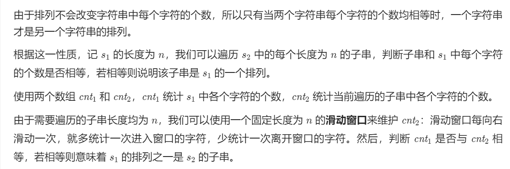
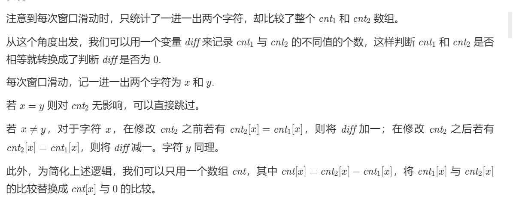

# 567. 字符串的排列

## 题目

难度: 中等

给你两个字符串 s1 和 s2 ，写一个函数来判断 s2 是否包含 s1****的排列。如果是，返回 true ；否则，返回 false 。

换句话说，s1 的排列之一是 s2 的 **子串** 。

**示例 1：**

```
输入：s1 = "ab" s2 = "eidbaooo"
输出：true
解释：s2 包含 s1 的排列之一 ("ba").

```

**示例 2：**

```
输入：s1= "ab" s2 = "eidboaoo"
输出：false

```

> 来源: 力扣（LeetCode）  
> 链接: <https://leetcode.cn/problems/permutation-in-string/>  
> 著作权归领扣网络所有。商业转载请联系官方授权，非商业转载请注明出处。

## 思路



## 答案

```c++
class Solution {
public:
    bool checkInclusion(string s1, string s2) {
        int n1 = s1.size();
        int n2 = s2.size();

        if (n1 > n2) {
            return false;
        }

        // 使用 hash 数组统计每个元素出现的次数
        std::vector<int> cnt1(26);
        std::vector<int> cnt2(26);

        for (int i = 0; i < n1; i++) {
            cnt1[s1[i] - 'a']++;
            cnt2[s2[i] - 'a']++;
        }
        if (cnt1 == cnt2) {
            return true;
        }

        for (int i = n1; i < n2; i++) {
            cnt2[s2[i] - 'a']++;
            cnt2[s2[i - n1] - 'a']--;
            if (cnt1 == cnt2) {
                return true;
            }
        }

        return false;
    }
};
```

## 优化


