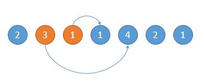
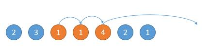

# 45. 跳跃游戏 II

## 题目

难度: 中等

给你一个非负整数数组 nums ，你最初位于数组的第一个位置。

数组中的每个元素代表你在该位置可以跳跃的最大长度。

你的目标是使用最少的跳跃次数到达数组的最后一个位置。

假设你总是可以到达数组的最后一个位置。

**示例 1:**

```
输入: nums = [2,3,1,1,4]
输出: 2
解释: 跳到最后一个位置的最小跳跃数是 2。
     从下标为 0 跳到下标为 1 的位置，跳 1 步，然后跳 3 步到达数组的最后一个位置。

```

**示例 2:**

```
输入: nums = [2,3,0,1,4]
输出: 2

```

> 来源: 力扣（LeetCode）  
> 链接: <https://leetcode.cn/problems/jump-game-ii/>  
> 著作权归领扣网络所有。商业转载请联系官方授权，非商业转载请注明出处。

## 思路

贪婪算法，我们每次在可跳范围内选择可以使得跳的更远的位置。

如下图，开始的位置是 2，可跳的范围是橙色的。然后因为 3 可以跳的更远，所以跳到 3 的位置。



如下图，然后现在的位置就是 3 了，能跳的范围是橙色的，然后因为 4 可以跳的更远，所以下次跳到 4 的位置。



写代码的话，我们用 end 表示当前能跳的边界，对于上边第一个图的橙色 1，第二个图中就是橙色的 4，遍历数组的时候，到了边界，我们就重新更新新的边界。

## 答案

```c++
class Solution {
public:
    int jump(vector<int>& nums) {
        // 维护当前能跳到的最远位置
        int farthest = 0;
        // 当前跳的次数
        int steps = 0;
        // 上次跳跃的可达范围右边界(下次的最右起跳点)
        int end = 0;
        for (int i = 0; i < nums.size() - 1; i++) {
            farthest = std::max(farthest, i + nums[i]);
            if (i == end) {
                steps++;
                end = farthest;
            }
        }
        return steps;
    }
};
```
