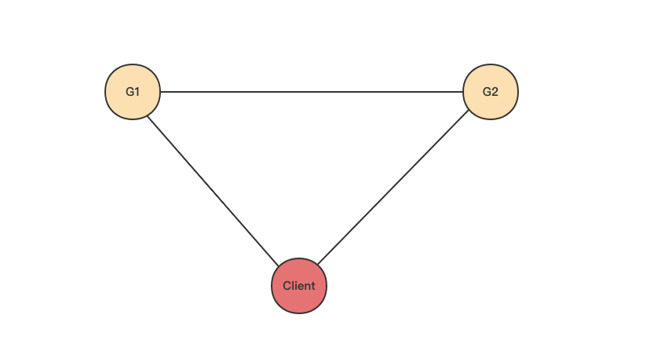
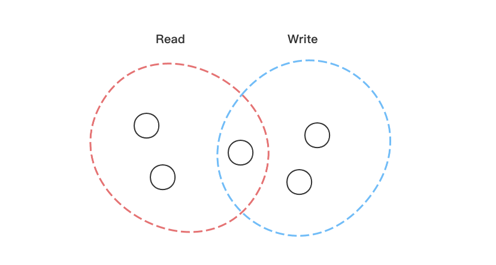

# 一致性问题

## 简介

尽管分布式系统应用范围越来越广，但是它存在一个与生俱来的难点：如何同步不同节点之间的状态。

## CAP

### 1. 原理

CAP 指的是在分布式系统中，以下三个指标不可能同时满足：

* 一致性（Consistency）：所有节点在任何时刻看到的数据都是一样的（客户端的 read 操作总是返回最新写入的值）
* 可用性（Availability）：系统应该允许客户端的请求，且可以很快返回结果
* 分区容错（Partition Tolerance）：大多数分布式系统分布在多个子网络中，在区间通信失败的情况下系统仍可以正常工作

一般而言分区容错是无法避免的，因此可以认为 CAP 中的 P 总是成立，而 C 和 A 无法同时做到。

### 2. 三者的重要性

* 一致性：在银行等交易系统中，任何客户端都必须看到最新的数据，否则可能会给业务带来极其严重的影响
* 可用性：直接影响系统的响应速度，不能快速且可靠地 Read/Write 对于部分高并发服务是致命的
* 分区容错：网络本身就是极其不稳定的，随时有可能断开，因此 P 是无法完全避免的

### 2. C 和 A 为什么无法同时实现

以下图为例，其中 G1 和 G2 表示两个分布式节点：

* 为了保证 G2 的一致性，那么 G1 必须在写操作时锁定 G2 的读写操作，待数据同步后才能重新开放 G2 的读写操作，锁定期间 G2 丧失可用性
* 为了保证 G2 的可用性，那么 G2 返回的数据就可能不是最新写入的值，丧失了一致性

## Consistency Level

### 1. 简介

既然分布式系统在一致性 C 和可用性 A 之间需要做一个权衡，那么我们就可以牺牲一部分一致性来提高分布式系统的可用性。客户端在发起 Read/Write 操作时可以选择一个 Consistency Level，其中写操作的 Consistency Level 指定了写操作在通知客户端请求成功之前，必须确保已经成功完成写操作的 replica 数量。

> replica 数量可以理解为在分布式系统中为数据冗余提供的副本。

* ANY：任意一个节点写操作已经成功（并且确保写请求不会失败），提供最低的一致性和最高的可用性
* ALL：读操作访问所有 replica 节点中 timestamp 最新的数据，写操作写到所有 replica 节点，提供最高的一致性和最低的可用性
* ONE：读操作返回最近 replica 节点的结果，写操作满足任意一个 replica 节点写操作成功
* QUORUM：读操作读取所有数据中心中 quorum 数量节点的节点，返回其中 timestamp 最新的数据，提高高一致性（不过有可能读取失败）

### 2. QUORUM（法定数量）

以下图为例，分布式系统中总共有 5 个节点，假设 QUORUM 为 3，那么进程 A 执行 Write 操作时需要随机写入 3 个节点，进程 B 执行 Read 操作时需要随机读取 3 个节点中 timestamp 最新的数据。由于 3+3 > 5，因此进程 B 读取的 3 个节点中至少有一个包含了最新数据，因此 QUORUM 比 ALL 执行速度更快，但是依然保证了强一致性。

将问题抽象一下，服务端处理一致性问题时需要将更新后的数据同步到分布式系统的所有节点中，缩小达到最终一致性的时间窗口，从而提高系统的可用性和用户体验。

我们定义：

* N：数据副本数
* W：写操作时保证写完成的节点数
* R：读操作时必须读取的节点数

## 一致性

### 1. 简介

前面提到分布式系统 CAP 原理中 P 总是成立的，因此分布式系统的设计重点就是在可用性 A 和一致性 C 之间做一个权衡。大多数 Web 应用对强一致性的要求并不高，因此可以牺牲一部分一致性换取高可用性。这里提到的牺牲一部分一致性并非指的是数据可以是混乱的，而是指不要求分布式系统满足关系型数据库的强一致性，只需要系统能达到最终一致性即可。

### 2. 一致性问题出现的原因

假设我们只有一个节点处理所有的读写请求，那么就不存在数据一致性问题。在分布式系统中一份数据需要被存储在多个节点中，原因在于：

* 高可用性：即使部分节点出现问题，系统也可以正常响应
* 低延迟：通过节点在地理上的合理分布使得用户距离节点更近
* 可扩展性：可以快速扩展节点数，提高系统吞吐量

### 3. 客户端和服务端视角的一致性

从客户端的视角上看，一致性指的是多并发访问更新后的数据时如何获取最新数据的问题；从服务端的视角上看，一致性指的是更新数据时如何将更新后的数据复制到所有节点的问题。

#### 3.1 客户端视角

数据更新后客户端访问时不同的获取最新数据策略决定了不同的一致性：

* 强一致性：最新数据能被更新后续的请求访问到，比如关系型数据库
* 弱一致性：允许最新数据被更新后部分或者全部请求访问不到
* 最终一致性（弱一致性的一种特殊形式）：存储系统保证如果没有新的写操作，那么最终所有请求都能访问到最新数据，期间数据不一致的情况

#### 3.2 服务端视角

服务端考虑的是更新数据时如何将更新后的数据复制到整个分布式系统，沿用前面提到的 N、W 和 R 变量：

* W+R > N：写的节点和读的节点存在交集，满足强一致性
* W+R<=N：不能保证写操作后续的所有读操作都能读到最新数据，属于弱一致性

### 4. 最终一致性

对于最终一致性而言，按照更新数据后各进程访问到最新数据的时间和方式不一样，可以分为因果一致性、读写一致性和单调读一致性。

#### 3.1 因果一致性

假设进程 A 通知进程 B（进程 B 和进程 A 有因果关系）它更新了一个数据，则进程 B 后续访问该数据时将返回最新数据，且该次写入保证取代前一次写入；与进程 A 无因果关系的进程 C 访问该数据时遵循通常的最终一致性规则

#### 3.2 读写一致性

* 定义：读写一致性也被称为读「己之所写」一致性，当进程 A 更新一个数据后，后续进程 A 的所有访问都可以看到最新数据，这是因果一致性的一个特例

* 例子：app 中用户修改资料后每次刷新都能看到最新的资料
* 实现：
  * 对于某些特定内容（比如用户个人资料），都从主库中读
  * 客户端在本地记录用户最后一次写入的时间戳，发起访问请求时带上该时间戳，从库提供任何查询服务前都需确保该时间戳之前的变更都已经同步到本从库中，否则就从另一个从库中读

#### 3.3 单调读一致性

* 定义：假设进程 A 之前读取到某个数据，则后续所有的访问都不会读取到该值的更早版本
* 例子：app 中用户多次浏览同一个贴子时，不可能出现下一次浏览比前一次浏览版本更早的情况
* 实现：确保每个用户总是从同一个节点进行读取（不同用户从不同节点读取），例如使用用户 ID 的哈希值来选取访问节点

## Reference

[1] <https://zhuanlan.zhihu.com/p/47215123>

[2] <http://www.ruanyifeng.com/blog/2018/07/cap.html>

[3] <http://www.javashuo.com/article/p-mlfynlwe-hn.html>

[4] <https://zhuanlan.zhihu.com/p/67949045>

[5] <https://blog.51cto.com/michaelkang/2415292>
