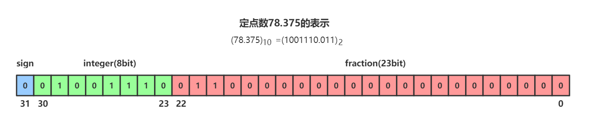

# 浮点数实现原理和精度损失问题

## 小数的二进制科学计数法表示

浮点数的表示借鉴了科学计数法，比如在十进制中 311.56 可以表示成$3.1156 * 10^2$。类似地，浮点型数据的二进制存储结构也可以被划分成：符号位 + 指数位 + 尾数位。按照国际标准 IEEE 754，任意一个二进制浮点数可以表示成：
$$
V = (-1)^s \times M \times 2^E
$$
其中：

* $(-1)^s$表示符号位，$s=0$表示正数，$s=1$表示负数
* $M$表示有效数字，$1\leq M<2$
* $2^E$表示指数位

> 指数部分决定了数的大小范围，有效数字部分决定了数的精度。

以 78.375 为例，它的整数和小数部分可以表示为：
$$
(78)_{10} = (1001110)_{2} \\
(0.375)_{10} = \frac{3}{8} = \frac{1}{4} + \frac{1}{8} = 2^{-2} + 2^{-3} = (0.01)_2 + (0.001)_2 = (0.011)_2
$$
因此二进制的科学计数法为：
$$
(78.375)_{10} = (1001110.011)_2 = 1.001110011 \times 2^6
$$

## 定点数和浮点数的区别

计算机中小数的表示按照小数点的位置是否固定可以分为浮点数和定点数。为了方便和 float32 浮点数做对比，我们构造一个 32 位精度的定点数，其中小数点固定在 23bit 处：

从定点数的存储上看，它表示的数值范围有限（以小数点在 23bit 为例，整数部分仅有 8 位，则整数部分取值范围是 0~255），但好在处理定点数计算的硬件比较简单。

以 32 位浮点数为例，最高一位是符号位 s，接着的 8 位是指数位 E，最后的 23 位是有效数字 M。double64 最高一位是符号位，有 11 个指数位和 52 个有效数字位。下图展示了 float32 类型的底层表示：

## 浮点数的精度损失问题

十进制中的 0.5（代表分数 1/2）表示二进制中的 0.1（等同于分数 1/2），我们可以把十进制中的小数部分乘以 2 作为二进制的一位，然后继续取小数部分乘以 2 作为下一位，直到不存在小数为止。以 0.2 这个无法精确表示成二进制的浮点数为例：
$$
0.2 \times 2 = 0.4 \rightarrow 0 \\
0.4 \times 2 = 0.8 \rightarrow 0 \\
0.8 \times 2 = 1.6 \rightarrow 1 \\
0.6 \times 2 = 1.2 \rightarrow 1 \\
0.2 \times 2 = 0.4 \rightarrow 0 \\
...... \\
(0.2)_{10} = (0.00110...)_{2}
$$
因此十进制下的 0.2 无法被精确表示成二进制小数，这也是为什么十进制小数转换成二进制小数时会出现精度损失的情况。

## 浮点数的表示范围

* 单精度浮点数 float 占四个字节，表示范围-3.40E+38 ~ +3.40E+38
* 双精度浮点数 double 占八个字节，表示范围-1.7E+308 ~ +1.79E+308

> 以 float 为例，能表示的最大二进制数据为$$+1.11111111111111111111111\times 2^{127}$$（小数点后为 23 个 1），而二进制下$1.111111... \approx 2$，因此能表示的最大十进制数据是：

$$
(+1.11111111111111111111111 \times 2^{127})_2 \approx (2^{128})_2 \approx (3.4 \times 10^{38})_{10}
$$
