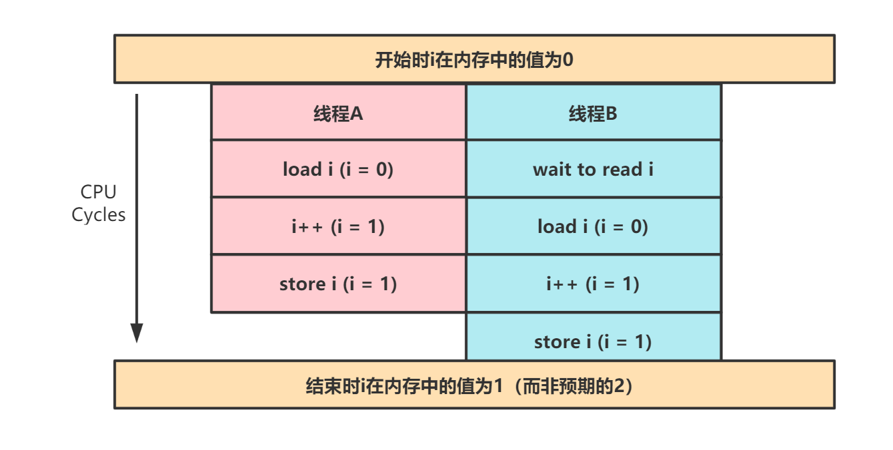

# i++为什么是非原子操作

## 原子操作

原子操作指的是不会被线程调度机制打断的操作，这种操作一旦开始就会一直运行到结束，中间不存在上下文切换（即切换到另一个线程）。

## 问题描述

以下面的 Go 代码为例，我们对 x 累加了 10000 次，但是最终 x 的结果却并不为 10000：

```go
package main

import (
 "fmt"
 "sync"
)

func main() {
 var x int
 var wg sync.WaitGroup

 fmt.Println("x start: ", x)

 wg.Add(10000)
 for i := 0; i < 10000; i++ {
  go func() {
   x++
   wg.Done()
  }()
 }
 wg.Wait()

 fmt.Println("x end:", x)
}
```

输出：

```bash
x start:  0
x end: 9912
```

## 原因

i++本身是非原子操作，它的执行分为如下三步：

* 读取内存中 i 的值到寄存器中
* 在寄存器进行自增操作
* 将 i 的值写回到内存中

上面三个步骤每一步都是原子操作，但是组合在一起就并非是原子操作了。举个例子，下图中线程 A 和 B 并发进行 i++操作，结果得到非预期的 1（当然也有可能得到预期的 2，取决于每条指令具体的执行情况）。



## 解决方法

最简单的实现方式即加锁（当然也可以用原子变量进行无锁编程）：

```go
package main

import (
 "fmt"
 "sync"
)

func main() {
 var x int
 var lock sync.Mutex
 var wg sync.WaitGroup

 fmt.Println("x start: ", x)

 wg.Add(10000)
 for i := 0; i < 10000; i++ {
  go func() {
   lock.Lock()
   x++
   lock.Unlock()
   wg.Done()
  }()
 }
 wg.Wait()

 fmt.Println("x end:", x)
}
```

输出：

```bash
x start:  0
x end: 10000
```

## Reference

[1] <https://blog.csdn.net/qq_32534441/article/details/83999009>

[2] <https://zhuanlan.zhihu.com/p/180412319>
