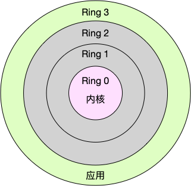

# 上下文切换

## 概念

### 1. CPU上下文

Linux 是一个多任务操作系统，它支持同时运行的任务数量远大于 CPU 个数。其实这些任务没有真正的同时运行，是因为系统在很短的时间内，将 CPU 轮流分配给它们，造成多任务同时运行的错觉。而在每个任务运行前，CPU 都需要知道任务从哪里加载、从哪里开始运行，需要系统事先设置好 CPU 寄存器和程序计数器。CPU 寄存器是 CPU 内置的容量小、速度极快的内存。而程序计数器则是用来存储 CPU 正在执行的指令位置、或即将执行的下一条指令位置。它们都是 CPU 在运行任务前必须依赖的环境，也被叫做 CPU 上下文。

### 2. 上下文切换

上下文切换，就是先把前一个任务的 CPU 上下文保存起来，然后加载新任务的上下文到这些寄存器和程序计数器，最后再跳到程序计数器所指的新位置，运行新任务。而这些保存下来的上下文，会存储在系统内核中，并在任务重新调度执行时再次加载进来。这样就能保证任务原来的状态不受影响，让任务看起来还是连续运行。

## 场景

在三种情况下可能会发生上下文切换：中断处理，多任务处理，内核/用户态切换。

### 1. 中断处理

其他程序“打断”了当前正在运行的程序，当CPU接收到中断请求后会在正在运行的程序和发起中断请求的程序之间进行一次上下文切换。

### 2. 多任务处理

CPU会在不同程序之间来回切换，每个程序都有相应的处理时间片，CPU在两个时间片的间隔中进行上下文切换。

### 3. 内核/用户态切换（系统调用）

进行系统调用时，Linux从用户态切换到系统态，CPU用户态的寄存器和程序计数器数据需要先保存起来，接着加载内核态的上下文信息，最后跳转到内核态运行内核任务。系统调用结束后CPU寄存器需要恢复原来保存的用户态上下文，然后切换到用户空间继续运行进程。

因此一次系统调用的过程其实发生了两次CPU上下文切换。**不过系统调用过程中并不会涉及到虚拟内存等进程用户态的资源，也不会切换进程**。这和我们通常所讲的进程上下文切换（从一个进程切换到另一个进程）是不同的，**系统调用中一直都是同一个进程在运行**。

> 系统调用属于同进程内的CPU上下文切换，因此系统调用过程通常也被称为特权模式切换而不是上下文切换。

## CPU上下文切换类型

根据任务的不同，可以分为以下三种类型：

- 进程上下文切换
- 线程上下文切换
- 中断上下文切换

### 1. 进程上下文切换

### 1.1 进程的用户态/用户态

Linux 按照特权等级，把进程的运行空间分为内核空间和用户空间：

- 内核空间（Ring 0）具有最高权限，可以直接访问所有资源
- 用户空间（Ring 3）只能访问受限资源，不能直接访问内存等硬件设备，必须通过系统调用陷入到内核中，才能访问这些特权资源

进程既可以在用户空间运行，又可以在内核空间中运行。进程在用户空间运行时，被称为进程的用户态，而陷入内核空间的时候，被称为进程的内核态。

### 1.2 系统调用

从用户态到内核态的转变，需要通过**系统调用**来完成。比如，当我们查看文件内容时，就需要多次系统调用来完成：首先调用`open()`打开文件，然后调用`read()`读取文件内容，并调用`write()`将内容写到标准输出，最后再调用 `close()`关闭文件。

前面提到**系统调用过程中，并不会涉及到虚拟内存等进程用户态的资源，也不会切换进程**。这跟我们通常所说的进程上下文切换是不一样的：**进程上下文切换，是指从一个进程切换到另一个进程运行；而系统调用过程中一直是同一个进程在运行**。

### 1.3 进程上下文切换与系统调用的关系

首先，**进程是由内核来管理和调度的，进程的切换只能发生在内核态**。所以，进程的上下文不仅包括了虚拟内存、栈、全局变量等用户空间的资源，还包括了内核堆栈、寄存器等内核空间的状态。

因此，**进程的上下文切换就比系统调用时多了一步：在保存内核态资源（当前进程的内核状态和 CPU 寄存器）之前，需要先把该进程的用户态资源（虚拟内存、栈等）保存下来；而加载了下一进程的内核态后，还需要刷新进程的虚拟内存和用户栈。**

如下图所示，保存上下文和恢复上下文的过程并不是“免费”的，需要内核在 CPU 上运行才能完成。

### 1.4 进程上下文切换的性能问题

根据 Tsuna 的测试报告，每次上下文切换都需要几十纳秒到数微秒的 CPU 时间。这个时间还是相当可观的，特别是在进程上下文切换次数较多的情况下，很容易导致 CPU 将大量时间耗费在寄存器、内核栈以及虚拟内存等资源的保存和恢复上，进而大大缩短了真正运行进程的时间。这也正是导致平均负载升高的一个重要因素。

另外，我们知道， Linux 通过 TLB（Translation Lookaside Buffer）来管理虚拟内存到物理内存的映射关系。当虚拟内存更新后，TLB 也需要刷新，内存的访问也会随之变慢。特别是在多处理器系统上，缓存是被多个处理器共享的，刷新缓存不仅会影响当前处理器的进程，还会影响共享缓存的其他处理器的进程。

### 1.5 进程上下文切换场景

1. 为了保证所有进程可以得到公平调度，CPU 时间被划分为一段段的时间片，这些时间片再被轮流分配给各个进程。这样，当某个进程的时间片耗尽了，就会被系统挂起，切换到其它正在等待 CPU 的进程运行。
2. 进程在系统资源不足（比如内存不足）时，要等到资源满足后才可以运行，这个时候进程也会被挂起，并由系统调度其他进程运行。
3. 当进程通过睡眠函数 sleep 这样的方法将自己主动挂起时，自然也会重新调度。
4. 当有优先级更高的进程运行时，为了保证高优先级进程的运行，当前进程会被挂起，由高优先级进程来运行
5. 发生硬件中断时，CPU 上的进程会被中断挂起，转而执行内核中的中断服务程序。

### 2. 线程上下文切换

#### 2.1 线程上下文切换与进程上下文切换的区别

线程与进程最大的区别在于：**线程是调度的基本单位，而进程则是资源拥有的基本单位**。说白了，所谓内核中的任务调度，实际上的调度对象是线程；而进程只是给线程提供了虚拟内存、全局变量等资源。

所以，对于线程和进程，我们可以这么理解：

- 当进程只有一个线程时，可以认为进程就等于线程。
- 当进程拥有多个线程时，这些线程会共享相同的**虚拟内存和全局变量**等资源。这些资源在上下文切换时是不需要修改的。
- 另外，线程也有自己的私有数据，比如**栈和寄存器**等，这些在上下文切换时也是需要保存的。

#### 2.2 线程上下文切换场景

- **前后两个线程属于不同进程**：此时因为资源不共享，所以切换过程就跟进程上下文切换是一样。

- **前后两个线程属于同一个进程**：此时因为虚拟内存是共享的，所以在切换时，虚拟内存这些资源就保持不动，只需要切换线程的私有数据、寄存器等不共享的数据

### 3. 中断上下文切换

为了快速响应硬件的事件，**中断处理会打断进程的正常调度和执行，转而调用中断处理程序，响应设备事件**。而在打断其他进程时，就需要将进程当前的状态保存下来，这样在中断结束后，进程仍然可以从原来的状态恢复运行。

**跟进程上下文不同，中断上下文切换并不涉及到进程的用户态**。所以，即便中断过程打断了一个正处在用户态的进程，也不需要保存和恢复这个进程的虚拟内存、全局变量等用户态资源。中断上下文，其实只包括内核态中断服务程序执行所必需的状态，包括 CPU 寄存器、内核堆栈、硬件中断参数等。

**对同一个 CPU 来说，中断处理比进程拥有更高的优先级**，所以中断上下文切换并不会与进程上下文切换同时发生。同样道理，由于中断会打断正常进程的调度和执行，所以大部分中断处理程序都短小精悍，以便尽可能快的执行结束。

另外，跟进程上下文切换一样，中断上下文切换也需要消耗 CPU，切换次数过多也会耗费大量的 CPU，甚至严重降低系统的整体性能。所以，当你发现中断次数过多时，就需要注意去排查它是否会给你的系统带来严重的性能问题。

## Reference

[1] <https://zhuanlan.zhihu.com/p/433518016>

[2] <https://www.cnblogs.com/cangqinglang/p/12455444.html>

[3] <https://www.cxybb.com/article/czd3355/85118727>
