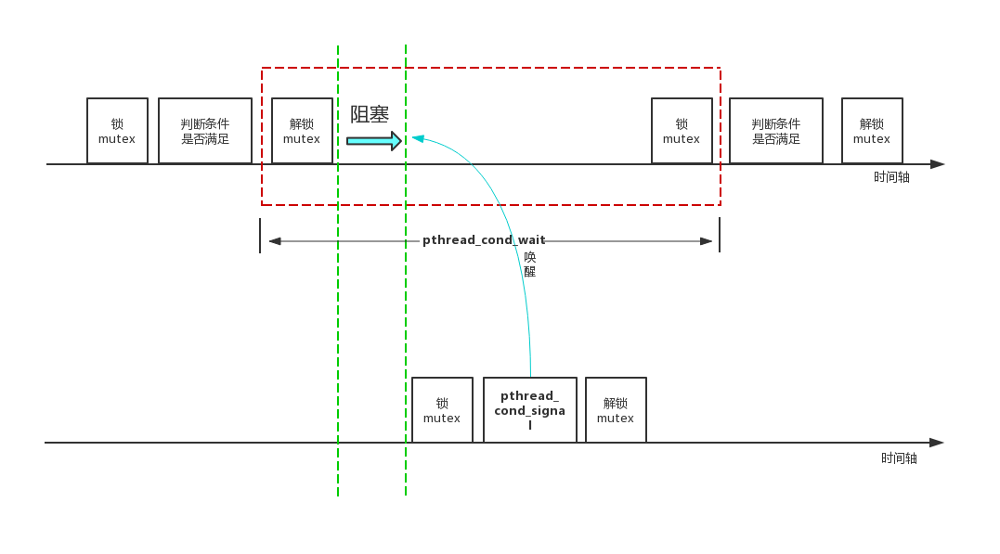

# 线程同步方式

## 前言

进程有自己的独立地址空间，因此**进程之间重点关注通信**，通信方式包括：管道Pipe、命名管道FIFO、消息队列MessageQueue、共享存储SharedMemory、信号量Semaphore、套接字Socket和信号Signal。

线程除了线程栈外其他数据都是共享的，如果同时读写数据可能造成数据不一致甚至程序崩溃的后果，因此**线程之间重点关注同步**。

### 1. 竞争条件

在多线程并发场景下指令执行的先后顺序由内核决定，同一个线程内部指令按照先后顺序执行，但不同线程之间的指令执行先后顺序是不一定的。

如果执行结果依赖于不同线程执行的先后顺序，那么就会形成**“竞争条件”**，由于竞争条件下计算结果是非预期的，因此我们应该尽量避免竞争条件的形成。

最常解决竞争条件的方式是**原子操作**，其次便是线程同步。

### 2. 线程同步概念

线程同步的概念和其他“同步”不太一致：

* 设备同步：在不同的设备之间规定一个共同的参考时间
* 数据库/文件同步：在不同的数据库之间保持数据一致

线程同步指的是线程之间“协同”，即线程之间按照规定的先后次序运行。

### 3. 线程同步方式

线程同步主要包括四种方式：

* 互斥量`pthread_mutex_`
* 读写锁`pthread_rwlock_`
* 条件变量`pthread_cond_`
* 信号量`sem_`

## 互斥锁

### 1. 简介

互斥锁（又名互斥量）强调的是资源之间的访问互斥：每个线程在对共享资源操作前都会尝试先加锁，加锁成功才能操作，操作结束之后解锁。

某个线程对互斥量加锁后，任何其他试图再对互斥量加锁的线程都将被阻塞直到当前线程释放该互斥锁。如果释放互斥锁时有多个线程阻塞，所有在该互斥锁上的阻塞线程都会变成可运行状态。第一个变成运行状态的线程可以对互斥量加锁，其余线程将会看到互斥量依然被锁住，只能回去再次等待它重新变为可用。

### 2. 特性

mutex是睡眠等待（sleep waiting）类型的锁，**当线程抢互斥锁失败的时候，线程会陷入休眠**。优点就是节省CPU资源，缺点就是休眠唤醒会消耗一点时间。

另外自从Linux 2.6版以后，mutex完全用futex的API实现了，内部系统调用的开销大大减小。

### 3. 主要接口

声明和销毁：

```c
#include <pthread.h>
int pthread_mutex_init(pthread_mutex_t *restrict mutex, const pthread_mutexattr_t *restrict attr);
int pthread_mutex_destroy(pthread_mutex_t *mutex);
```

加锁解锁：

```c
#include <pthread.h>

int pthread_mutex_lock(pthread_mutex_t *mutex);
int pthread_mutex_trylock(pthread_mutex_t *mutex);
int pthread_mutex_unlock(pthread_mutex_t *mutex);
```

超时加锁，避免死锁：

```c
#include <pthread.h>
#include <time.h>
int pthread_mutex_timedlock(pthread_mutex_t *restrict mutex, const struct timesec *restrict tsptr);
```

### 4. 例子

```c
// 声明一个互斥量    
pthread_mutex_t mtx;
// 初始化 
pthread_mutex_init(&mtx, NULL);
// 加锁  
pthread_mutex_lock(&mtx);
// 解锁 
pthread_mutex_unlock(&mtx);
// 销毁
pthread_mutex_destroy(&mtx);
```

## 读写锁

### 1. 简介

读写锁和互斥量类似，是另一种实现线程同步的方式，但是它将操作分为读、写两种方式，可以多个线程同时占用读模式，这样使得读写锁具有更高的并行性。相较于互斥锁而言**读写锁有一定的性能提升**，应对的是单写多读模型：

* 写独占：写锁占用时，其他线程加读锁或者写锁时都会阻塞（并非失败）
* 读共享：读锁占用时，其他线程加写锁时会阻塞，加读锁会成功

### 2. 策略

读写锁有两种策略：

* 强读同步：读锁优先，只要写锁没有占用那么就可以加读锁
* 强写同步：写锁优先，只能等到所有正在等待或者执行的写锁执行完成后才能加读锁

大部分读写锁的实现都采用的是“强写同步”策略，对尝试加锁的操作进行排队，如果前面已经有尝试加写被锁阻塞住的话，后续加读锁也都会被阻塞住（尽管当前时刻是读锁占用的状态）。这样做的目的主要是为了避免“写饥饿”，在“多读少写”的情况下防止数据修改延迟过高。

当然，具体采取哪种策略取决于业务。例如航班订票系统使用强写同步策略，图书馆查阅系统使用强读同步策略。

### 3. 应用

非常适用于对数据结构读的次数远大于写的情况，因为读锁是共享的，这样可以提高并行性。

### 4. 主要接口

```c
#include<pthread.h>

/*
 * 功能: 初始化rwlock所指向的读写锁
 * 返回值: 成功返回0, 失败返回非0错误码
 * 
 * @param1 rwlock: 指向要初始化的读写锁指针
 * @param2 attr: 读写锁的属性指针, 如果attr为NULL则会使用默认属性初始化读写锁, 否则使用指定值
 */
int pthread_rwlock_init(pthread_rwlock_t *restrict rwlock, const pthread_rwlockattr_t *restrict attr);

/*
 * 功能: 销毁rwlock所指向的读写锁
 * 返回值: 成功返回0, 失败返回非0错误码
 * 
 * @param1 rwlock: 指向要销毁的读写锁指针
 */
int pthread_rwlock_destroy(pthread_rwlock_t *rwlock);

/*
 * 功能: 加读锁
 * 返回值: 成功返回0, 失败返回非0错误码
 * 
 * @param1 rwlock: 读写锁指针
 */
int pthread_rwlock_rdlock(pthread_rwlock_t *rwlock);
// 注: 以阻塞方式在读写锁上获取读锁(读锁定), 如果没有写线程持有该锁并且没有写线程阻塞, 则可以获取读锁
//     如果调用线程未获取读锁, 则将它阻塞直到获取该锁
//     一个线程可以在一个读写锁上执行多次读锁定, 线程可以成功调用pthread_rwlock_rdlock()函数多次
//     但之后也要调用对应的次数pthread_rwlock_unlock()函数执行解除锁定


/*
 * 功能: 尝试加读锁
 * 返回值: 成功返回0, 失败返回非0错误码
 * 
 * @param1 rwlock: 读写锁指针
 */
int pthread_rwlock_tryrdlock(pthread_rwlock_t *rwlock);
// 注：用于尝试以非阻塞的方式来在读写锁上获取读锁, 如果有任何的写线程持有该锁或者有写阻塞在该锁上，则返回失败


/*
 * 功能: 加写锁
 * 返回值: 成功返回0, 失败返回非0错误码
 * 
 * @param1 rwlock: 读写锁指针
 */
int pthread_rwlock_wrlock(pthread_rwlock_t *rwlock);
// 注: 在读写锁上获取写锁(写锁定), 如果没有写线程持有该锁且没有读线程持有该锁, 则调用的线程会获取该锁
//     如果调用的线程未获取写锁则它将阻塞直到获取该锁


/*
 * 功能: 尝试加写锁
 * 返回值: 成功返回0, 失败返回非0错误码
 * 
 * @param1 rwlock: 读写锁指针
 */
int pthread_rwlock_tryrwlock(pthread_rwlock_t *rwlock);
// 注：用于尝试以非阻塞的方式来在读写锁上获取写锁, 如果有任何读线程或写线程持有该锁, 则立即返回失败

/*
 * 功能: 尝试加写锁
 * 返回值: 成功返回0, 失败返回非0错误码
 * 
 * @param1 rwlock: 读写锁指针
 */
int pthread_rwlock_unlock(pthread_rwlock_t *rwlock);
// 注: 无论是读锁还是写锁，都通过此函数解锁
```

### 5. 例子

```c
// 声明一个读写锁
pthread_rwlock_t rwlock;

// 在读之前加读锁
pthread_rwlock_rdlock(&rwlock);

... 共享资源的读操作

// 读完释放锁
pthread_rwlock_unlock(&rwlock);

// 在写之前加写锁
pthread_rwlock_wrlock(&rwlock); 

/... 共享资源的写操作

// 写完释放锁
pthread_rwlock_unlock(&rwlock);

// 销毁读写锁
pthread_rwlock_destroy(&rwlock);
```

## 条件变量

并发有互斥和等待两大需求，前者是因为线程间存在共享数据依赖而后者是线程间存在依赖，条件变量正是为了解决等待需求。

### 1. 简介

条件变量本质上也是一个多线程间共享的全局变量，它的功能是阻塞线程，被阻塞的线程直到接收到“条件成立”的信号后才能继续执行。

需要注意的是：

* 条件变量并不是锁（但它几乎总是和互斥量一起使用的），而是线程间的一种通讯机制

* 条件变量本身也不包含条件，它被称为条件变量是因为它经常和条件语句（if/while）一起使用

### 2. 背景：轮询模式与事件模式

以生产者消费者模型为例，消费者依赖生产者push元素进队列才能开始工作。在不考虑条件变量的情况下，一种实现方式是让消费者线程一直轮询队列（需要加mutex锁），判断队列里是否存在元素：

* 队列非空：消费队列元素
* 队列为空：继续轮询队列（spin策略，浪费CPU性能）或者休眠一段时间后再轮询（sleep策略，浪费该线程性能）

在使用mutex的情况下，队列为空时两种策略都属于轮询（poll）模式。但是有了条件变量后就可以使用事件（event）模式：当消费者线程发现队列为空时就通知操作系统它要wait，待生产者线程push元素进队列后就调用signal让操作系统唤醒消费者线程。总结一下：

* mutex + spin策略（轮询模式）：浪费CPU性能，队列为空时消费线程会一直占用CPU空跑
* mutex + sleep策略（轮询模式）：sleep时间过短时存在多次上下文切换开销，sleep时间较长时浪费消费线程性能
* mutex + 条件变量（事件模式）：只有当生产者push元素进入队列才会唤醒消费线程，但依然存在上下文切换的开销

因此条件变量的产生正是为了不循环加锁解锁，又可以在第一时间收到**条件满足**的通知。

### 3. 实现原理

假设线程A依赖线程B某个条件：

* 线程A获取mutex访问共享区域，判断条件是否满足
* 如果条件不满足，则调用wait方法等待条件达成
* 线程B准备好条件后通过发singal唤醒线程A



### 4. 主要接口

```c
#include <pthread.h>

/*
 * 功能: 初始化一个条件变量
 * 返回值: 成功返回0, 其他返回值表示错误
 *
 * @param1 cond: 待初始化的条件变量
 * @parma2 attr: NULL表示创建default条件变量, 否则条件变量的属性由attr决
 */
int pthread_cond_init(pthread_cond_t *restrict cond, const pthread_condattr_t *restrict attr);

/*
 * 功能: 销毁一个条件变量
 * 返回值: 成功返回0, 其他返回值表示错误
 */
int pthread_cond_destroy(pthread_cond_t *cond);

/*
 * 功能: 阻塞等待一个条件变量
 * 返回值: 成功返回0, 其他返回值表示错误
 */
int pthread_cond_wait(pthread_cond_t *restrict cond, pthread_mutex_t *restrict mutex);
// pthread_cond_wait函数包含三步(前两步为一个原子操作):
//   1) 阻塞等待条件变量cond满足
//   2) 释放已掌握的互斥锁mutex
//   3) 当被唤醒时解除阻塞并重新申请获得互斥锁mutex

/*
 * 功能: 超时等待一个条件变量
 * 返回值: 成功返回0, 其他返回值表示错误
 */
int pthread_cond_timedwait(pthread_cond_t* cond, pthread_mutex_t* mutex, const struct timespec* abstime);

/*
 * 功能: 唤醒至少一个阻塞在条件变量上的线程
 * 返回值: 成功返回0, 其他返回值表示错误
 */
int pthread_cond_signal(pthread_cond_t *cond);

/*
 * 功能: 唤醒全部阻塞在条件变量上的线程
 * 返回值: 成功返回0, 其他返回值表示错误
 */
 int pthread_cond_broadcast(pthread_cond_t *cond);
```

### 5. 例子

仍然以消费者生产者模型为例，在这个场景下消费者和生产者两者是互相制约的：

* 缓冲区为空时：消费者不能消费，只能等待生产者往缓冲区中push元素
* 缓冲区满了：生产者不能生产，只能等待消费者从缓冲区中pop元素

```c++
#include <unistd.h>
#include <pthread.h>
#include <stdio.h>
#include <iostream>
#include <queue>

const size_t MAX_SIZE = 5;

class BlockQueue {
 public:
    explicit BlockQueue(size_t capacity = MAX_SIZE) : _capacity(capacity) {
        pthread_mutex_init(&_mutex, NULL);
        pthread_cond_init(&_pro_cond, NULL);
        pthread_cond_init(&_cus_cond, NULL);
    }

    ~BlockQueue() {
        pthread_mutex_destroy(&_mutex);
        pthread_cond_destroy(&_pro_cond);
        pthread_cond_destroy(&_cus_cond);
    }

    void Push(int data) {
        pthread_mutex_lock(&_mutex);

        // 队列已满时阻塞生产者生产
        while (_queue.size() == _capacity) {
            pthread_cond_wait(&_pro_cond, &_mutex);
        }
        // 数据入队
        _queue.push(data);
        pthread_mutex_unlock(&_mutex);

        // 生产完毕，唤醒消费者消费
        pthread_cond_signal(&_cus_cond);
    }

    void Pop(int& data) {
        pthread_mutex_lock(&_mutex);

        // 队列空为空时阻塞消费者消费
        while (_queue.empty()) {
            pthread_cond_wait(&_cus_cond, &_mutex);
        }
        data = _queue.front();
        _queue.pop();
        pthread_mutex_unlock(&_mutex);

        // 消费完毕, 唤醒生产者生产
        pthread_cond_signal(&_pro_cond);
    }

 private:
    std::queue<int> _queue;
    size_t _capacity;
    pthread_mutex_t _mutex;
    pthread_cond_t _pro_cond;
    pthread_cond_t _cus_cond;
};

void *producter(void *arg) {
    BlockQueue *queue = reinterpret_cast<BlockQueue*>(arg);
    int data = 0;
    while (true) {
        queue->Push(data);
        printf("producer push data: %d\n", data++);
    }

    return NULL;
}

void *customer(void *arg) {
    BlockQueue *queue = reinterpret_cast<BlockQueue*>(arg);
    while (true) {
        int data;
        queue->Pop(data);
        printf("consumer fetch data: %d\n", data);
    }

    return NULL;
}

int main() {
    BlockQueue queue;
    pthread_t pro_tid[5], cus_tid[5];

    // 创建消费者和生产者线程
    for (size_t i = 0; i < 5; i++) {
        pthread_create(&pro_tid[i], NULL, producter, reinterpret_cast<void*>(&queue));
        pthread_create(&cus_tid[i], NULL, customer, reinterpret_cast<void*>(&queue));
    }

    // 等待线程退出
    for (size_t i = 0; i < 4; i++) {
        pthread_join(pro_tid[i], NULL);
        pthread_join(cus_tid[i], NULL);
    }

    return 0;
}
```

## 信号量

### 1. 简介

信号量分为有名信号量和无名信号量，无名信号量用于线程同步，有名信号量一般用于进程之间管理。

信号量本质上是一个非负的整数计数器，用于控制公共资源的访问，也被称为PV原子操作：

* P操作：即信号量sem减一，若sem小于等于0则P操作被阻塞，直到sem变量大于0为止
* V操作：即信号量sem加一

### 2. 与互斥量的区别

信号量允许多个线程同时进入临界区，而互斥量只允许一个线程进入临界区。

### 3. 主要接口

```c
#include <semaphore.h>

/*
 * 功能: 创建信号量
 * 返回值: 成功返回0, 失败返回-1
 *
 * @param1 sem: 要进行初始化的信号量对象
 * @param2 pshared: 控制着信号量的类型, 如果值为0表示它是当前进程的局部信号量, 否则其他进程就能够共享这个信号量
 * @param3 value: 赋给信号量对象的一个整数类型的初始值
 */
int sem_init(sem_t *sem, int pshared, unsigned int value)


/*
 * 功能: 以原子操作的方式将信号量值减1
 */
int sem_wait(sem_t *sem);

// sem_trywait()是sem_wait()的非阻塞版本, 当条件不满足时(信号量为0)该函数直接返回EAGAIN错误而不会阻塞等待
int sem_trywait(sem_t *sem);

// sem_timedwait()与sem_trywait()功能类似, 只是在指定的abs_timeout时间内等待, 超时返回ETIMEDOUT错误
int sem_timedwait(sem_t *sem, const struct timespec *abs_timeout);

/*
 * 功能: 以原子操作的方式将信号量的值加1
 * 返回值: 调用成功时返回0，失败返回-1
 */
int  sem_post(sem_t *sem);

/*
 * 功能: 返回当前信号量的值, 通过restrict输出参数返回
 * 返回值: 如果当前信号量已经上锁(即同步对象不可用)那么返回值为0; 如果返回负数其绝对值就是等待该信号量解锁的线程数
 */
int sem_getvalue(sem_t *restrict, int *restrict);

/*
 * 功能: 销毁信号量
 * 返回值: 成功返回0, 失败返回-1
 */
int sem_destroy(sem_t *sem);
```

## Reference

[1] <https://zhuanlan.zhihu.com/p/372006232>

[2] <https://zhuanlan.zhihu.com/p/107196194>

[3] <https://zhuanlan.zhihu.com/p/190199754>

[4] <https://www.cnblogs.com/caidi/p/11310274.html>

[5] <https://blog.csdn.net/guotianqing/article/details/80559865>

[6] <https://www.zhihu.com/question/66733477/answer/1267625567>

[7] <https://www.cnblogs.com/yinbiao/p/11190336.html>

[8] <http://c.biancheng.net/view/8633.html>

[9] <https://blog.csdn.net/qq_39736982/article/details/82380689>
