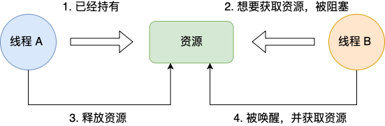
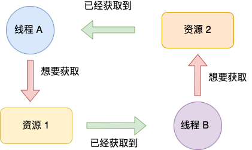
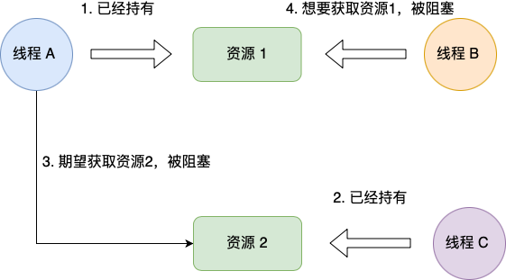

# 死锁及避免

## 概念

死锁是指两个或两个以上的进程在执行过程中，由于竞争资源或者由于彼此通信而造成的一种阻塞的现象，若无外力作用，它们都将无法推进下去。此时称系统处于死锁状态或系统产生了死锁，这些永远在互相等待的进程称为死锁进程。

死锁的规范定义：集合中的每一个进程都在等待只能由本集合中的其他进程才能引发的事件，那么该组进程是死锁的。

## 死锁必要条件

死锁只有**同时满足**以下四个条件才会发生：

* **互斥条件**：一个执行流获取互斥锁后，其它执行流不能再获取该锁；
* **不可剥夺条件**：A执行流拿着锁，其它执行流不能释放；
* **循环等待条件**：多个执行流拿着对方想要的锁，并且各执行流还去请求对方的锁；
* **请求与保持条件**：执行流本身使用着一把锁并不释放，还在请求别的锁；

### 1. 互斥条件

> 互斥条件是指**多个线程不能同时使用同一个资源**。

比如下图，如果线程 A 已经持有的资源，不能再同时被线程 B 持有，如果线程 B 请求获取线程 A 已经占用的资源，那线程 B 只能等待，直到线程 A 释放了资源。

### 2. 不可剥夺条件

> 不可剥夺条件是指，当线程已经持有了资源 ，**在自己使用完之前不能被其他线程获取**，线程 B 如果也想使用此资源，则只能在线程 A 使用完并释放后才能获取。

### 3. 循环等待条件

> 循环等待条件指都是，在死锁发生的时候，**两个线程获取资源的顺序构成了环形链**。

比如，线程 A 已经持有资源 2，而想请求资源 1， 线程 B 已经获取了资源 1，而想请求资源 2，这就形成资源请求等待的环形图。

### 4. 请求与保持条件

请求并保持条件是指，当线程 A 已经持有了资源 1，又想申请资源 2，而资源 2 已经被线程 C 持有了，所以线程 A 就会处于等待状态，但是**线程 A 在等待资源 2 的同时并不会释放自己已经持有的资源 1**。

## 如何避免死锁

前面我们提到，产生死锁的四个必要条件是：互斥条件、不可剥夺条件、循环等待条件和请求与保持条件。

那么避免死锁问题就只需要破环其中一个条件就可以，最常见的并且可行的就是**使用资源有序分配法，来破环循环等待条件**。

具体例子就是线程 A 和 线程 B 获取资源的顺序要一样，当线程 A 是先尝试获取资源 A，然后尝试获取资源 B 的时候，线程 B 同样也是先尝试获取资源 A，然后尝试获取资源 B。也就是说，线程 A 和 线程 B 总是以相同的顺序申请自己想要的资源。

## Reference

[1] <https://zhuanlan.zhihu.com/p/361475700>
