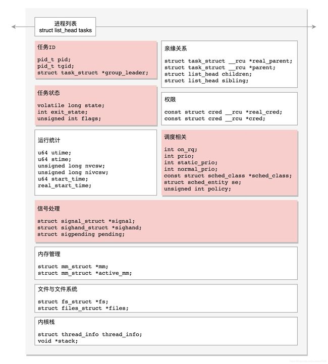
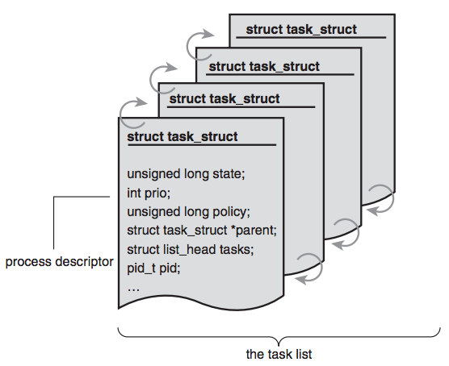
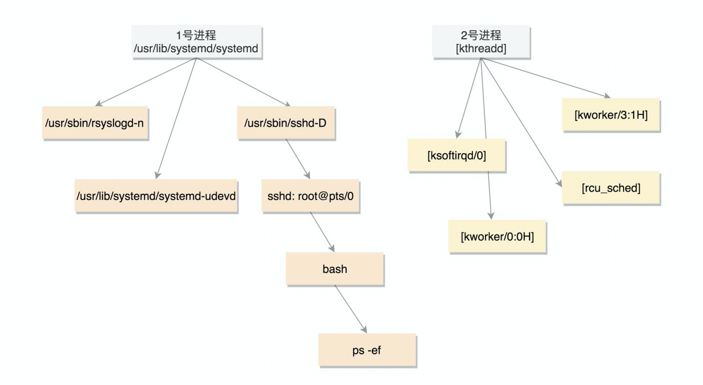
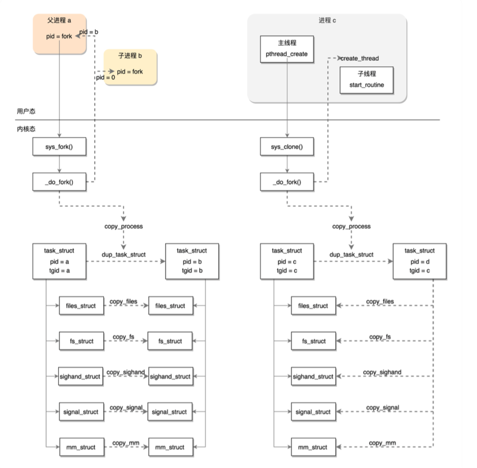

# 进程与线程区别

## 概念

### 1. 进程

进程指的是正在运行中的程序。

> 程序是一些保存在磁盘上的指令的有序集合，是静态的。进程是程序执行过程，包括了动态创建、调度和消亡的整个过程。
>
> 程序编译后的可执行文件是放在磁盘上的，执行时首先将进程加载到内存中然后再放到寄存器中，最后让CPU执行程序，一个静态的程序就变成了进程。

* 用户角度：进程是程序的一次动态执行过程
* 操作系统：进程是操作系统分配资源的最小单位

### 2. 线程

每个进程都有独立的代码和数据空间（程序上下文），程序之间的切换会有较大的开销；线程可以看做轻量级的进程，同一类线程共享代码和数据空间，每个线程都有自己独立的运行栈和程序计数器，线程之间切换的开销小。所以线程的创建、销毁、调度性能远远优于进程。

### 3. 关联

进程负责分配和管理系统资源，线程负责CPU调度运算，也是CPU切换时间片的最小单位。对于任何一个进程来讲，即便我们没有主动去创建线程，进程也是默认有一个主线程的。

## Linux中的线程与进程

### 1. Task

Linux内核中并不明确区分进程和线程，它们统一都被称为Task。每个Task由一个统一的结构`task_struct`进行管理，这个`task_struct` 数据结构非常复杂，囊括了进程管理生命周期中的各种信息。

Linux中有一个任务列表包含了所有的Task：

### 2. fork创建进程与clone创建线程

我们一般都是通过`fork()`系统调用来创建新的进程，它包含两个重要的事件：

1. 将`task_struct`结构复制一份并且初始化
2. 试图唤醒新创建的子进程

在Linux操作系统内核初始化时会创建第一个进程，即0号创始进程。随后会初始化1号进程（用户进程祖宗：/usr/lib/systemd/systemd），2号进程（内核进程祖宗：[kthreadd]），其后所有的进程线程都是在他们的基础上fork出来的。

创建进程时，系统调用`fork()`会将五大数据结构`files_struct`、`fs_struct`、`sighand_struct`、`signal_struct`和`mm_struct`都复制一遍，从此父进程和子进程各用各的数据结构。

而创建线程时调用的是系统调用`clone()`，五大结构仅仅是引用计数+1，即线程共享进程的数据结构。

## 区别

### 1. 线程与进程

**调度**：线程是CPU调度的基本单位；进程是操作系统分配和管理资源的基本单位

**并发**：不仅进程之间可以并发执行，同一个进程的多个线程之间也可以并发执行

**资源**：进程是拥有资源的一个独立单位，线程不拥有系统资源，但可以访问隶属于进程的资源

**系统开销**：进程创建、销毁和切换的系统开销要明显大于线程

### 2. 多线程与多进程

| 对比维度         | 多进程                                                       | 多线程                                               | 总结     |
| ---------------- | ------------------------------------------------------------ | ---------------------------------------------------- | -------- |
| 数据共享和同步   | 数据共享复杂、需要使用IPC；数据是独立的，同步简单            | 数据本身就是共享的，但也正是由于这个原因导致同步复杂 | 各有优势 |
| 内存和CPU        | 占用内存多、切换复杂、CPU利用率低                            | 占用内存少、切换简单、CPU利用率高                    | 线程占优 |
| 创建、销毁和切换 | 复杂、速度慢                                                 | 简单、速度快                                         | 线程占优 |
| 编程和调试       | 简单                                                         | 复杂                                                 | 进程占优 |
| 可靠性           | 进程间互不影响                                               | 一个线程挂掉将导致整个进程挂掉                       | 进程占优 |
| 分布式           | 适用于多核、多机分布式，如果一台机器不够可以简单扩展到多台机器 | 适用于多核分布式                                     | 进程占优 |

## Reference

[1] <https://zhuanlan.zhihu.com/p/433518016>

[2] <https://zhuanlan.zhihu.com/p/62862633>
