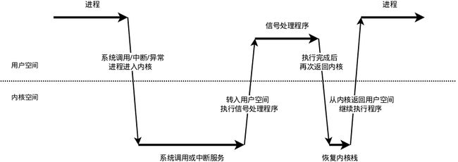

# 信号处理流程

## 信号本质

软中断信号（signal，又简称为信号）用来通知进程发生了异步事件。在软件层次上是对中断机制的一种模拟，在原理上，一个进程收到一个信号与处理器收到一个中断请求可以说是一样的。**信号是进程间通信机制中唯一的异步通信机制**，一个进程不必通过任何操作来等待信号的到达，事实上，进程也不知道信号到底什么时候到达。

## 信号来源

### 1. 硬件来源

* 用户按终端键，引起终端产生的信号（如：CTRL+C、CTRL+\，CTRL+Z等）
* 硬件异常产生信号：内核检测到段错误、管道破裂等、除数为0、无效的内存引用等。这些条件通常由硬件检测到，并将其通知内核。然后内核为该条件发生时正在运行的进程产生相应的信号。

### 2. 软件来源

* kill命令以及进程之间可以互相通过系统调用kill发送软中断信号；

## 可靠信号和不可靠信号

Linux信号的编号是从1-64，其中32和33空缺，没有对应的信号。通过`kill -l`可查看所有的信号。

```bash
$kill -l
 1) SIGHUP       2) SIGINT       3) SIGQUIT      4) SIGILL       5) SIGTRAP
 6) SIGABRT      7) SIGBUS       8) SIGFPE       9) SIGKILL     10) SIGUSR1
11) SIGSEGV     12) SIGUSR2     13) SIGPIPE     14) SIGALRM     15) SIGTERM
16) SIGSTKFLT   17) SIGCHLD     18) SIGCONT     19) SIGSTOP     20) SIGTSTP
21) SIGTTIN     22) SIGTTOU     23) SIGURG      24) SIGXCPU     25) SIGXFSZ
26) SIGVTALRM   27) SIGPROF     28) SIGWINCH    29) SIGIO       30) SIGPWR
31) SIGSYS      34) SIGRTMIN    35) SIGRTMIN+1  36) SIGRTMIN+2  37) SIGRTMIN+3
38) SIGRTMIN+4  39) SIGRTMIN+5  40) SIGRTMIN+6  41) SIGRTMIN+7  42) SIGRTMIN+8
43) SIGRTMIN+9  44) SIGRTMIN+10 45) SIGRTMIN+11 46) SIGRTMIN+12 47) SIGRTMIN+13
48) SIGRTMIN+14 49) SIGRTMIN+15 50) SIGRTMAX-14 51) SIGRTMAX-13 52) SIGRTMAX-12
53) SIGRTMAX-11 54) SIGRTMAX-10 55) SIGRTMAX-9  56) SIGRTMAX-8  57) SIGRTMAX-7
58) SIGRTMAX-6  59) SIGRTMAX-5  60) SIGRTMAX-4  61) SIGRTMAX-3  62) SIGRTMAX-2
63) SIGRTMAX-1  64) SIGRTMAX
```

* 1~31之间的信号叫做非实时信号, 不支持排队, 信号可能会丢失, 也叫做不可靠信号。
* 34~64之间的信号叫做实时信号, 支持排队, 信号不会丢失, 也叫做可靠信号。

### 1. 不可靠信号问题

不可靠信号主要有以下问题：

* 每次信号处理完之后，就会恢复成默认处理，这可能是调用者不希望看到的（早期的signal函数，linux2.6.35.6内核经验证已经不再恢复默认动作）。
* 存在信号丢失的问题（进程收到的信号不作排队处理，相同的信号多次到来会合并为一个）。

现在的Linux对信号机制进行了改进，因此，不可靠信号主要是指信号丢失。

### 2. 注册机制

* 可靠信号注册机制：内核每收到一个可靠信号都会去注册这个信号，在信号的未决信号链中分配sigqueue结构，因此，不会存在信号丢失的问题。
* 不可靠信号注册机制：而对于不可靠的信号，如果内核已经注册了这个信号，那么便不会再去注册，对于进程来说，便不会知道本次信号的发生。

## 信号在内核的表示

在linux里面每个进程都是按照进程描述符`task_struct`结构创建的，在进程描述符`task_struct`里面，有一项是`Signal_Struct`。`Signal_Strct`这里面有一项`list_head`的描述符，在这里面有一个`sigset_t`表，定义了**64种信号**的所代表的含义。也就是说在每个进程中，都有一个表，里面存着各种信号所代表的含义。

## 信号处理机制

接收到信号的进程对各种信号有三类不同的处理方法：

* 捕捉信号处理，类似中断的处理程序，对于需要处理的信号，进程可以指定处理函数，由该函数来处理。
* 忽略某个信号，对该信号不做任何处理，就象未发生过一样。但有两种信号不能被忽略SIGKILL，SIGSTOP。
* 对该信号的处理保留系统的默认值，这种缺省操作，对大部分的信号的缺省操作是使得进程中止。

## 信号处理过程

既然信号是异步的，这就涉及信号何时接收、何时处理的问题。

我们知道，函数运行在用户态，当遇到系统调用、中断或是异常的情况时，程序便需要进入内核态。信号涉及到了这两种状态之间的转换，过程可以先看一下下面的示意图：



我们把这个过程拆分成信号的接收、检测、处理三个步骤。

### 1. 信号接收

接收信号的任务是由内核代理的，当内核接收到信号后，会将其放到对应进程的信号队列中，**同时向进程发送一个中断，使其陷入内核态**。我们将进程刚接收到信号并未处理的那种状态称为信号未决（Pending）。

注意，此时信号还只是在队列中，对进程来说暂时是不知道有信号到来的。

### 2. 信号检测

进程陷入内核态后，有两种场景会对信号进行检测：

* 进程从内核态返回到用户态前进行信号检测
* 进程在内核态中，从睡眠状态被唤醒的时候进行信号检测

当发现有新信号时，便会进入下一步，信号的处理。

### 3. 信号处理

**信号处理函数是运行在用户态的**，**之所以如此是由于若处于内核态程序便拥有过高的权利会对系统有潜在的危险**，故调用处理函数前，内核会将当前内核栈的内容备份拷贝到用户栈上，并且修改指令寄存器（eip）将其指向信号处理函数。

接下来进程返回到用户态中，执行相应的信号处理函数。

**信号处理函数执行完成后，还需要返回内核态，检查是否还有其它信号未处理。如果所有信号都处理完成，就会将内核栈恢复（从用户栈的备份拷贝回来），同时恢复指令寄存器（eip）将其指向中断前的运行位置，最后回到用户态继续执行进程。**

至此，一个完整的信号处理流程便结束了，如果同时有多个信号到达，上面的处理流程会在第2步和第3步骤间重复进行。

## 未决信号和阻塞信号

执行信号的处理动作称为信号递达（Delivery），信号从产生到递达之间的状态，称为信号未决（Pending）。

信号的“未决”是一种状态，指的是从信号的产生到信号被处理前的这一段时间；信号的“阻塞”是一个开关动作，指的是阻止信号被处理，但不是阻止信号产生。

进程可以选择阻塞（Block）某个信号。被阻塞的信号产生时将保持在未决状态，直到进程解除对此信号的阻塞，才执行递达的动作。**注意，阻塞和忽略是不同，只要信号被阻塞就不会递达，而忽略是在递达之后可选的一种处理动作。**

## 信号安装

如果进程要处理某一信号，那么就要在进程中安装该信号。安装信号主要用来确定信号值及进程针对该信号值的动作之间的映射关系，即进程将要处理哪个信号；该信号被传递给进程时，将执行何种操作。

```c
#include <signal.h>

void (*signal(int signum, void (*handler))(int)))(int);
```

第一个参数指定信号的值，第二个参数指定针对前面信号值的处理，可以忽略该信号（参数设为SIG_IGN）；可以采用系统默认方式处理信号(参数设为SIG_DFL)；也可以自己实现处理方式(参数指定一个函数地址)。

## Reference

[1] <https://blog.csdn.net/Chasing__Dreams/article/details/106304765>
