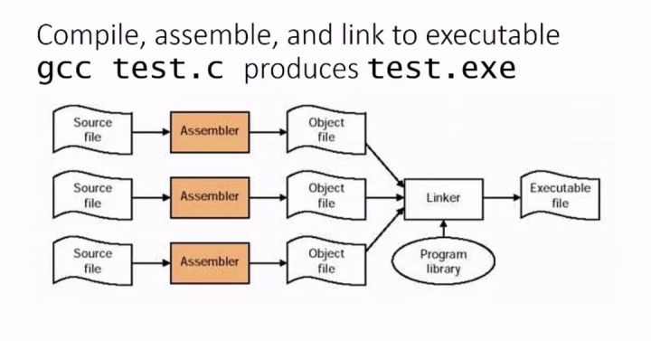
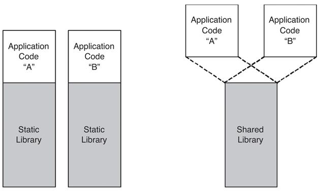

# 静态链接与动态链接

## 库

库是写好的现有的，成熟的，可以复用的代码。现实中每个程序都要依赖很多基础的底层库，不可能每个人的代码都从零开始，因此库的存在意义非同寻常。本质上来说库是一种可执行代码的二进制形式，可以被操作系统载入内存执行。

库有两种：

- **静态库（.a、.lib）**
- **动态库（.so、.dll）**

在一个程序的编译过程中，分为以下几个步骤：**预处理**，**编译**，**汇编**，**链接**。本文中讨论的链接库就是针对最后一个步骤「链接」而言的。

## 动态库和静态库区别

左图为静态链接库，右图为动态链接库：

对于静态链接库而言在链接阶段，会将汇编生成的「目标文件.o」与引用到的库一起链接打包到可执行文件中。因此对应的链接方式称为静态链接：

- 程序在运行时与静态链接库就没有任何的联系。
- 它比较浪费空间和资源，因为所有相关的目标文件与牵涉到的函数库被链接合成一个可执行文件。
- 静态库对程序的更新和发布也会带来麻烦。如果静态库更新了，所有使用它的应用程序都需要重新编译、部署、发布给用户。

静态链接可以理解为最后生成了一个「单文件免安装绿色版」的程序，优点在于移植的时候只需要移动这一个文件，缺点在于文件体积非常大，为了解决这样的问题，就有了动态链接库。动态链接库在程序编译时并不会被连接到目标代码中，而是在程序运行时才被载入。

- 不同的应用程序如果调用相同的库，那么在内存里只需要有一份该共享库的实例，可以实现进程之间的资源共享。（因此动态库也称为共享库）规避了空间浪费问题。
- 动态库在程序运行时才被载入，也解决了静态库对程序的更新、部署和发布带来的麻烦。用户只需要更新动态库即可将一些程序升级变得简单，增量更新。

动态库连接到系统空间，如果多个程序连接了同一个库，那么只需要一份，优点在于编译程序的时候不会将对应的库文件全部打包在生成的程序中，而是保留了到对应库的链接，缺点就是移植的时候如果只移动了对应的程序没有安装相关的库的话，程序就无法正常运行。

## Reference

[1] <https://zhuanlan.zhihu.com/p/83716863>
