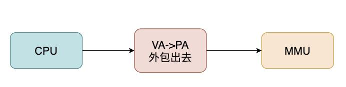
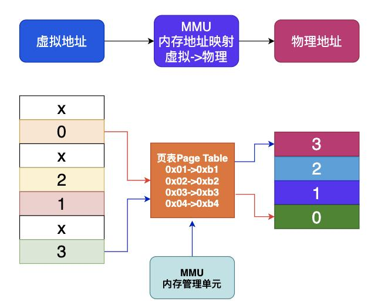
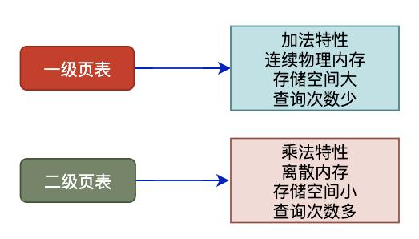
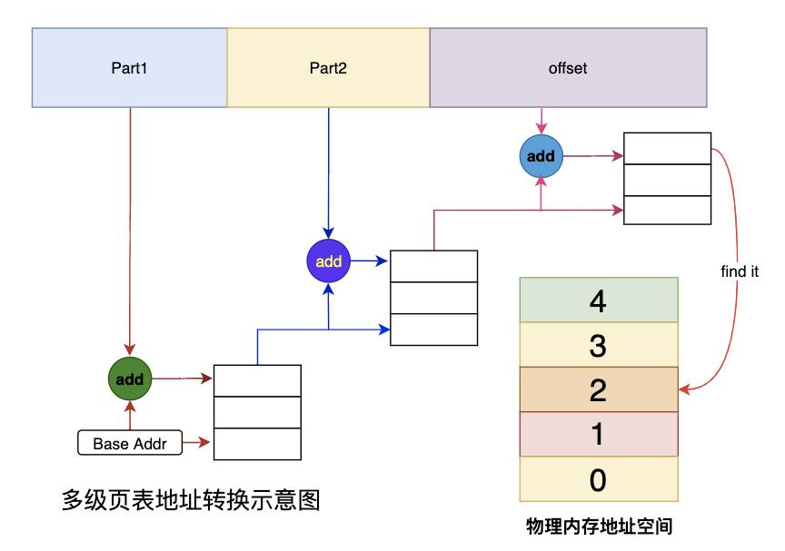

# MMU地址翻译的具体流程

## CPU通过MMU获取内存数据

CPU并不直接和物理内存打交道，而是把地址转换的活外包给了MMU，MMU是一种硬件电路，其速度很快，主要工作是进行内存管理，地址转换只是它承接的业务之一。

## MMU和Page Table

每个进程都会有自己的页表Page Table，页表存储了进程中虚拟地址到物理地址的映射关系，所以就相当于一张地图，MMU收到CPU的虚拟地址之后开始查询页表，确定是否存在映射以及读写权限是否正常，如图：

## 一级页表和二级页表

对于4GB虚拟内存和4KB页而言，一级页表将包含$$2^{20}$$个表项。页表占有连续内存且存储空间大，多级页表可以有效降低页表的存储空间以及内存连续性要求，但是多级页表也带来了查询效率问题。

我们以2级页表为例，MMU要先进行两次页表查询确定物理地址，在确认了权限等问题后，MMU再将这个物理地址发送到总线，内存收到之后开始读取对应地址的数据并返回。

MMU在2级页表的情况下进行了2次检索和1次读写，那么当页表变为N级时，就变成了N次检索+1次读写。

可见，页表级数越多查询的步骤越多，对于CPU来说等待时间越长，效率越低，这个问题还需要优化才行。

## 小结

* 页表存在于进程的内存之中，MMU收到虚拟地址之后查询Page Table来获取物理地址。
* 单级页表对连续内存要求高，于是引入了多级页表，但是**多级页表也是一把双刃剑**，在减少连续存储要求且减少存储空间的同时降低了查询效率。
