# 缺页处理过程

## 术语

* **VA（Virtual Address）**：虚拟地址
* **PA（Physical Address）**：物理地址
* **MMU（Memory Manage Unit）**：内存管理单元
* **TLB（Translation Lookaside Buffer）**：旁路快表缓存/地址变换高速缓存
* **PTE（Page Table Entry）**：分页表项

## 内存惰性分配

### 1. 介绍

以32位的Linux系统为例，每个进程独立拥有4GB的虚拟地址空间，根据局部性原理没有必要也不可能为每个进程分配4GB的物理地址空间。

64位系统也是一样的道理，只不过空间寻址范围大了很多很多倍，进程的虚拟地址空间会分为几个部分：

> 文件映射区：进程打开文件后将文件内容从硬盘读到进程的文件映射区，之后就直接在内存中操作这个文件，读写完了之后在保存时再将内存中的文件写到硬盘中。

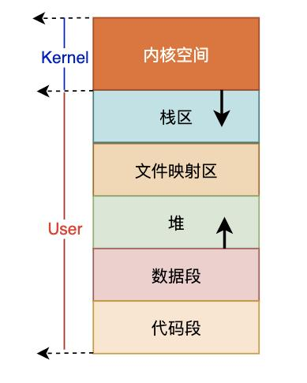

实际上只有程序运行时用到了才去内存中寻找虚拟地址对应的页帧，找不到才可能进行分配，这就是内存的惰性(延时)分配机制。

对于一个运行中的进程来说，不是所有的虚拟地址在物理内存中都有对应的页，如图展示了部分虚拟地址存在对应物理页的情况：

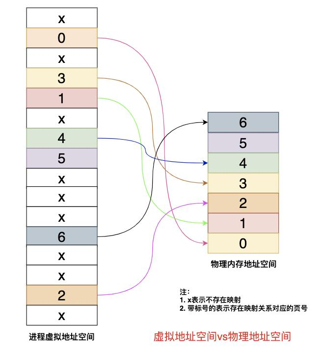

虚拟地址空间根据固定大小一般是4KB进行划分，物理内存可以设置不同的页面大小，通常物理页大小和虚拟页大小是一样的，本文按照物理页4KB大小展开。

经过前面的分析，我们将面临一个问题：**如何将虚拟地址准确快速地映射到物理页呢**?

### 2. 小结

* Linux的虚拟地址空间就是**空头支票**，看着很大但是实际对应的物理空间只有很少的一部分。

* 内存的**惰性分配**是个有效的机制，可以保证内存利用率和服务器利用率，是资源合理配置的方法。

* 大量的虚拟地址到物理地址的**快速准确地查询转换**是一个难题。

## CPU通过MMU获取内存数据

CPU并不直接和物理内存打交道，而是把地址转换的活外包给了MMU，MMU是一种硬件电路，其速度很快，主要工作是进行内存管理，地址转换只是它承接的业务之一。

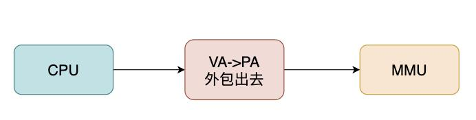

### 1. MMU和Page Table

每个进程都会有自己的页表Page Table，页表存储了进程中虚拟地址到物理地址的映射关系，所以就相当于一张地图，MMU收到CPU的虚拟地址之后开始查询页表，确定是否存在映射以及读写权限是否正常，如图：

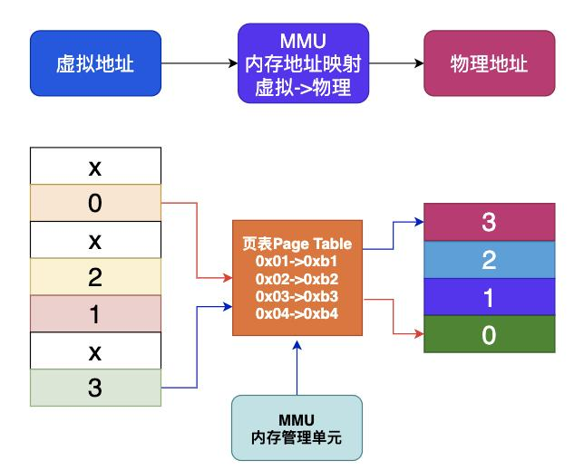

### 2. 一级页表和二级页表

对于4GB虚拟内存和4KB页而言，一级页表将包含$$2^{20}$$个表项。页表占有连续内存且存储空间大，多级页表可以有效降低页表的存储空间以及内存连续性要求，但是多级页表也带来了查询效率问题。

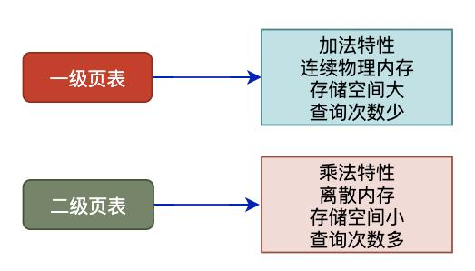

我们以2级页表为例，MMU要先进行两次页表查询确定物理地址，在确认了权限等问题后，MMU再将这个物理地址发送到总线，内存收到之后开始读取对应地址的数据并返回。

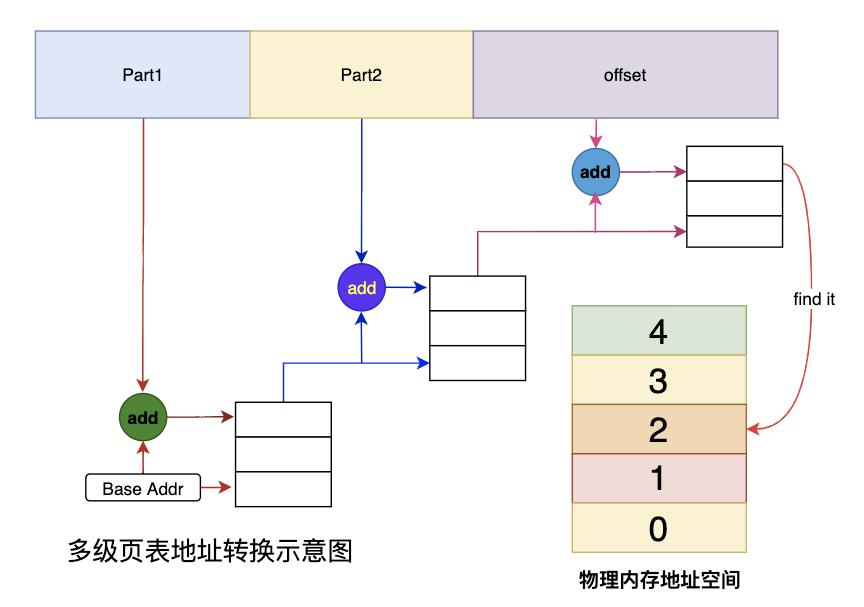

MMU在2级页表的情况下进行了2次检索和1次读写，那么当页表变为N级时，就变成了N次检索+1次读写。

可见，页表级数越多查询的步骤越多，对于CPU来说等待时间越长，效率越低，这个问题还需要优化才行。

### 3. 小结

* 页表存在于进程的内存之中，MMU收到虚拟地址之后查询Page Table来获取物理地址。
* 单级页表对连续内存要求高，于是引入了多级页表，但是**多级页表也是一把双刃剑**，在减少连续存储要求且减少存储空间的同时降低了查询效率。

## TLB

### 1. 介绍

当CPU给MMU传新虚拟地址之后，MMU先去问TLB那边有没有，如果有就直接拿到物理地址发到总线给内存。

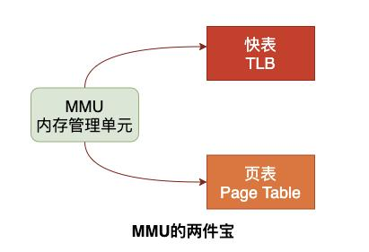

TLB容量比较小，难免发生Cache Miss，这时候MMU还有保底的老武器页表 Page Table，在页表中找到之后MMU除了把地址发到总线传给内存，还把这条映射关系给到TLB，让它记录一下刷新缓存。

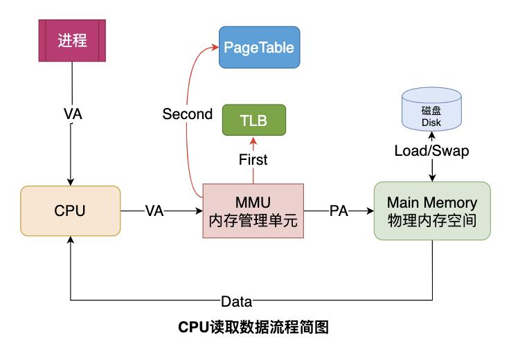

TLB容量不满的时候就直接把新记录存储了，当满了的时候就开启了淘汰大法把旧记录清除掉，来保存新记录，彷佛完美解决了问题。

### 2. 小结

* CPU要根据用户进程提供的虚拟地址来获取真实数据，但是它并不自己做而是交给了MMU**。**
* MMU也是个聪明的家伙，集成了TLB来存储CPU最近常用的页表项来加速寻址，TLB找不到再去全量页表寻址，可以认为TLB是MMU的缓存。
* TLB的容量毕竟有限，为此必须依靠Page Table一起完成TLB Miss情况的查询，并且更新到TLB建立新映射关系。

## 缺页异常Page Fault

### 1. 介绍

假如目标内存页在物理内存中**没有对应的页帧或者存在但无对应权限**，**CPU 就无法获取数据**，这种情况下**CPU就会报告一个缺页错误**。**它是一个由硬件中断触发的可以由软件逻辑纠正的错误**。

由于CPU没有数据就无法进行计算，CPU罢工了**用户进程也就出现了缺页中断**，进程会从用户态切换到内核态，并将缺页中断交给内核的 **Page Fault Handler** 处理。

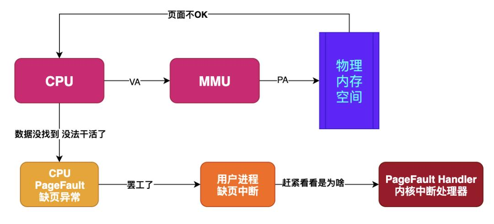

### 2. 缺页异常处理方法

缺页中断会交给PageFaultHandler处理，其根据缺页中断的不同类型会进行不同的处理：

* **Hard Page Fault**：也被称为Major Page Fault，翻译为硬缺页错误/主要缺页错误，这时物理内存中没有对应的页帧，需要CPU打开磁盘设备读取到物理内存中，再让MMU建立VA和PA的映射。
* **Soft Page Fault**：也被称为Minor Page Fault，翻译为软缺页错误/次要缺页错误，这时物理内存中是存在对应页帧的，只不过可能是其他进程调入的，发出缺页异常的进程不知道而已，此时MMU只需要建立映射即可，无需从磁盘读取写入内存，一般出现在多进程共享内存区域。
* **Invalid Page Fault**：翻译为无效缺页错误，比如进程访问的内存地址越界访问，又比如对空指针解引用内核就会报segment fault错误中断进程直接挂掉。

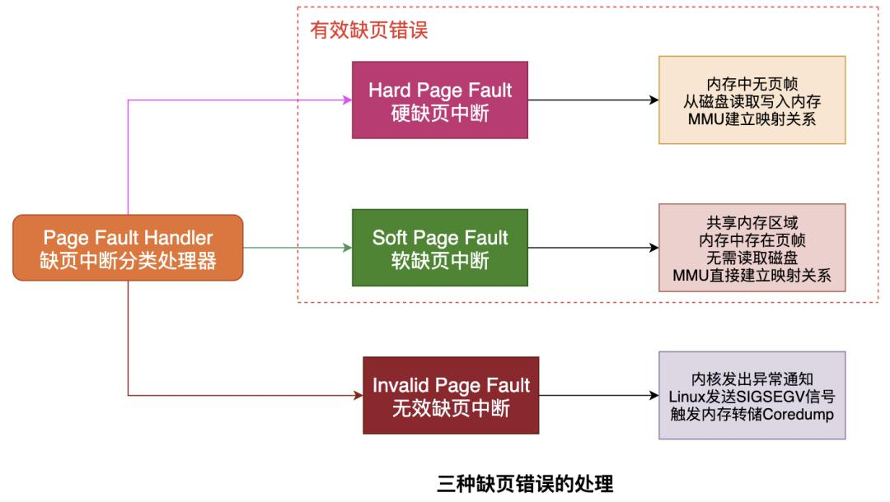

### 3. 缺页异常原因

不同类型的Page Fault出现的原因也不一样，常见的几种原因包括：

* **非法操作访问越界**：这种情况产生的影响也是最大的，也是Coredump的重要来源，比如空指针解引用或者权限问题等都会出现缺页错误。
* **使用malloc新申请内存**：malloc机制是延时分配内存，当使用malloc申请内存时并未真实分配物理内存，等到真正开始使用malloc申请的物理内存时发现没有才会启动申请，期间就会出现Page Fault。
* **访问数据被swap换出**：物理内存是有限资源，当运行很多进程时并不是每个进程都活跃，对此OS会启动内存页面置换将长时间未使用的物理内存页帧放到swap分区来腾空资源给其他进程，当存在于swap分区的页面被访问时就会触发Page Fault从而再置换回物理内存。

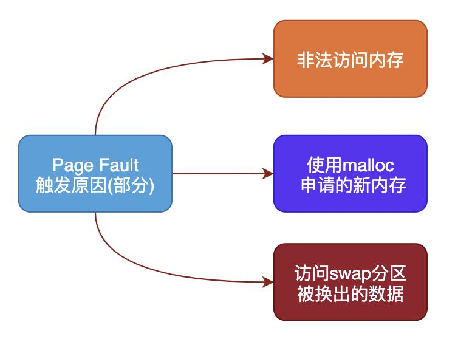

### 4. 小结

触发Page Fault的原因可能有很多，归根到底也只有几种大类：

* 如使用共享内存区域，没有存储VA->PA的映射但是存在物理页帧的软缺页错误，在Page Table/TLB中建立映射关系即可。
* 访问的地址在物理内存中确实不存在，需要从磁盘/swap分区读入才能使用，这种性能影响会比较大，因为磁盘太慢了，尽量使用高性能的SSD来降低延时。
* 访问的地址内存非法，缺页错误会升级触发SIGSEGV信号结束进程，这种属于可以导致进程挂掉的一种缺页错误。

## Reference

[1] <https://www.pianshen.com/article/62511549621/>
