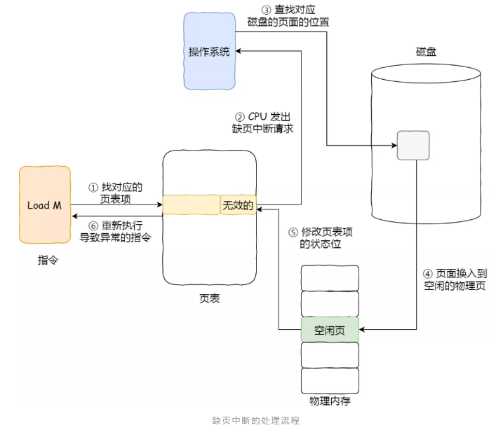
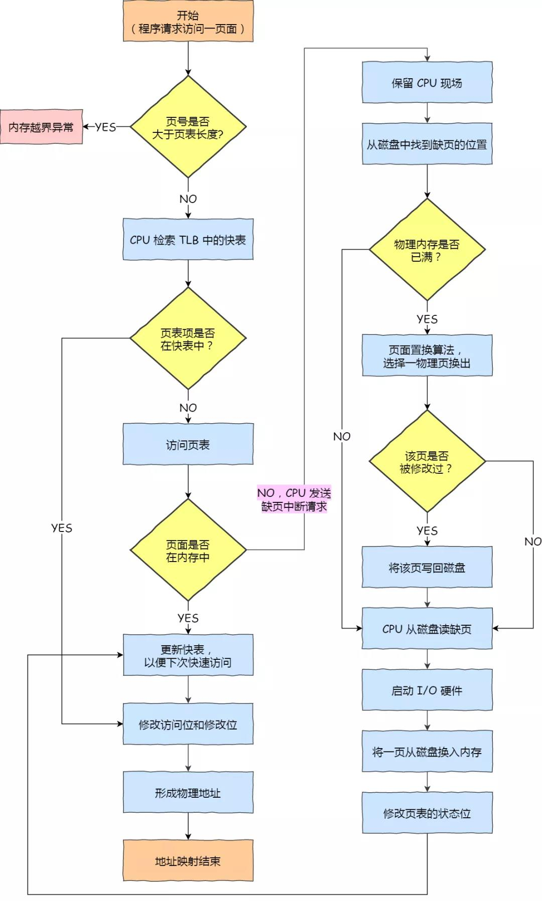
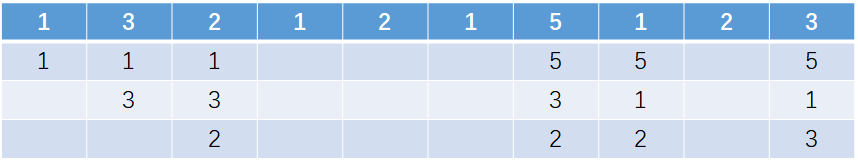
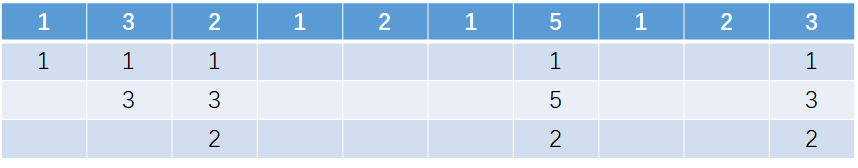

# 缺页置换算法

## 缺页异常

在了解内存页面置换算法前，我们得先谈一下**缺页异常（缺页中断）**。

当 CPU 访问的页面不在物理内存时，便会产生一个缺页中断，请求操作系统将所缺页调入到物理内存。那它与一般中断的主要区别在于：

- 缺页中断在指令执行「期间」产生和处理中断信号，而一般中断在一条指令执行「完成」后检查和处理中断信号。
- 缺页中断返回到该指令的开始重新执行「该指令」，而一般中断返回回到该指令的「下一个指令」执行。

我们来看一下缺页中断的处理流程，如下图：

1. 在 CPU 里访问一条 `Load M` 指令，然后 `CPU` 会去找 M 所对应的页表项。
2. 如果该页表项的状态位是「有效的」，那 CPU 就可以直接去访问物理内存了，如果状态位是「无效的」，则 CPU 则会发送缺页中断请求。
3. 操作系统收到了缺页中断，则会执行缺页中断处理函数，先会查找该页面在磁盘中的页面的位置。
4. 找到磁盘中对应的页面后，需要把该页面换入到物理内存中，但是在换入前，需要在物理内存中找空闲页，如果找到空闲页，就把页面换入到物理内存中。
5. 页面从磁盘换入到物理内存完成后，则把页表项中的状态位修改为「有效的」。
6. 最后，CPU 重新执行导致缺页异常的指令。

上面所说的过程，第 4 步是能在物理内存找到空闲页的情况，那如果找不到呢？

找不到空闲页的话，就说明此时内存已满了，这时候，就需要「页面置换算法」选择一个物理页

- 如果该物理页有被修改过（脏页），则把它换出到磁盘
- 然后把该被置换出去的页表项的状态改成「无效的」，最后把正在访问的页面装入到这个物理页中。

## 虚拟内存管理

这里整理了虚拟内存的管理整个流程，你可以从下面这张图看到：

- 所以，页面置换算法的功能是，**当出现缺页异常，需调入新页面而内存已满时，选择被置换的物理页面**
- 也就是说选择一个物理页面换出到磁盘，然后把需要访问的页面换入到物理页。

## 页面置换算法

### 1. 先进先出（FIFO）

> 把内存中驻留时间最久的页面置换算法予以淘汰。

在分页中，采用FIFO页面置换算法，序列 1、3、2、1、2、1、5、1、2、3，当物理块为3时，计算缺页次数和缺页率？

算法执行如下操作步骤：

1. 程序运行，将1、3、2三个页面装入内存
2. 接着1、2、1已经有存在内存，不必产生缺页中断
3. 访问页面5时，内存中不存在该页面，发生缺页中断，根据FIFO算法，先进先出，将1置换出去
4. 访问页面1时，内存中不存在该页面，发生缺页中断，根据FIFO算法，先进先出，将页面3置换出去
5. 访问页面3时，内存中不存在该页面，发生缺页中断，根据FIFO算法，先进先出，将2置换出去

总共进行了三次页面置换，所以**缺页数**=3+3=6，**缺页率**为6/10=0.6。

**优点**：先进先出算法实现简单，是最直观的一个算法
**缺点**：性能最差，可能出现Belady 异常：**当所分配的物理块数增大而页故障数不减反增的异常现象**

### 2. 最近最久未使用算法（LRU）

> 选择最近且最久未被使用的页面进行淘汰。

在分页中，采用LRU页面置换算法，序列 1、3、2、1、2、1、5、1、2、3，当物理块为3时，计算缺页次数和缺页率？

算法执行如下操作步骤：

1. 程序运行，将1、3、2三个页面装入内存
2. 接着1、2、1已经有存在内存，不必产生缺页中断
3. 访问页面5时，内存中不存在该页面，发生缺页中断，根据LRU算法，页面1、3、2中3最近且最久未被使用，将3置换出去
4. 访问页面3时，内存中不存在该页面，发生缺页中断，根据LRU算法，页面5、1、2中5最久未被使用，将页面5置换出去

总共进行了两次页面置换，所以**缺页数**=3+2=5，**缺页率**为5/10=0.5。

**优点**：LRU性能较好。

**缺点**：需要寄存器和栈的硬件支持。

> LRU是堆栈类的算法。理论上可以证明，堆栈类算法不可能出现Belady异常。FIFO算法基于队列实现，不是堆栈类算法。

### 3. 最佳置换算法（OPT）

> 当要调入一页而必须淘汰旧页时，应该淘汰以后不再访问的页，或距现在最长时间后要访问的页面，**即被淘汰页面是以后永不使用或最长时间内不再访问的页面**。

在分页中，采用OPT页面置换算法，序列 1、3、2、1、2、1、5、1、2、3，当物理块为3时，计算缺页次数和缺页率？

算法执行如下操作步骤：

1. 程序运行，将1、3、2三个页面装入内存
2. 接着1、2、1已经有存在内存，不必产生缺页中断
3. 访问页面5时，内存中不存在该页面，发生缺页中断，根据OPT算法，页面1、3、2中3最长时间内不被访问，将3置换出去
4. 访问页面3时，内存中不存在该页面，发生缺页中断，根据OPT算法，将5置换出去

总共进行了两次页面置换，所以**缺页数**=3+2=5，**缺页率**为5/10=0.5。

最佳置换算法很理想，但是实际系统中无法实现，因为程序访问页面时是动态的，我们是无法预知每个页面在「下一次」访问前的等待时间。所以，最佳页面置换算法作用是为了衡量你的算法的效率，你的算法效率越接近该算法的效率，那么说明你的算法是高效的。

## Reference

[1] <https://blog.csdn.net/cckluv/article/details/113405250>

[2] <http://zhuuu.work/2020/10/22/Linux/Linux-10-%E5%86%85%E5%AD%98%E9%A1%B5%E9%9D%A2%E7%BD%AE%E6%8D%A2%E7%AE%97%E6%B3%95/>
