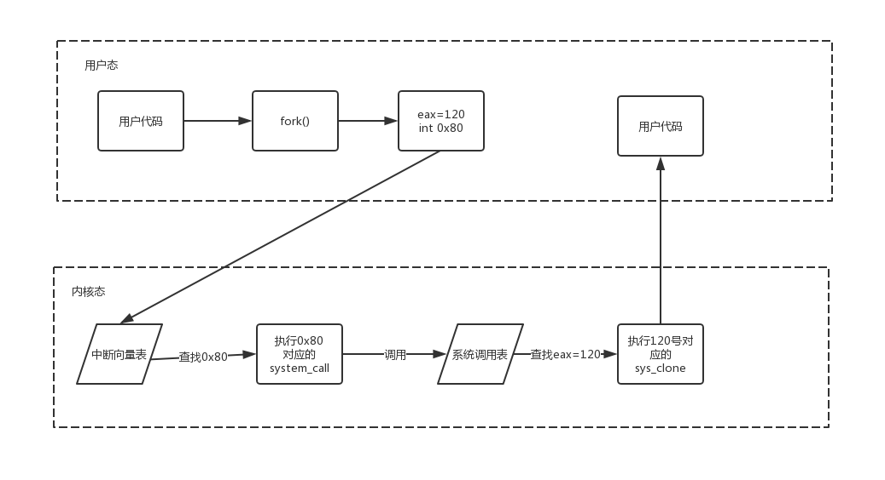

# 系统调用

## 基础知识

### 1. CPU特权级别

**一般而言CPU的特权级别共有4个，编号从Ring 0（最高特权）到Ring 3（最低特权），Linux操作系统只用到Ring 0（内核态）和Ring 3（用户态）。**

### 2. 中断

**中断包含两个属性：**中断号**和**中断处理程序**。不同的中断有不同的中断号，每个中断号都对应了一个中断处理程序**（内核中的中断向量表映射了这个对应关系）。

当中断到来时，CPU会暂停正在执行的代码，根据中断号去中断向量表找到对应的中断处理程序并调用，中断处理程序执行完成后会继续执行之前的代码。

中断分为硬件中断和软件中断，系统调用中的中断指的是后者。**软件中断通常是一条指令，使用这条指令的用户可以手动触发某个中断。例如在i386下软件中断的指令是int，在int后指定对应的中断号，比如int 0x80表示调用第0x80的中断处理程序。**

中断号是有限的，所以不会用一个中断号来对应一个系统调用。Linux下用int 0x80触发所有的系统调用，在触发中断之前将系统调用号放入到一个固定的寄存器，0x80对应的中断处理程序会读取该寄存器的值，进而决定执行哪个系统调用的代码。

## 概述

在现代操作系统中系统资源可能被多个应用程序访问，如果不加以保护那么各个应用程序之间可能产生冲突，恶意应用程序甚至可能导致系统崩溃。**这里提到的系统资源包括文件、网络和各种硬件设备等，通过操作系统提供的api访问系统资源就被称为系统调用。**

## 为什么需要系统调用

linux内核中设置了一组用于实现系统功能的子程序，称为系统调用。系统调用和普通库函数调用非常相似，**只是系统调用由操作系统核心提供，运行于**内核态****，而普通的函数调用由函数库或用户自己提供，运行于**用户态**。

系统调用在用户空间进程和硬件设备之间添加了一个中间层。该层主要作用有三个：

1. **它为用户空间提供了一种统一的硬件的抽象接口**。比如当需要读些文件的时候，应用程序就可以不去管磁盘类型和介质，甚至不用去管文件所在的文件系统到底是哪种类型。
2. **系统调用保证了系统的稳定和安全**。作为硬件设备和应用程序之间的中间人，内核可以基于权限和其他一些规则对需要进行的访问进行裁决。举例来说，这样可以避免应用程序不正确地使用硬件设备，窃取其他进程的资源，或做出其他什么危害系统的事情。
3. 每个进程都运行在虚拟系统中，而在用户空间和系统的其余部分提供这样一层公共接口，也是出于这种考虑。如果应用程序可以随意访问硬件而内核又对此一无所知的话，几乎就没法实现多任务和虚拟内存，当然也不可能实现良好的稳定性和安全性。**在Linux中，系统调用是用户空间访问内核的唯一手段**；**除异常和中断外，它们是内核惟一的合法入口**。

## 参数传递

除了系统调用号以外，大部分系统调用都还需要一些外部的参数输人。所以，在发生异常的时候，应该把这些参数从用户空间传给内核。最简单的办法就是像传递系统调用号一样把这些参数也存放在寄存器里。**在x86系统上，ebx, ecx, edx, esi和edi按照顺序存放前五个参数。需要六个或六个以上参数的情况不多见，此时，应该用一个单独的寄存器存放指向所有这些参数在用户空间地址的指针。**

**给用户空间的返回值也通过寄存器传递。在x86系统上，它存放在eax寄存器中。**接下来许多关于系统调用处理程序的描述都是针对x86版本的。但不用担心，所有体系结构的实现都很类似。

## 系统调用过程

Linux在x86上的系统调用通过 int 80实现，用系统调用号来区分入口函数。

操作系统实现系统调用的基本过程是：

1. 应用程序调用库函数API
2. API将系统调用号存入EAX，**然后中断调用使系统进入内核态**
3. 内核的中断处理函数根据系统调用号，调用对应的内核函数（系统调用）
4. 系统调用完成相应功能，将返回值存入EAX，返回到中断处理函数
5. 中断处理函数返回到API中
6. API将EAX返回给应用程序

应用程序调用系统调用的过程是：

1. **把系统调用的编号存入EAX**
2. **把函数参数存入其他通用寄存器**
3. **触发0x80号中断（int 0x80）**

