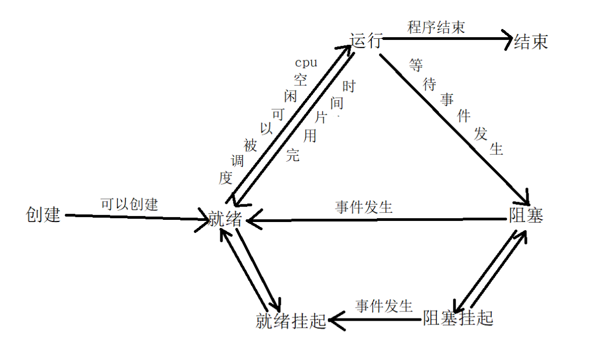

# 孤儿进程与僵尸进程

## 进程状态

程序运行必须加载在内存中，当有过多的就绪态或阻塞态进程在内存中没有运行，因为内存很小，有可能不足。系统需要把他们移动到内存外磁盘中，称为挂起状态。就绪状态的进程挂起就是挂起就绪状态，阻塞进程挂起就称为阻塞挂起状态。



每个进程的产生都有自己的唯一的ID号（pid），并且附带有一个它父进程的ID号（ppid）。进程死亡时，ID被回收。

进程间靠优先级获得CPU资源，时间片段轮换来更新优先级，以保证不会一个进程占据CPU时间过长。每个进程都得到轮换运行，因为这个时间非常短，所以给我们就好像是系统在同时运行好多进程。

## 僵尸进程

### 1. 概念

子进程先于父进程退出，子进程的PCB需要其父进程释放，但是父进程并没有释放子进程的PBC，这样的子进程就被称为僵尸进程。

> 僵尸进程是已完成且处于终止状态，但在进程表中仍然存在的进程，它本质上是一个已经死掉的进程。

### 2. 例子

```c++
#include<stdio.h>
#include<stdlib.h>
#include<unistd.h>
#include<string.h>
#include<assert.h>
#include<sys/types.h>

int main() {
    // fork 在已经存在的进程中创建一个子进程, 而原进程被称为父进程
    // 1) 分配新的内存块和内核数据结构给子进程
    // 2) 将父进程部分数据结构拷贝至子进程
    // 3) 将子进程添加到系统进程列表
    // 4) fork返回

    // 需要注意fork函数被父进程调用一次, 但是却返回两次:
    // * 当父进程调用完fork后, 就有两个二进制代码相同的进程, 它们都运行到相同的地方
    // * 对于父进程而言返回子进程的PID; 对于子进程而言返回0
    pid_t pid = fork();

    if (pid == -1) {  // fork出错
        perror("fork");
        exit(1);
    }
    if (pid == 0) {  // 子进程
        printf("child process: pid %d, ppid %d\n", ::getpid(), ::getppid());
    } else {
        // 父进程不退出，使子进程成为僵尸进程
        printf("parent process: fork() return %d pid %d\n", pid, ::getpid());
        while (1) {}
    }
    printf("quit, pid %d\n", ::getpid());
    exit(0);
}
```

编译运行：

```bash
$./a.out 
parent process: fork() return 31058 pid 31057
child process: pid 31058, ppid 31057
quit, pid 31058

```

从控制台日志上看，可以发现子进程已经退出了，但是此时父进程还未退出。

查看对应的进程信息，可以发现子进程已经是僵尸进程，但是父进程还处于运行中。

```bash
$ps -aux | grep 31058
root     31058  0.0  0.0      0     0 pts/23   Z+   14:24   0:00 [a.out] <defunct>

$ps -aux | grep 31057
root     31057 99.7  0.0  18988  1136 pts/23   R+   14:24   1:18 ./a.out
```

### 3. 分析

一个进程在调用exit命令结束自己的生命的时候，其实它并没有真正的被销毁，而是留下一个称为僵尸进程（Zombie）的数据结构（系统调用exit，它的作用是使进程退出，但也仅仅限于将一个正常的进程变成一个僵尸进程，并不能将其完全销毁）。

在Linux进程的状态中，僵尸进程是非常特殊的一种，它已经放弃了几乎所有内存空间，没有任何可执行代码，也不能被调度，仅仅在进程列表中保留一个位置，记载该进程的退出状态等信息供其他进程收集，除此之外，僵尸进程不再占有任何内存空间。这个僵尸进程需要它的父进程来为它收尸，如果他的父进程没有处理这个僵尸进程的措施，那么它就一直保持僵尸状态，如果这时父进程结束了，那么init进程自动会接手这个子进程，为它收尸，它还是能被清除的。

但是如果如果父进程是一个循环，不会结束，那么子进程就会一直保持僵尸状态，这就是为什么系统中有时会有很多的僵尸进程。

### 4. 编程指导

试想一下，如果有大量的僵尸进程驻在系统之中，必然消耗大量的系统资源。但是系统资源是有限的，因此当僵尸进程达到一定数目时，系统因缺乏资源而导致奔溃。所以在实际编程中，避免和防范僵尸进程的产生显得尤为重要。

## 孤儿进程

### 1. 概念

一个父进程退出，而它的一个或多个子进程还在运行，那么那些子进程将成为孤儿进程。孤儿进程将被init进程(进程号为1)所收养，并由init进程对它们完成状态收集工作。

### 2. 分析

子进程死亡需要父进程来处理，那么意味着正常的进程应该是子进程先于父进程死亡。当父进程先于子进程死亡时，子进程死亡时没父进程处理，这个死亡的子进程就是孤儿进程。

但孤儿进程与僵尸进程不同的是，由于父进程已经死亡，系统会帮助父进程回收处理孤儿进程。所以孤儿进程实际上是不占用资源的，**因为它终究是被系统回收了。不会像僵尸进程那样占用ID损害运行系统**。

### 3. 例子

```c
#include<stdio.h>
#include<stdlib.h>
#include<unistd.h>
#include<string.h>
#include<assert.h>
#include<sys/types.h>

int main() {
    pid_t pid = fork();

    if (pid == -1) {  // fork出错
        perror("fork");
        exit(1);
    }
    if (pid == 0) {
        // 子进程
        printf("child process: before sleep ppid %d\n", ::getppid());
        ::sleep(5);  // 令父进程先退出
        printf("child process: after sleep ppid %d\n", ::getppid());
    } else {
        // 父进程
        printf("parent process: fork() return %d pid %d\n", pid, ::getpid());
    }
    printf("quit, pid %d\n", ::getpid());
    exit(0);
}
```

编译运行，可以看出当父进程退出后，子进程的ppid编程，即被init进程回收。

```bash
$./a.out 
parent process: fork() return 35126 pid 35125
quit, pid 35125
child process: before sleep ppid 35125
$child process: after sleep ppid 1
quit, pid 35126
```

## 僵尸进程的解决方法

任何一个子进程（init进程除外）在`exit()`之后，并非马上就消失掉，而是留下一个称为僵尸进程（Zombie）的数据结构，等待父进程处理。这是每个子进程在结束时都要经过的阶段。如果子进程在`exit()`之后，父进程没有来得及处理，这时用ps命令就能看到子进程的状态是「defunct」。

如果父进程能及时处理，可能用ps命令就来不及看到子进程的僵尸状态，但这并不等于子进程不经过僵尸状态。如果父进程在子进程结束之前退出，则子进程将由init接管。init将会以父进程的身份对僵尸状态的子进程进行处理。所以孤儿进程不会占资源，僵尸进程会占用资源危害系统。我们应当避免僵尸进程的出现。

### 1. 杀死父进程

一种比较暴力的做法是将其父进程杀死，那么它的子进程，即僵尸进程会变成孤儿进程，由系统来回收。但是这种做法在大多数情况下都是不可取的，如父进程是一个服务器程序，如果为了回收其子进程的资源，而杀死服务器程序，那么将导致整个服务器崩溃，得不偿失。

### 2. SIGCHLD信号处理

#### 2.1 wait函数

我们都知道wait函数是用来处理僵尸进程的，但是进程一旦调用了wait，就立即阻塞自己，由wait自动分析是否当前进程的某个子进程已经退出：

* 如果让它找到了这样一个已经变成僵尸的子进程，wait就会收集这个子进程的信息，并把它彻底销毁后返回；
* 如果没有找到这样一个子进程，wait就会一直阻塞在这里，直到有一个出现为止。

wait函数的定义如下：

```c
#include <sys/types.h>   /* 提供类型pid_t的定义，实际就是int型 */
#include <sys/wait.h>

pid_t wait(int *status)
```

参数status用来保存被收集进程退出时的一些状态，它是一个指向int类型的指针。但如果我们对这个子进程是如何死掉的毫不在意，只想把这个僵尸进程消灭掉，（事实上绝大多数情况下，我们都会这样想），我们就可以设定这个参数为NULL：

```c++
// 成功时返回被收集的子进程的pid
// 如果调用进程没有子进程, 调用就会失败返回-1, errno被置为ECHILD
pid = wait(NULL);
```

#### 2.2 wait函数的阻塞问题

由于调用wait之后，就必须阻塞，直到有子进程结束，所以，这样来说是非常不高效的，我们的父进程难道要一直等待你子进程完成，最后才能执行自己的代码吗？难道就不能我父进程执行自己的代码，你子进程什么时候完成我就什么时候去处理你，不用一直等你？当然是有这种方式了。

实际上当子进程终止时，内核就会向它的父进程发送一个SIGCHLD信号，父进程可以选择忽略该信号，也可以提供一个接收到信号以后的处理函数。对于这种信号的系统默认动作是忽略它。我们不希望有过多的僵尸进程产生，所以当父进程接收到SIGCHLD信号后就应该调用 wait 或 waitpid 函数对子进程进行善后处理，释放子进程占用的资源。

#### 2.3 具体处理僵尸进程的例子

```c
#include<stdio.h>
#include<stdlib.h>
#include<unistd.h>
#include<string.h>
#include<assert.h>
#include<sys/types.h>
#include<sys/wait.h>
#include<signal.h>

// 回收子进程
void release_child_process(int signal) {
    pid_t pid = wait(NULL);
    printf("release child process [%d]\n", pid);
}

int main() {
    // 注册 SIGCHLD 的信号处理函数
    signal(SIGCHLD, release_child_process);
    pid_t pid = fork();

    if (pid == 0) {
        // 子进程先于父进程退出, 变成僵尸进程
        printf("child process [%d] start\n", ::getpid());
        sleep(5);
        printf("child porcess [%d] quit\n", ::getpid());
    } else {
        printf("parent process [%d] start\n", ::getpid());
        sleep(20);  // 被信号中断时就会停止sleep
        printf("sleep 20 seconds awake\n");
        sleep(5);
        printf("sleep 5 seconds awake\n");
        printf("parent process [%d] quit\n", ::getpid());
    }

    exit(0);
}
```

编译运行：

```bash
$g++ -g main.cpp 
$./a.out 
parent process [44472] start
child process [44473] start
child porcess [44473] quit
release child process [44473]
sleep 20 seconds awake
sleep 5 seconds awake
parent process [44472] quit
```

#### 2.4 多个僵尸进程时的处理方法

我们测试了一下，如果创建了5个子进程，但是销毁的时候仍然有两个仍是僵尸进程，这又是为什么呢？

这是因为当5个进程同时终止的时候，内核都会向父进程发送SIGCHLD信号，而父进程此时有可能仍然处于信号处理的deal_child函数中，那么在处理完之前，中间接收到的SIGCHLD信号就会丢失，**内核并没有使用队列等方式来存储同一种信号**。

所以为了解决这一问题，我们需要调用`waitpid`函数来清理子进程。

```c
void release_child_process(int signal) {
    for (;;) {
        int ret = waitpid(-1, NULL, WNOHANG);
        if (!ret || ret == -1) {
            break;
        }
    }
}
```

这样的话，只有检验没有僵尸进程，他才会返回0，这样就可以确保所有的僵尸进程都被杀死了。

## Reference

[1] <https://blog.csdn.net/eunice_fan1207/article/details/81387417>
