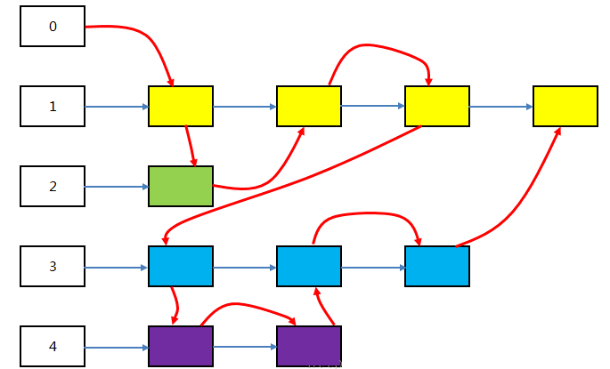

# 进程间通信

## 管道

管道，英文为pipe。这是一个我们在学习Linux命令行的时候就会引入的一个很重要的概念。它的发明人是道格拉斯.麦克罗伊，这位也是UNIX上早期shell的发明人。他在发明了shell之后，发现系统操作执行命令的时候，经常有需求要将一个程序的输出交给另一个程序进行处理，这种操作可以使用输入输出重定向加文件搞定，比如：

```bash
$ls  -l /etc/ > etc.txt
$wc -l etc.txt 
183 etc.txt
```

但是这样未免显得太麻烦了。所以，管道的概念应运而生。目前在任何一个shell中，都可以使`|`连接两个命令，shell会将前后两个进程的输入输出用一个管道相连，以便达到进程间通信的目的：

```bash
$ls -l /etc/ | wc -l
183
```

对比以上两种方法，我们也可以理解为，管道本质上就是一个文件，前面的进程以写方式打开文件，后面的进程以读方式打开。这样前面写完后面读，于是就实现了通信。实际上管道的设计也是遵循UNIX的“一切皆文件”设计原则的，它本质上就是一个文件。Linux系统直接把管道实现成了一种文件系统，借助VFS给应用程序提供操作接口。

虽然实现形态上是文件，但是管道本身并不占用磁盘或者其他外部存储的空间。在Linux的实现上，它占用的是内存空间。所以，**Linux上的管道就是一个操作方式为文件的内存缓冲区**。

### 1. 匿名管道（PIPE）

前面提到的`|`就是管道的意思，`|`前面的部分作为`|`后面部分的输出。它很明显是单向的传输，这样的管道我们叫做"匿名管道"，自行创建和销毁。

```bash
# 匿名管道
$ls -l /etc/ | wc -l
```

### 2. 命名管道（FIFO）

匿名管道除了父子进程外，其他进程不知道这个管道文件的描述符。所以通过这个管道中的信息无法传递给其他进程。这保证了传输数据的安全性，当然也降低了管道了通用性，于是系统还提供了命名管道。

```bash
# 命名管道
$mkfifo pipe
# 管道文件用p标识
$ls -l pipe
prw-r--r-- 1 root root 0 Apr 20 14:00 pipe
# 往管道中写数据时阻塞
$echo cat > pipe

```

往管道中写数据时会阻塞，因为管道另一端没有人读，这是内核对管道文件定义的默认行为。此时如果有进程读这个管道，那么这个写操作的阻塞才会解除：

```bash
$cat pipe
cat
```

当我们cat完这个文件之后，另一端的echo命令也返回了。这就是命名管道。

### 3. 优缺点

* 优点：简单易用

* 缺点：采用管道进行通信的效率很低，因为假设现在有AB两个进程，A进程将数据写入管道，B进程需要等待A进程将信息写完以后才能读出来，所以这种方案不适合频繁的通信。

## 消息队列

### 1. 简介

消息队列本质上是位于内核空间的链表，链表的每个节点都是一条消息。每一条消息都有自己的消息类型，消息类型用整数来表示，而且必须大于 0。每种类型的消息都被对应的链表所维护：



其中数字 1 表示类型为 1 的消息，数字2、3、4 类似。彩色块表示消息数据，它们被挂在对应类型的链表上。

消息类型为 0 的链表记录了所有消息加入队列的顺序，其中红色箭头表示消息加入的顺序。

### 2. 优缺点

* 优点：管道传递的消息大小受限且只能承载无格式字节流，而消息队列允许不同进程按照一个个消息体（双方约定好的规定大小的消息类型）的方式发送给任意进程。
* 缺点：当发送到消息队列的数据太大时，拷贝成本较高。

## 共享内存

### 1. 简介

在Linux系统中，每个进程都有独立的虚拟内存空间，也就是说不同的进程访问同一段虚拟内存地址所得到的数据是不一样的，这是因为不同进程相同的虚拟内存地址会映射到不同的物理内存地址上。

但有时候为了让不同进程之间进行通信，需要让不同进程共享相同的物理内存，Linux通过 「共享内存」 来实现这个功能。下面先来介绍一下Linux系统的共享内存的使用。

> **共享内存是通过将不同进程的虚拟内存地址映射到相同的物理内存地址来实现的。**

### 2. 优缺点

* 优点：因为所有进程共享同一块内存，共享内存在各种进程间通信方式中具有最高的效率。访问共享内存区域和访问进程独有的内存区域一样快，并不需要通过系统调用或者其它需要切入内核的过程来完成。同时它也避免了对数据的各种不必要的复制。
* 缺点：因为系统内核没有对访问共享内存进行同步，您必须提供自己的同步措施。例如，在数据被写入之前不允许进程从共享内存中读取信息、不允许两个进程同时向同一个共享内存地址写入数据等。解决这些问题的常用方法是通过使用信号量进行同步。

## 信号量

信号量实际上是一个计数器，这里需要注意下，信号量主要实现进程之间的同步和互斥，而不是存储通信内容。

信号量定义了两种操作，p操作和v操作，p操作为申请资源，会将数值减去M，表示这部分被他使用了，其他进程暂时不能用。v操作是归还资源操作，告知归还了资源可以用这部分。

## 信号

在操作系统中，不同信号用不同的值表示，每个信号设置相应的函数，一旦进程发送某一个信号给另一个进程，另一进程将执行相应的函数进行处理。也就是说先把可能出现的异常等问题准备好，一旦信号产生就执行相应的逻辑即可。

## 套接字

前面提到的都是单机模式下多个进程的通信方式，多机模式下只能使用socket通信了。

## Reference

[1] <https://zhuanlan.zhihu.com/p/58489873>

[2] <https://zhuanlan.zhihu.com/p/166247291>

[3] <https://www.jianshu.com/p/7e3045cf1ab8>
