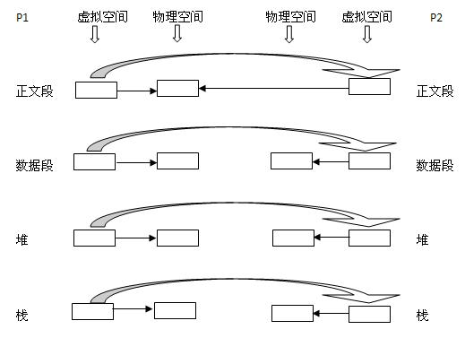
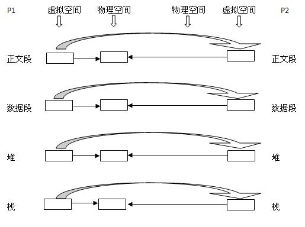
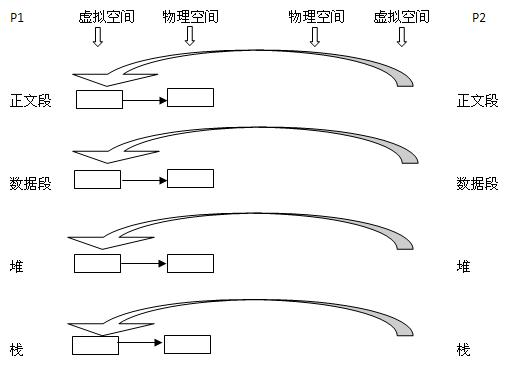

# fork读时共享与写时复制

## 传统的fork()

传统的`fork()`系统调用直接把父进程所有的资源复制给新创建的进程，这种操作相当耗时，因为它需要执行如下步骤：

* 为子进程的页表分配空间
* 为子进程的页分配空间
* 初始化子进程的页表
* 把父进程的页复制到子进程相应的页中

这种实现过于简单且效率低下，因为它拷贝的数据也许并不共享。更糟糕的情况时，如果新进程打算立即执行一个新的映像，那么所有的拷贝都是无意义的。

传统`fork()`复制父进程的正文段、数据段、堆和栈四个部分，并为除正文段外的三个部分分配物理内存，子进程的正文段和父进程的正文段共享物理内存空间。

## 写时复制的fork()

Linux的`fork()`使用写时拷贝（copy-on-write）页实现，它是一种可以推迟甚至免除拷贝数据的技术。调用`fork()`时内核并不复制整个进程地址空间，而是让父进程和子进程共享同一个拷贝。只有在需要写入的时候才会复制数据，从而让各个进程拥有各自的拷贝。

> 即资源只有在需要写入的时候才进行复制，在此之前都是以只读方式共享。这种技术使得地址空间上的页的拷贝被推迟到实际发生的时候才进行。在页根本不会被写入的情况下（例如`fork()`后立即调用`exec()`）就可以避免拷贝的成本。

`fork()`的实际开销就是复制父进程的页表以及给子进程创建唯一的进程描述符。由于在一般情况下进程创建后都会马上运行一个可执行的文件，这种优化可以避免拷贝大量根本不会被使用的数据（地址空间内常常包含数十兆的数据）。

写时复制的`fork()`下内核只为新创建的子进程创建虚拟空间结构，但是不为这些段分配物理内存，它们和父进程共享物理空间。当父子进程中有更改相应段的行为发生时，再为子进程相应的段分配物理空间。

## vfork()

`vfork()`直接共享父进程的虚拟空间结构，它并不会将父进程的地址空间完全复制给子进程，因为子进程会立即调用`exec`或`exit`，也就不会访问该地址空间了。在子进程调用`exit`前它就在父进程空间中运行。`vfork()`保证子进程先运行，在子进程调用`exec`或`exit`后父进程才能调度运行。

## Reference

[1] <https://www.cnblogs.com/wuchanming/p/4495479.html>
