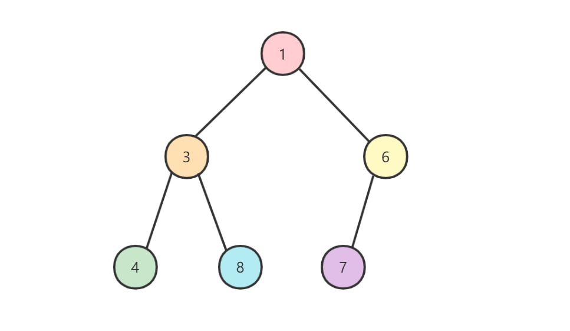
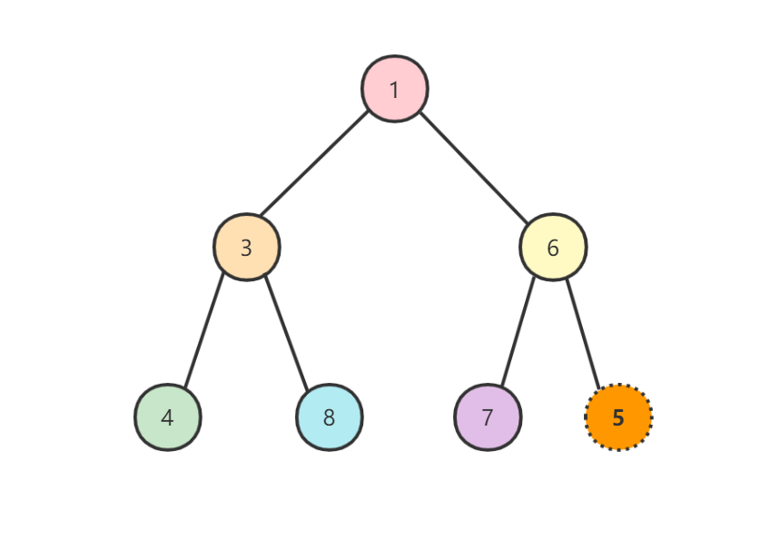
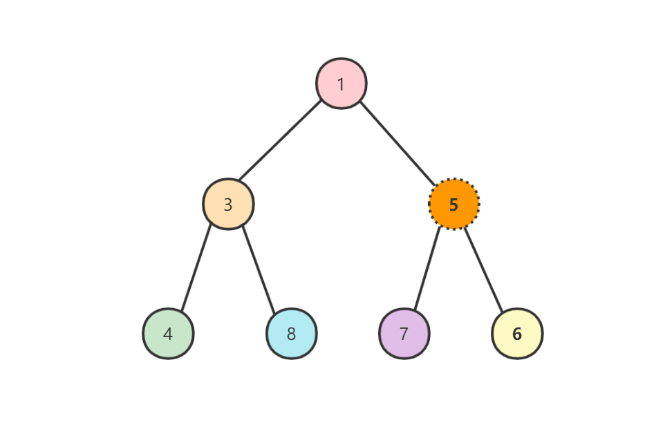
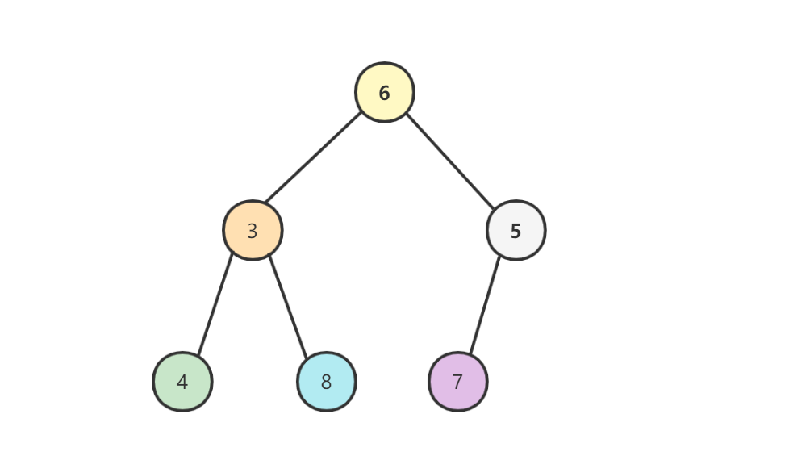
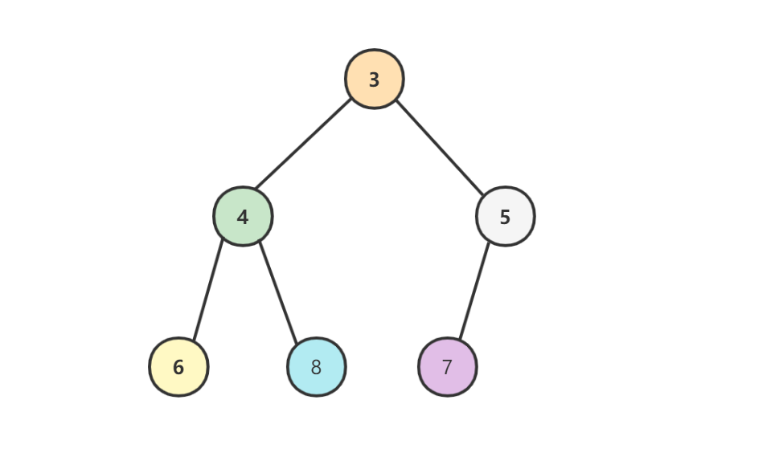

# 堆

## 使用方法

### 0. 头文件

```c++
#include <queue>
```

### 1. 定义

```c++
// 普通的std::priority_queue
std::priority_queue<int> q;

// 等价于:
std::priority_queue<int, vector<int>> q;
std::priority_queue<int, std::vector<int>, std::less<int>> q;
```

### 2. 操作

```c++
// 删除queue的首元素或者priority_queue最高优先级的元素，但不返回此元素
q.pop();

// 返回最高优先级元素，但不删除该元素
q.top();

// 在queue末尾或者priority_queue中恰当的位置创建一个元素
q.push(i);

// 在queue末尾或者priority_queue中恰当的位置创建一个元素
q.emplace(a);
```

### 3. 使用例子

> `std::priority_queue`默认是按照从大到小输出的。

```c++
#include <queue>
#include <iostream>

int main() {
    std::priority_queue<int> q;
    q.push(1);
    q.push(2);
    q.push(10);
    q.push(3);

    while (!q.empty()) {
        std::cout << q.top() << std::endl;
        q.pop();
    }
}

// 输出:
10
3
2
1
```

### 4. 自定义比较器

原理：实现了`()`运算符、lambda表达式和普通函数都属于可调用对象。

#### 4.1 struct重载()运算符

> 这属于传入实现了`operator()`的对象。

```c++
#include <queue>
#include <iostream>

struct cmp {
    bool operator() (int a, int b) {
        return a < b;
    }
};

int main() {
    std::priority_queue<int, std::vector<int>, cmp> q;
    q.push(1);
    q.push(2);
    q.push(10);
    q.push(3);

    while (!q.empty()) {
        std::cout << q.top() << std::endl;
        q.pop();
    }
}
```

#### 4.2 定义函数

```c++
#include <queue>
#include <iostream>

bool cmp(int a, int b) {
    return a > b;
}

int main() {
    std::priority_queue<int, std::vector<int>, decltype(&cmp)> q(cmp);
    q.push(1);
    q.push(2);
    q.push(10);
    q.push(3);

    while (!q.empty()) {
        std::cout << q.top() << std::endl;
        q.pop();
    }
}
```

#### 4.3 定义类成员函数

> 注意必须要声明static。

```c++
#include <queue>
#include <iostream>

class Solution {
 public:
    static bool cmp(int a, int b) {
        return a > b;
    }
};


int main() {
    std::priority_queue<int, std::vector<int>, decltype(&Solution::cmp)> q(Solution::cmp);
    q.push(1);
    q.push(2);
    q.push(10);
    q.push(3);

    while (!q.empty()) {
        std::cout << q.top() << std::endl;
        q.pop();
    }
}
```

#### 4.4 lambda表达式

```c++
#include <queue>
#include <iostream>

auto cmp =  [](int a, int b)->bool{return a > b; };

int main() {
    std::priority_queue<int, std::vector<int>, decltype(cmp)> q(cmp);
    q.push(1);
    q.push(2);
    q.push(10);
    q.push(3);

    while (!q.empty()) {
        std::cout << q.top() << std::endl;
        q.pop();
    }
}
```

### 5. 遍历堆

利用`while (!q.empty())`进行操作：

```c++
int main() {
    std::priority_queue<int, std::vector<int>, decltype(cmp)> q(cmp);
    q.push(1);
    q.push(2);
    q.push(10);
    q.push(3);

    while (!q.empty()) {
        std::cout << q.top() << std::endl;
        q.pop();
    }
}
```

## 简介

堆是一种近似完全二叉树的树形结构，被用于实现优先队列`priority queues`。顾名思义，堆满足子结点的数值总是大于（或小于）它的父结点。

堆可以分为大根堆和小根堆，大根堆父结点的值大于左右两个子结点的值，小根堆父结点的值小于左右两个子结点的值。为了方便介绍，我们这里仅讨论小根堆的情况。



## 操作

### 1. 添加结点

往堆中添加结点时会添加在最下面一行靠左的位置，如果最下面一行无多余空间时则另起一行添加在这一行的最左侧，如果添加后父结点大于子结点则需要交换父子结点位置，一直重复这样的操作直到所有的子结点都大于父结点

假如我们往上面的堆中添加结点5，那么首先我们将数据加在最后一排靠左的位置：



此时5的父结点6大于它，因此需要交换父子结点位置：



此时5的父结点1小于它，因此添加元素结束。

### 2. 删除结点

往堆中取出数据时直接取出根节点，因为它就是最小的值：


然后将位于最后的数据（最后一排最右边的元素）移动到最顶端：



如果父结点的值大于子结点，那么将父结点与其左右两个子结点中较小的一个进行交换（这里交换父结点6和子结点3）：


继续交换父结点6和子结点4：



### 3. 复杂度

由于堆中顶端的数据是最小值，因此无论堆中包含多少个结点，取出最小值的时间复杂度都是 $O(1)$。

取出数据后需要将最后的数据移动到最顶端，然后比较它和左右两个子结点的大小并一直向下移动，所以取出数据需要的运行时间和树高度（数据量为n时树的高度是 $log_{2}n$）相关。因此取出最小值后重构堆的时间复杂度是 $O(log n)$。

往堆中添加数据时需要在堆的最后添加元素，然后一边比较它和父结点的大小再一边向上移动，所以添加数据需要的时间复杂度也是 $O(log n)$。

### 4. 适用范围

对于需要频繁从管理的数据中取出最小值时，可以使用堆（优先队列就是以堆实现的）。
