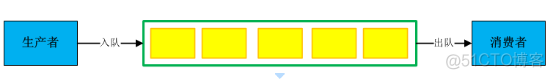
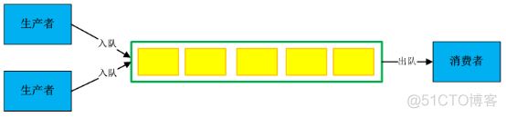
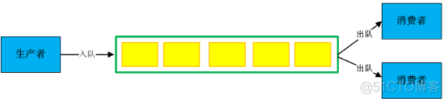
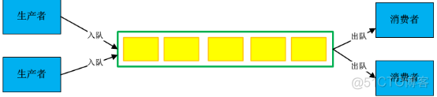
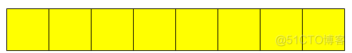
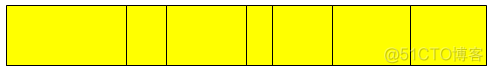
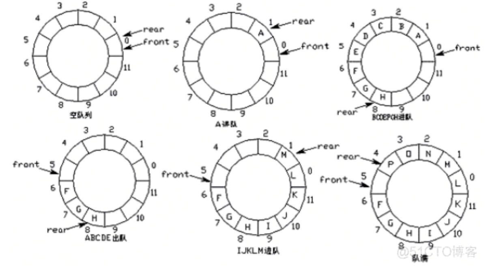

# 无锁队列

## 介绍

在工程上，为了解决两个处理器交互速度不一致的问题，**我们使用队列作为缓存，生产者将数据放入队列，消费者从队列中取出数据。**

这个时候就会出现四种情况，单生产者单消费者，多生产者单消费者，单生成者多消费者，多生产者多消费者。

我们知道，多线程往往会带来数据不一致的情况，一般需要靠加锁解决问题。但是，加锁往往带来阻塞，阻塞会带来线程切换开销，在数据量大的情况下锁带来的开销是很大的，因此无锁队列实现势在必行。下面就详细讲一下每种情况的不同实现方法。

**生产环境中广泛使用生产者和消费者模型，要求生产者在生产的同时，消费者可以进行消费，通常使用互斥锁保证数据同步。但线程互斥锁的开销仍然比较大，因此在要求高性能、低延时场景中，推荐使用无锁队列。**

## 队列操作模型

队列是一种非常重要的数据结构，其特性是先进先出（FIFO），符合流水线业务流程。**在进程间通信、网络通信间经常采用队列做缓存，缓解数据处理压力**。

**根据操作队列的场景分为：单生产者——单消费者、多生产者——单消费者、单生产者——多消费者、多生产者——多消费者四大模型**。

**根据队列中数据分为：队列中的数据是定长的、队列中的数据是变长的**。

### 1. 单生产者 - 单消费者



### 2. 多生产者 - 单消费者



### 3. 单生产者 - 多消费者



### 4. 多生产者 - 多消费者



### 5. 数据定长队列



### 6. 数据变长队列



## CAS 操作

CAS（compare and swap）是 CPU 支持的原子操作，用于实现各种无锁（LockFree）数据结构。

CAS 的 C 语言实现方式如下：

```c
bool compare_and_swap ( int *memory_location, int expected_value, int new_value)
{
    if (*memory_location == expected_value)
    {
        *memory_location = new_value;
        return true;
    }
    return false;
}
```

CAS 用于检查一个内存位置是否包含预期值，如果包含，则把新值复赋值到内存位置。成功返回 true，失败返回 false。

## 无锁队列方案

### 1. boost 方案

boost 提供了三种无锁方案，分别适用不同使用场景：

* `boost::lockfree::queue` 是支持多个生产者和多个消费者线程的无锁队列
* `boost::lockfree::stack` 是支持多个生产者和多个消费者线程的无锁栈
* `boost::lockfree::spsc_queue` 是仅支持单个生产者和单个消费者线程的无锁队列，比 `boost::lockfree::queue` 性能更好

Boost 提供的 queue 可以设置初始容量，添加新元素时如果容量不够，则总容量自动增长；但对于无锁数据结构，添加新元素时如果容量不够，总容量不会自动增长。

### 2. ConcurrentQueue

ConcurrentQueue 是基于 C 实现的工业级无锁队列方案。

GitHub：<https://github.com/cameron314/concurrentqueue>

ReaderWriterQueue 是基于 C 实现的单生产者单消费者场景的无锁队列方案。

GitHub：<https://github.com/cameron314/readerwriterqueue>

### 3. Disruptor

Disruptor 是英国外汇交易公司 LMAX 基于 JAVA 开发的一个高性能队列。

GitHub：<https://github.com/LMAX-Exchange/disruptor>

## 无锁队列实现

### 1. 环形缓冲区

RingBuffer 是生产者和消费者模型中常用的数据结构，生产者将数据追加到数组尾端，当达到数组的尾部时，生产者绕回到数组的头部；消费者从数组头端取走数据，当到达数组的尾部时，消费者绕回到数组头部。

如果只有一个生产者和一个消费者，环形缓冲区可以无锁访问，环形缓冲区的写入 index 只允许生产者访问并修改，只要生产者在更新 index 前将新的值保存到缓冲区中，则消费者将始终看到一致的数据结构；读取 index 也只允许消费者访问并修改，消费者只要在取走数据后更新读 index，则生产者将始终看到一致的数据结构。



入队操作：

```c++
data[rear] = x;
rear = (rear + 1) % maxn;
```

出队操作：

```c++
x = data[front];
front = (front + 1) % maxn;
```

### 2. 单生产者单消费者

对于单生产者和单消费者场景，由于 read_index 和 write_index 都只会有一个线程写，因此不需要加锁也不需要原子操作，直接修改即可，但读写数据时需要考虑遇到数组尾部的情况。

线程对 write_index 和 read_index 的读写操作如下：

* 写操作：先判断队列时否为满，如果队列未满，则先写数据，写完数据后再修改 write_index
* 读操作：先判断队列是否为空，如果队列非空，则先读数据，读完再修改 read_index

### 3. 多生产者单消费者

多生产者和单消费者场景下，由于多个生产者都会修改 write_index，所以在不加锁的情况下必须使用原子操作。

### 4. RingBuffer 实现

RingBuffer.hpp：

```c++
#pragma once

template <class T>
class RingBuffer
{
public:
    RingBuffer(unsigned size): m_size(size), m_front(0), m_rear(0)
    {
        m_data = new T[size];
    }

    ~RingBuffer()
    {
        delete [] m_data;
 m_data = NULL;
    }

    inline bool isEmpty() const
    {
        return m_front == m_rear;
    }

    inline bool isFull() const
    {
        return m_front == (m_rear + 1) % m_size;
    }

    bool push(const T& value)
    {
        if(isFull())
        {
            return false;
        }
        m_data[m_rear] = value;
        m_rear = (m_rear + 1) % m_size;
 return true;
    }

    bool push(const T* value)
    {
        if(isFull())
        {
            return false;
        }
 m_data[m_rear] = *value;
        m_rear = (m_rear + 1) % m_size;
 return true;
    }

    inline bool pop(T& value)
    {
        if(isEmpty())
        {
            return false;
        }
        value = m_data[m_front];
        m_front = (m_front + 1) % m_size;
        return true;
    }
    inline unsigned int front()const
    {
 return m_front;
    }

    inline unsigned int rear()const
    {
 return m_rear;
    }
    inline unsigned int size()const 
    {
        return m_size;
    }
private:
    unsigned int m_size;// 队列长度
    int m_front;// 队列头部索引
    int m_rear;// 队列尾部索引
    T* m_data;// 数据缓冲区
};
```

RingBufferTest.cpp：

```c++
#include <stdio.h>
#include <thread>
#include <unistd.h>
#include <sys/time.h>
#include "RingBuffer.hpp"


class Test
{
public:
   Test(int id = 0, int value = 0)
   {
 this->id = id;
        this->value = value;
 sprintf(data, "id = %d, value = %d\n", this->id, this->value);
   }
   void display()
   {
  printf("%s", data);
   }
private:
   int id;
   int value;
   char data[128];
};

double getdetlatimeofday(struct timeval *begin, struct timeval *end)
{
    return (end->tv_sec + end->tv_usec * 1.0 / 1000000) -
           (begin->tv_sec + begin->tv_usec * 1.0 / 1000000);
}

RingBuffer<Test> queue(1 << 12);2u000

#define N (10 * (1 << 20))

void produce()
{
    struct timeval begin, end;
    gettimeofday(&begin, NULL);
    unsigned int i = 0;
    while(i < N)
    {
        if(queue.push(Test(i % 1024, i)))
        {
    i++;
        }
    }
    gettimeofday(&end, NULL);
    double tm = getdetlatimeofday(&begin, &end);
    printf("producer tid=%lu %f MB/s %f msg/s elapsed= %f size= %u\n", pthread_self(), N * sizeof(Test) * 1.0 / (tm * 1024 * 1024), N * 1.0 / tm, tm, i);
}

void consume()
{
    sleep(1);
    Test test;
    struct timeval begin, end;
    gettimeofday(&begin, NULL);
    unsigned int i = 0;
    while(i < N)
    {
        if(queue.pop(test))
 {
    // test.display();
    i++;
 }
    }
    gettimeofday(&end, NULL);
    double tm = getdetlatimeofday(&begin, &end);
    printf("consumer tid=%lu %f MB/s %f msg/s elapsed= %f, size=%u \n", pthread_self(), N * sizeof(Test) * 1.0 / (tm * 1024 * 1024), N * 1.0 / tm, tm, i);
}

int main(int argc, char const *argv[])
{
    std::thread producer1(produce);
    std::thread consumer(consume);
    producer1.join();
    consumer.join();
    return 0;
}
```

编译：

```bash
g++ --std=c++11 RingBufferTest.cpp -o test -pthread
```

单生产者单消费者场景下，消息吞吐量为 350 万条/秒左右。

## 变长消息队列

> C++ 中是不是可以在环形数组中存储消息指针，然后我们设计一个消息基类，不同类型的消息派生类可以做到不同长度？

修改 struct msg：

```c++
struct msg
{
    long int msgtype;
    int   count;
    unsigned int data[35];
}
```

其中 count 记录总共有多少个 data，这样就可以发送变长的消息了，比如你要发 10 个 unsigned int，那么：

```c++
struct msg mymsg;
mymsg.msgtype = XXXX;
mymsg.count = 10;
```

发消息不用整个 msg 都发送出去，只需要发送有效的内容：

```c++
len = sizeof(msg) - sizeof(unsigned int) * (35-mymsg.count);
mq_send(queue, &mymsg, len, 0);
```

接收数据后可以根据收到的 count 来取数据：

```c++
struct msg rcvmsg;
mq_receive(queue, &rcvmsg, sizeof(rcvmsg), NULL);
printf("%d data received\n", rcvmsg.count);
```

## Reference

[1] <https://www.cnblogs.com/scaugsh/p/10074297.html>

[2] <https://blog.51cto.com/quantfabric/2588193>
