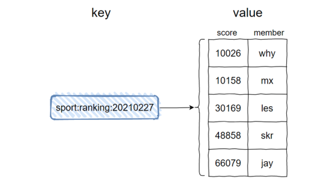
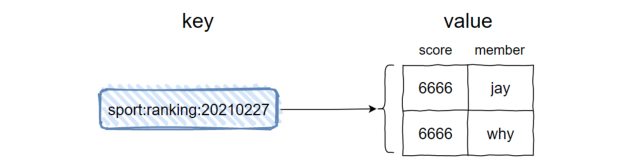
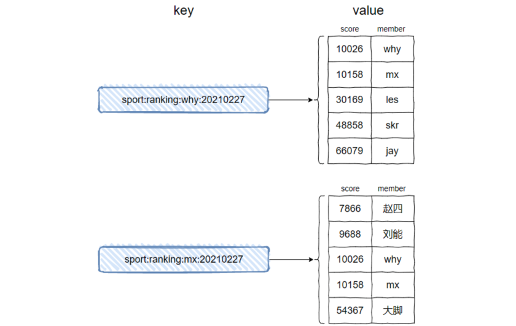
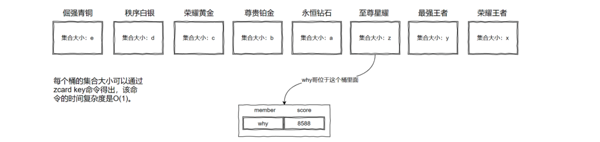
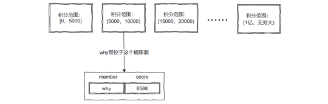

# 排行榜

## 题目

如何设计一个排行榜？

## 基于数据库

如果之前没有遇见过，最容易想到的就是平时接触的最多的数据库排序。前端每隔一段时间调用接口去查询数据库，然后更新排行榜表。

**在一个用户量非常的小的具体场景，这是可行的**。

如果是一个游戏排行榜的话，随着游戏玩家的增加，**达到千万用户级别的话，虽然可以扯什么查询慢就加索引，数据量大就分库分表**，但这仍然不是一个特别好的方案。

## 基于Redis

### 1. 简介

这个场景其实就是考察 Redis 中 sorted set 数据结构的掌握。

sorted set 是有序集合的意思。

- key 是 sport:ranking:20210227
- value 是一个集合，且这个集合是有序的
  - 集合中的每一个 member 都有一个 score，然后按照这个 score 进行降序排序
  - member 是不可以重复的，但是 score 是可以重复的
  - 当 member 的 score 一样的时候，member 按照字典序(lexicographically) 进行排序，所以上图 jay 在 why 前

### 2. ZSET 常用操作

- 添加 member 命令格式：zadd key score member [score member ...]
- 增加 member 的 score 命令格式：zincrby key increment member
- 获取 member 排名命令格式：zrank/zrevrank key member
- 返回指定排名范围内的 member 命令格式：zrange/zrevrange key start end [withscores]

### 3. 微信运动排行榜

每个人看见的数据排行数据来源自己的微信好友，而微信好友各不相同，所以看到的排行榜也各不相同。

当前的 key 是 sport:ranking:20210227，里面只包含了某一天的信息，只要在 key 里面加上用户的属性就可以了。

例如 key 可以设计为 sport:ranking:why:20210227 ，由于 key 里面多了用户信息，每个人的 key 都各不相同。

### 亿级用户排行榜

**需要利用分治的思想。**

如王者一共 8 个段位，可以有 8 个，这个桶可以是一个 Redis 里面的 8 个不同的 key，甚至是 8 个 Redis 里面各一个 key：

对于亿级用户只分 8 个桶未免太少了，那就根据每个段位里面还有小段位继续分桶。

还是不够的话，直接把段位加上各种其他条件换算成积分，然后按照积分来拆分：

当然实际情况下，用户的落点其实并不是均匀的，这就需要进行数据分析，通过一系列的高数、概率、离散等知识去做个桶大小的预估。

## Reference

[1] <https://www.cnblogs.com/luedong/p/15940644.html>
