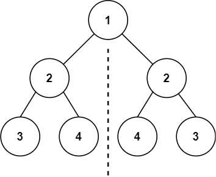
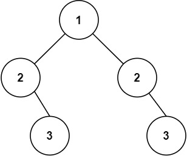

# 101. 对称二叉树

## 题目

难度：简单

给你一个二叉树的根节点 root ， 检查它是否轴对称。

**示例 1：**



```
输入：root = [1,2,2,3,4,4,3]
输出：true

```

**示例 2：**



```
输入：root = [1,2,2,null,3,null,3]
输出：false

```

**进阶**：你可以运用递归和迭代两种方法解决这个问题吗？

> 来源：力扣（LeetCode）  
> 链接：<https://leetcode-cn.com/problems/symmetric-tree/>  
> 著作权归领扣网络所有。商业转载请联系官方授权，非商业转载请注明出处。

## 答案

> 递归，但是需要取巧，用左子树和右子树进行比较。

```c++
/**
 * Definition for a binary tree node.
 * struct TreeNode {
 *     int val;
 *     TreeNode *left;
 *     TreeNode *right;
 *     TreeNode() : val(0), left(nullptr), right(nullptr) {}
 *     TreeNode(int x) : val(x), left(nullptr), right(nullptr) {}
 *     TreeNode(int x, TreeNode *left, TreeNode *right) : val(x), left(left), right(right) {}
 * };
 */
class Solution {
public:
    bool helper(TreeNode* left, TreeNode* right) {
        if (left == right) {
            return true;  // 两个都是空
        }
        if (left == nullptr || right == nullptr) {
            return false;
        }
        if (left->val != right->val) {
            return false;
        }
        return helper(left->right, right->left) && helper(left->left, right->right);
    }

    bool isSymmetric(TreeNode* root) {
        // 递归
        if (root == nullptr) {
            return false;
        }
        return helper(root->left, root->right);
    }
};
```
