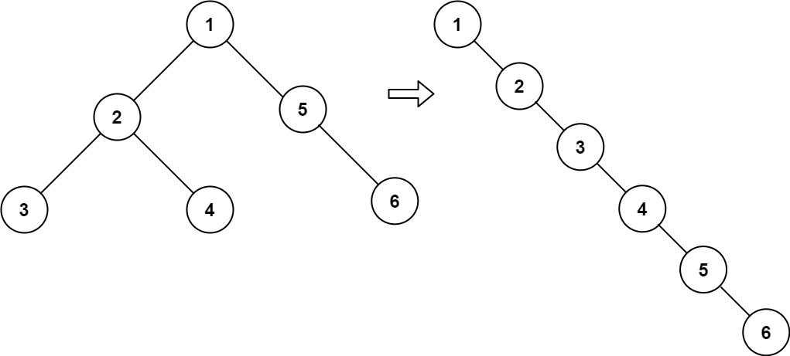

# 114. 二叉树展开为链表

## 题目

难度：中等

给你二叉树的根结点 root，请你将它展开为一个单链表：

* 展开后的单链表应该同样使用 TreeNode，其中 right 子指针指向链表中下一个结点，而左子指针始终为 null。
* 展开后的单链表应该与二叉树 **先序遍历** 顺序相同。

**示例 1：**



```
输入：root = [1,2,5,3,4,null,6]
输出：[1,null,2,null,3,null,4,null,5,null,6]

```

**示例 2：**

```
输入：root = []
输出：[]

```

**示例 3：**

```
输入：root = [0]
输出：[0]

```

**进阶：**你可以使用原地算法（O(1) 额外空间）展开这棵树吗？

> 来源: 力扣（LeetCode）  
> 链接: <https://leetcode.cn/problems/flatten-binary-tree-to-linked-list/?favorite=2cktkvj>  
> 著作权归领扣网络所有。商业转载请联系官方授权，非商业转载请注明出处。

## 答案

### 1. 递归

```c++
/**
 * Definition for a binary tree node.
 * struct TreeNode {
 *     int val;
 *     TreeNode *left;
 *     TreeNode *right;
 *     TreeNode() : val(0), left(nullptr), right(nullptr) {}
 *     TreeNode(int x) : val(x), left(nullptr), right(nullptr) {}
 *     TreeNode(int x, TreeNode *left, TreeNode *right) : val(x), left(left), right(right) {}
 * };
 */
class Solution {
public:
    // 找到一个链表树的非空叶子结点
    TreeNode* find_leaf_node(TreeNode* root) {
        // !!!特别注意while循环!!!
        while (root->right) {
            root = root->right;
        }

        return root;
    }

    void helper(TreeNode* root) {
        // 先处理根节点
        if (root == nullptr) {
            return;
        }

        auto left_tree = root->left;
        auto right_tree = root->right;

        // 左节点标记为空
        root->left = nullptr;
        // 右结点先放左子树
        helper(left_tree);
        root->right = left_tree;

        // 右结点左子树的末尾再放右子树
        auto leaf_node = find_leaf_node(root);
        helper(right_tree);
        leaf_node->right = right_tree;

        return;
    }

    void flatten(TreeNode* root) {
        // 依然是递归
        return helper(root);
    }
};
```
