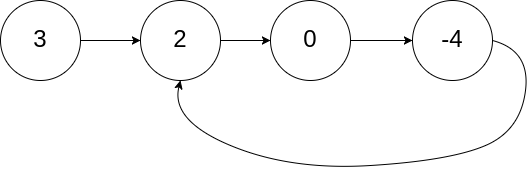

# 141. 环形链表

## 题目

难度：简单

给你一个链表的头节点 head，判断链表中是否有环。

如果链表中有某个节点，可以通过连续跟踪 next 指针再次到达，则链表中存在环。为了表示给定链表中的环，评测系统内部使用整数 pos 来表示链表尾连接到链表中的位置（索引从 0 开始）。**注意：pos 不作为参数进行传递**。仅仅是为了标识链表的实际情况。

 如果链表中存在环，则返回 true。否则，返回 false。

**示例 1：**



```
输入：head = [3,2,0,-4], pos = 1
输出：true
解释：链表中有一个环，其尾部连接到第二个节点。

```

**示例 2：**


```
输入：head = [1,2], pos = 0
输出：true
解释：链表中有一个环，其尾部连接到第一个节点。

```

**示例 3：**


```
输入：head = [1], pos = -1
输出：false
解释：链表中没有环。

```

**进阶：**你能用 O(1)（即，常量）内存解决此问题吗？

> 来源: 力扣（LeetCode）  
> 链接: <https://leetcode.cn/problems/linked-list-cycle/?favorite=2cktkvj>  
> 著作权归领扣网络所有。商业转载请联系官方授权，非商业转载请注明出处。

## 答案

### 1. 额外空间复杂度

用 set 来做 hash 表即可，遍历结点，出现了两次就是环形链表：

```c++
/**
 * Definition for singly-linked list.
 * struct ListNode {
 *     int val;
 *     ListNode *next;
 *     ListNode(int x) : val(x), next(NULL) {}
 * };
 */
class Solution {
public:
    // O(1)空间复杂度
    // 1) swap
    // 2) 位运算

    bool hasCycle(ListNode *head) {
        // 创建集合存放所有的节点
        std::unordered_set<ListNode*> node_ptr_set;

        // 遍历链表
        while (head) {
            if (node_ptr_set.count(head)) {
                // 已经存在时说明有环形链表
                return true;
            }
            node_ptr_set.insert(head);
            head = head->next;
            
        }

        return false;
    }
};
```

### 2. 快慢指针（龟兔赛跑算法）

```c++
/**
 * Definition for singly-linked list.
 * struct ListNode {
 *     int val;
 *     ListNode *next;
 *     ListNode(int x) : val(x), next(NULL) {}
 * };
 */
class Solution {
public:
    bool hasCycle(ListNode *head) {
        if (!head || !head->next) {
            return false;
        }

        auto slow = head;
        auto fast = head->next;

        while (slow) {
            // fast每次走两步
            if (!fast->next || !fast->next->next) {
                return false;
            }
            fast = fast->next->next;
            if (fast == slow || fast == slow->next) {
                return true;
            }
            slow = slow->next;
        }

        return false;
    }
};
```
