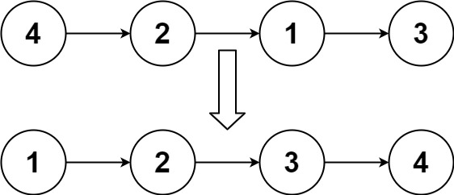
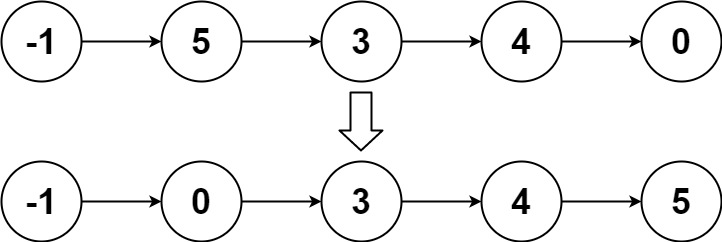

# 148. 排序链表

## 题目

难度：中等

给你链表的头结点 head，请将其按 **升序** 排列并返回 **排序后的链表**。

**示例 1：**



```
输入：head = [4,2,1,3]
输出：[1,2,3,4]

```

**示例 2：**



```
输入：head = [-1,5,3,4,0]
输出：[-1,0,3,4,5]

```

**示例 3：**

```
输入：head = []
输出：[]

```

 **进阶：** 你可以在 O(N logN) 时间复杂度和常数级空间复杂度下，对链表进行排序吗？

> 来源: 力扣（LeetCode）  
> 链接: <https://leetcode.cn/problems/sort-list/?favorite=2cktkvj>  
> 著作权归领扣网络所有。商业转载请联系官方授权，非商业转载请注明出处。

## 答案

### 1. 利用 map 进行排序

> 如果节点可以重复就用 `std::multimap`，注意 `std::multimap` 插入元素得用 `insert({key,value})`。

注意：

* 使用 dummy 和 cur
* dummy 的内存泄漏问题
* 返回链表时需要注意尾结点一定要指向 nullptr

```c++
/**
 * Definition for singly-linked list.
 * struct ListNode {
 *     int val;
 *     ListNode *next;
 *     ListNode() : val(0), next(nullptr) {}
 *     ListNode(int x) : val(x), next(nullptr) {}
 *     ListNode(int x, ListNode *next) : val(x), next(next) {}
 * };
 */
class Solution {
public:
    ListNode* sortList(ListNode* head) {
        // 使用multimap的key进行排序
        std::multimap<int, ListNode*> value2node;

        // 将链表元素挨个插入到map中, 会自动排序
        ListNode* cur = head;
        while (cur) {
            value2node.insert({cur->val, cur});
            cur = cur->next;
        }
        // cur为null

        // 挨个取出map中的元素拼接链表
        ListNode* dummy = new ListNode();
        cur = dummy;
        for (auto iter = value2node.begin(); iter != value2node.end(); iter++) {
            cur->next = iter->second;
            cur = cur->next;
        }

        // cur指向最后一个元素
        cur->next = nullptr;
        return dummy->next;  // 暂不处理dummy的内存泄漏问题
    }
};
```

### 2. 自顶向下归并排序

题目要求 O(1) 空间复杂度，因此只能使用归并排序。

![[image/image-20230209224017911.png]]

```c++
/**
 * Definition for singly-linked list.
 * struct ListNode {
 *     int val;
 *     ListNode *next;
 *     ListNode() : val(0), next(nullptr) {}
 *     ListNode(int x) : val(x), next(nullptr) {}
 *     ListNode(int x, ListNode *next) : val(x), next(next) {}
 * };
 */
class Solution {
// 自底向上归并排序法
public:
    // 自顶向下归并排序
    // 长度为0或者1时直接返回, 其他继续拆分后聚合
    ListNode* sort_helper(ListNode* head, ListNode* tail) {
        if (!head) {
            return head;
        }
        if (head->next == tail) {
            head->next = nullptr;  // 注意这一步一定要加上, 否则合并链表时会死循环
            return head;
        }

        // 找到链表中点
        ListNode* slow = head;
        ListNode* fast = head;
        while (fast != tail && fast->next != tail) {
            slow = slow->next;
            fast = fast->next->next;
        }
        
        // 此时slow指向的位置就是中点
        ListNode* mid = slow;
        ListNode* sub1 = sort_helper(head, mid);
        ListNode* sub2 = sort_helper(mid, tail);
        return merge(sub1, sub2);
    }

    // 合并两个有序链表
    ListNode* merge(ListNode* list1, ListNode* list2) {
        ListNode* dummy = new ListNode();
        ListNode* cur = dummy;
        while (list1 && list2) {
            if (list1->val < list2->val) {
                cur->next = list1;
                list1 = list1->next;
            } else {
                cur->next = list2;
                list2 = list2->next;
            }
            cur = cur->next;  // 这一步别漏了
        }
        if (list1) {
            cur->next = list1;
        } else {
            cur->next = list2;
        }
        return dummy->next;
    }

public:
    ListNode* sortList(ListNode* head) {
        return sort_helper(head, nullptr);
    }
};
```

### 3. 自底向上归并排序

> TODO：作为归并排序的练习。
