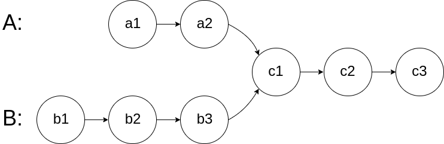
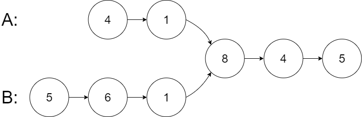
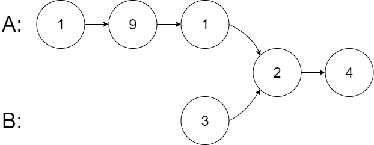
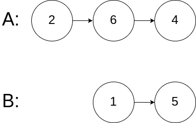

# 160. 相交链表

## 题目

难度：简单

给你两个单链表的头节点 headA 和 headB，请你找出并返回两个单链表相交的起始节点。如果两个链表不存在相交节点，返回 null。

图示两个链表在节点 c1 开始相交：



题目数据 **保证** 整个链式结构中不存在环。

**注意**，函数返回结果后，链表必须 **保持其原始结构**。

**自定义评测：**

**评测系统** 的输入如下（你设计的程序 **不适用** 此输入）：

* `intersectVal`：相交的起始节点的值。如果不存在相交节点，这一值为 0
* `listA`：第一个链表
* `listB`：第二个链表
* `skipA`：在 listA 中（从头节点开始）跳到交叉节点的节点数
* `skipB`：在 listB 中（从头节点开始）跳到交叉节点的节点数

评测系统将根据这些输入创建链式数据结构，并将两个头节点 headA 和 headB 传递给你的程序。如果程序能够正确返回相交节点，那么你的解决方案将被 **视作正确答案**。

**示例 1：**



```
输入：intersectVal = 8, listA = [4,1,8,4,5], listB = [5,6,1,8,4,5], skipA = 2, skipB = 3
输出：Intersected at '8'
解释：相交节点的值为 8 （注意，如果两个链表相交则不能为 0）。
从各自的表头开始算起，链表 A 为 [4,1,8,4,5]，链表 B 为 [5,6,1,8,4,5]。
在 A 中，相交节点前有 2 个节点；在 B 中，相交节点前有 3 个节点。
— 请注意相交节点的值不为 1，因为在链表 A 和链表 B 之中值为 1 的节点 (A 中第二个节点和 B 中第三个节点) 是不同的节点。换句话说，它们在内存中指向两个不同的位置，而链表 A 和链表 B 中值为 8 的节点 (A 中第三个节点，B 中第四个节点) 在内存中指向相同的位置。

```

**示例 2：**



```
输入：intersectVal = 2, listA = [1,9,1,2,4], listB = [3,2,4], skipA = 3, skipB = 1
输出：Intersected at '2'
解释：相交节点的值为 2 （注意，如果两个链表相交则不能为 0）。
从各自的表头开始算起，链表 A 为 [1,9,1,2,4]，链表 B 为 [3,2,4]。
在 A 中，相交节点前有 3 个节点；在 B 中，相交节点前有 1 个节点。

```

**示例 3：**



```
输入：intersectVal = 0, listA = [2,6,4], listB = [1,5], skipA = 3, skipB = 2
输出：null
解释：从各自的表头开始算起，链表 A 为 [2,6,4]，链表 B 为 [1,5]。
由于这两个链表不相交，所以 intersectVal 必须为 0，而 skipA 和 skipB 可以是任意值。
这两个链表不相交，因此返回 null 。

```

**进阶**：你能否设计一个时间复杂度 O(m+n)、仅用 O(1) 内存的解决方案？

> 来源: 力扣（LeetCode）  
> 链接: <https://leetcode.cn/problems/intersection-of-two-linked-lists/?favorite=2cktkvj>  
> 著作权归领扣网络所有。商业转载请联系官方授权，非商业转载请注明出处。

## 答案

### 1. 哈希法

> 这里用 hash 集合 unordered_set 来存储 hash 数据。

```c++
/**
 * Definition for singly-linked list.
 * struct ListNode {
 *     int val;
 *     ListNode *next;
 *     ListNode(int x) : val(x), next(NULL) {}
 * };
 */
class Solution {
public:
    ListNode *getIntersectionNode(ListNode *headA, ListNode *headB) {
        // 遍历两次即可, 但是如果其中一个链表特别长需要优化一下成两个set
        std::set<ListNode*> setA;

        // TODO: 万一A是一个环状链表, 这里需要fix一下
        ListNode* curA = headA;
        while (curA) {
            setA.insert(curA);
            curA = curA->next;
        }

        // 遍历B, 如果存在则返回
        ListNode* curB = headB;
        while (curB) {
            if (setA.count(curB)) {
                return curB;
            }
            curB = curB->next;
        }

        return nullptr;
    }
};
