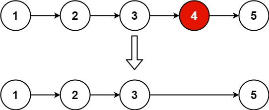

# 19. 删除链表的倒数第 N 个结点

## 题目

难度: 中等

给你一个链表，删除链表的倒数第 n 个结点，并且返回链表的头结点。

**示例 1：**



```
输入：head = [1,2,3,4,5], n = 2
输出：[1,2,3,5]

```

**示例 2：**

```
输入：head = [1], n = 1
输出：[]

```

**示例 3：**

```
输入：head = [1,2], n = 1
输出：[1]

```

**进阶：** 你能尝试使用一趟扫描实现吗？

> 来源: 力扣（LeetCode）
> 链接: <https://leetcode.cn/problems/remove-nth-node-from-end-of-list/?favorite=2cktkvj>
> 著作权归领扣网络所有。商业转载请联系官方授权，非商业转载请注明出处。

## 答案

```c++
/**
 * Definition for singly-linked list.
 * struct ListNode {
 *     int val;
 *     ListNode *next;
 *     ListNode() : val(0), next(nullptr) {}
 *     ListNode(int x) : val(x), next(nullptr) {}
 *     ListNode(int x, ListNode *next) : val(x), next(next) {}
 * };
 */
class Solution {
public:
    ListNode* removeNthFromEnd(ListNode* head, int n) {
        ListNode* dummy = new ListNode();
        dummy->next = head;

        // 快慢指针
        ListNode* fast = head;
        ListNode* slow = head;
        ListNode* prev = dummy;

        // fast 指针比 slow 指针多走 n 步
        for (int i = 0; i < n; i++) {
            fast = fast->next;
        }
        // fast 移动到链表尾部的 nullptr 时 slow 就是需要被删除的节点
        while (fast) {
            fast = fast->next;
            slow = slow->next;
            prev = prev->next;
        }

        // 此时 slow 就是要被删除的节点
        prev->next = slow->next;
        return dummy->next;
    }
};
```
