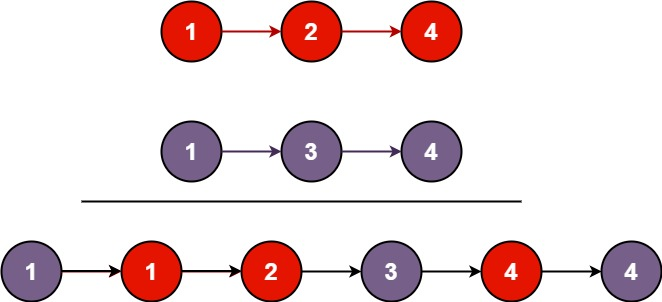

# 21. 合并两个有序链表

## 题目

难度: 简单

将两个升序链表合并为一个新的 **升序** 链表并返回。新链表是通过拼接给定的两个链表的所有节点组成的。

**示例 1：**




```
输入：l1 = [1,2,4], l2 = [1,3,4]
输出：[1,1,2,3,4,4]

```

**示例 2：**

```
输入：l1 = [], l2 = []
输出：[]

```

**示例 3：**

```
输入：l1 = [], l2 = [0]
输出：[0]

```

> 来源: 力扣（LeetCode）
> 链接: <https://leetcode.cn/problems/merge-two-sorted-lists/?favorite=2cktkvj>
> 著作权归领扣网络所有。商业转载请联系官方授权，非商业转载请注明出处。

## 答案

```c++
/**
 * Definition for singly-linked list.
 * struct ListNode {
 *     int val;
 *     ListNode *next;
 *     ListNode() : val(0), next(nullptr) {}
 *     ListNode(int x) : val(x), next(nullptr) {}
 *     ListNode(int x, ListNode *next) : val(x), next(next) {}
 * };
 */
class Solution {
public:
    ListNode* mergeTwoLists(ListNode* list1, ListNode* list2) {
        ListNode* dummy = new ListNode();
        ListNode* cur = dummy;

        while (list1 && list2) {
            if (list1->val < list2->val) {
                cur->next = list1;
                list1 = list1->next;
            } else {
                cur->next = list2;
                list2 = list2->next;
            }
            cur = cur->next;
        }

        while (list1) {
            cur->next = list1;
            list1 = list1->next;
            cur = cur->next;
        }

        while (list2) {
            cur->next = list2;
            list2 = list2->next;
            cur = cur->next;
        }

        return dummy->next;
    }
};
```
