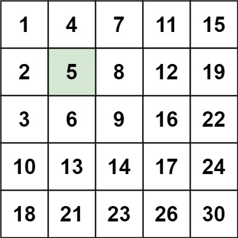
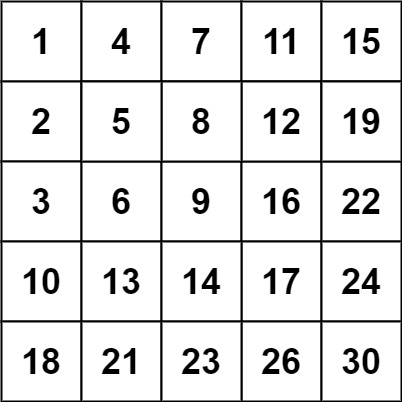

# 240. 搜索二维矩阵 II

## 题目

难度：中等

编写一个高效的算法来搜索 *m* x *n* 矩阵 matrix 中的一个目标值 target。该矩阵具有以下特性：

* 每行的元素从左到右升序排列。
* 每列的元素从上到下升序排列。

 **示例 1：**



```
输入：matrix = [[1,4,7,11,15],[2,5,8,12,19],[3,6,9,16,22],[10,13,14,17,24],[18,21,23,26,30]], target = 5
输出：true

```

 **示例 2：**



```
输入：matrix = [[1,4,7,11,15],[2,5,8,12,19],[3,6,9,16,22],[10,13,14,17,24],[18,21,23,26,30]], target = 20
输出：false

```

> 来源: 力扣（LeetCode）  
> 链接: <https://leetcode.cn/problems/search-a-2d-matrix-ii/?favorite=2cktkvj>  
> 著作权归领扣网络所有。商业转载请联系官方授权，非商业转载请注明出处。

## 答案

### 1. 暴力法

理论上暴力法应该剪枝，但这里写不出来。

```c++
class Solution {
public:
    bool searchMatrix(vector<vector<int>>& matrix, int target) {
        int n = matrix.size();
        int m = matrix[0].size(); 

        // 暴力 + 剪枝
        for (int i = 0; i < n; i++) {
            for (int j = 0; j < m; j++) {
                if (matrix[i][j] == target) {
                    return true;
                }
            }
        }

        return false;
    }
};
```

### 2. Z 字型搜索

根据大小关系，每次丢掉一行或者一列：

```c++
class Solution {
public:
    bool searchMatrix(vector<vector<int>>& matrix, int target) {
        // 从右上角搜索, 每次随机丢掉一行或者一列
        int row_cnt = matrix.size();
        int col_cnt = matrix[0].size();

        // 从右上角开始搜索, 每次丢掉一行或者一列
        int x = 0;
        int y = col_cnt - 1;

        // x只能++, y只能-while (x < row_cnt && y >= 0) {
            if (matrix[x][y] == target) {
                return true;
            }

            if (matrix[x][y] > target) {
                y--;
            } else {
                x++;
            }
        }

        return false;
    }
};
```

### 3. 二分查找

```c++
class Solution {
public:
    bool searchMatrix(vector<vector<int>>& matrix, int target) {
        // 遍历行， 对每行都做一次二分查找
        for (const auto& row : matrix) {
            // 找到第一个小于等于target的迭代器
            auto iter = std::lower_bound(row.begin(), row.end(), target);
            if (iter != row.end() && *iter == target) {
                return true;
            }
        }

        return false;
    }
};
```
