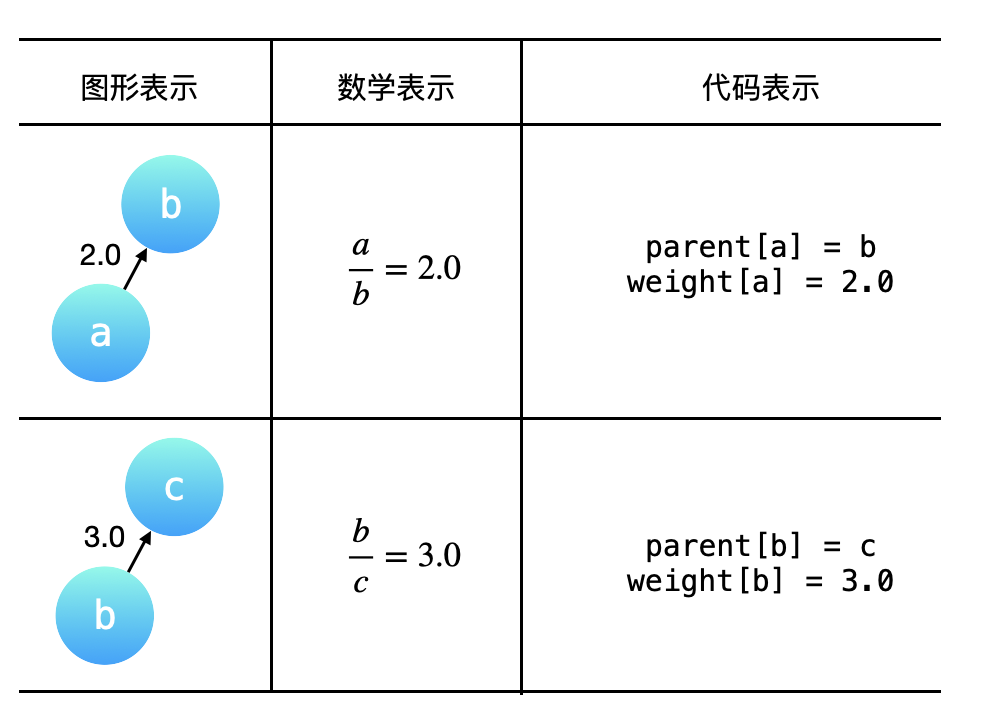
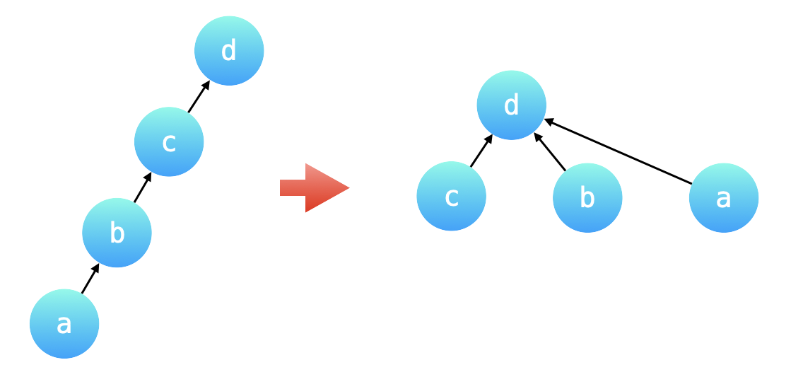
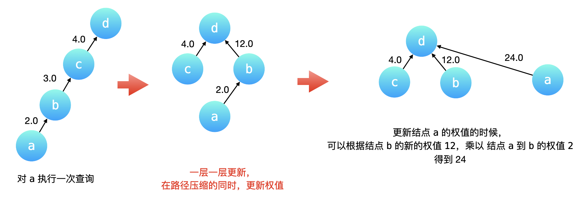
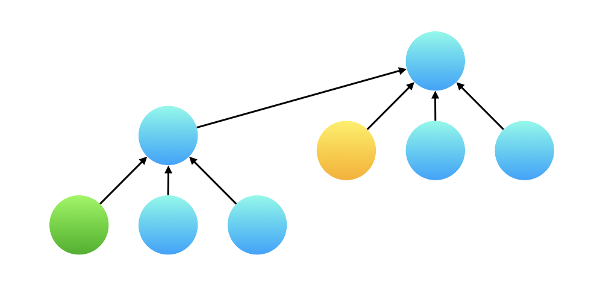
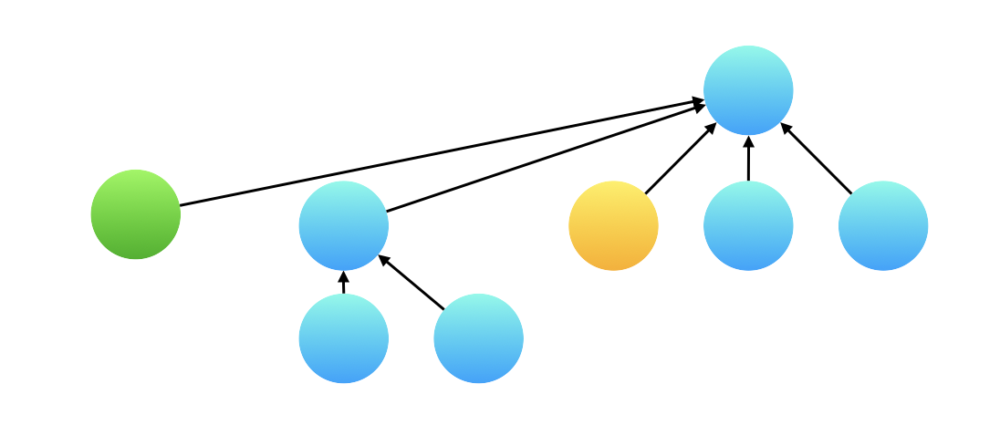

# 399. 除法求值

## 题目

难度：中等

给你一个变量对数组 `equations` 和一个实数值数组 `values` 作为已知条件，其中 `equations[i] = [Ai, Bi]` 和 `values[i]` 共同表示等式 `Ai / Bi = values[i]` 。每个 `Ai` 或 `Bi` 是一个表示单个变量的字符串。

另有一些以数组 `queries` 表示的问题，其中 `queries[j] = [Cj, Dj]` 表示第 `j` 个问题，请你根据已知条件找出 `Cj / Dj = ?` 的结果作为答案。

返回 **所有问题的答案** 。如果存在某个无法确定的答案，则用 `-1.0` 替代这个答案。如果问题中出现了给定的已知条件中没有出现的字符串，也需要用 `-1.0` 替代这个答案。

**注意：**输入总是有效的。你可以假设除法运算中不会出现除数为 0 的情况，且不存在任何矛盾的结果。

**示例 1：**

```
输入：equations = [["a","b"],["b","c"]], values = [2.0,3.0], queries = [["a","c"],["b","a"],["a","e"],["a","a"],["x","x"]]
输出：[6.00000,0.50000,-1.00000,1.00000,-1.00000]
解释：
条件：a / b = 2.0, b / c = 3.0
问题：a / c = ?, b / a = ?, a / e = ?, a / a = ?, x / x = ?
结果：[6.0, 0.5, -1.0, 1.0, -1.0 ]

```

**示例 2：**

```
输入：equations = [["a","b"],["b","c"],["bc","cd"]], values = [1.5,2.5,5.0], queries = [["a","c"],["c","b"],["bc","cd"],["cd","bc"]]
输出：[3.75000,0.40000,5.00000,0.20000]

```

**示例 3：**

```
输入：equations = [["a","b"]], values = [0.5], queries = [["a","b"],["b","a"],["a","c"],["x","y"]]
输出：[0.50000,2.00000,-1.00000,-1.00000]

```

> 来源: 力扣（LeetCode）  
> 链接: <https://leetcode.cn/problems/evaluate-division/?favorite=2cktkvj>  
> 著作权归领扣网络所有。商业转载请联系官方授权，非商业转载请注明出处。

## 答案

### 1. 并查集

由于变量之间的倍数关系具有传递性，处理有传递性关系的问题，可以使用「并查集」，我们需要在并查集的「合并」与「查询」操作中 **维护这些变量之间的倍数关系**。

分析示例 1：

* `a / b = 2.0` 说明 a = 2b，a 和 b 在同一个集合中
* `b / c = 3.0` 说明 b = 3c，b 和 c 在同一个集合中

求 $\frac{a}{c}$， 可以把 a = 2b，b = 3c 依次代入，得到：

$$
\frac{a}{c} = \frac{2b}{c} = \frac{2*3c}{c} = 6.0
$$

求 $\frac{b}{a}$，同理可得：

$$
\frac{b}{a} = \frac{b}{2b} = \frac{3c}{6c} = 0.5
$$

**同在一个集合中的两个变量就可以通过某种方式计算出它们的比值**。具体来说可以把 **不同的变量的比值转换成相同的变量的比值**，这样在做除法时就可以消去相同的变量，然后再计算转换成相同变量以后的系数的比值。

如果两个变量不在同一个集合中，返回 -1.0。并且根据题目的意思，如果两个变量中至少有一个变量没有出现在所有 equations 出现的字符集中，也返回 -1.0。

#### 1.1 构建有向图

我们可以将题目中的 equations 和 values 表示成一个图：

> `weight` 表示



#### 1.2 「统一变量」与「路径压缩」的关系

刚刚在分析例 1 时就提到了可以把一个一个 query 中的不同变量转换成 **同一个变量**，这样在计算 query 时就可以以 $O(1)$ 的时间复杂度计算出结果，在「并查集」的一个优化技巧中，「路径压缩」就恰好符合了这样的应用场景。

为了避免并查集所表示的树形结构高度过高，影响查询性能。「路径压缩」就是针对树的高度的优化。「路径压缩」的效果是：在查询一个结点 a 的根结点同时，把结点 a 到根结点的沿途所有结点的父亲结点都指向根结点。如下图所示，除了根结点以外，所有的结点的父亲结点都指向了根结点。特别地，也可以认为根结点的父亲结点就是根结点自己。如下国所示：路径压缩前后，并查集所表示的两棵树形结构等价，路径压缩以后的树的高度为 2，查询性能最好。



由于有「路径压缩」的优化，两个同在一个连通分量中的不同的变量，它们分别到根结点（父亲结点）的权值的比值，就是题目的要求的结果。

#### 1.3 如何在「查询」操作的「路径压缩」优化中维护权值变化

如下图所示，我们在结点 `a` 执行一次「查询」操作。路径压缩会先一层一层向上先找到根结点 `d`，然后依次把 `c`、`b` 、`a` 的父亲结点指向根结点 `d`。

* c 的父亲结点已经是 d 了，所以权值不用改
* b 的父亲结点要改成根节点 d，它的权值就是从当前结点到根结点经过的所有有向边的权值乘积，因此是 3.0 乘上 4.0 等于 12.0
* a 的父亲结点要改成根节点 d，权值等于 12.0 乘上 2.0 等于 24.0



#### 1.4 如何在「合并」操作中维护权值的变化

「合并」操作基于这样一个 很重要的前提：我们将要合并的两棵树的高度最多为 222，换句话说两棵树都必需是「路径压缩」以后的效果，两棵树的叶子结点到根结点最多只需要经过一条有向边。

例如已知 $\frac{a}{b} = 3.0$，$\frac{d}{c} = 4.0$，又已知 $\frac{a}{d} = 6.0$，现在合并结点 a 和 d 所在的集合，其实就是把 a 的根节点 b 指向 d 的根节点 c。**因此两条路径上的有向边的权值的乘积是一定相等的**。设 b 到 c 的权值为 x，那么：

$$
3.0 \times x = 6.0 \times 4.0
$$

因此可以得到 $x = 8.0$。

#### 1.5 一个容易忽略的细节

接下来还有一个小的细节问题：在合并以后，产生了一棵高度为 3 的树，那么我们在执行查询的时候，例如下面展示的绿色结点和黄色结点，绿色结点并不直接指向根结点，在计算这两个变量值的时候，计算边的权值的比值的结果是不对的。



但其实不用担心这个问题，**并查集的「查询」操作会执行「路径压缩」**，所以真正在计算两个变量的权值的时候，绿色结点已经指向了根结点，和黄色结点的根结点相同。因此可以用它们指向根结点的有向边的权值的比值作为两个变量的比值。



> 我们通过这个细节向大家强调：**一边查询一边修改结点指向是并查集的特色**。

```c++
class Solution {

private:
    // 指向的父结点
    std::vector<int> parent;
    // 指向的父结点的权值
    std::vector<double> weight;

private:
    // 路径压缩
    int find(int x) {
        if (x != parent[x]) {
            int origin = parent[x];
            parent[x] = find(parent[x]);
            weight[x] *= weight[origin]; 
        }
        return parent[x];
    }


    // 合并集合
    void union_fn(int x, int y, double val) {
        int rootX = find(x);
        int rootY = find(y);
        if (rootX == rootY) {
            return;
        }

        parent[rootX] = rootY;
        weight[rootX] = weight[y] * val / weight[x];
    }

    // 判断是否相交
    double is_connected(int x, int y) {
        int rootX = find(x);
        int rootY = find(y);
        if (rootX == rootY) {
            return weight[x] / weight[y];
        } else {
            return -1.0;
        }
    }

public:
    vector<double> calcEquation(vector<vector<string>>& equations, vector<double>& values, vector<vector<string>>& queries) {
        // 0. 初始化并查集
        int n = equations.size() * 2;  // 保留足够空间
        parent.resize(n);
        weight.resize(n);
        for (int i = 0; i < n; ++i) {
            parent[i] = i;
            weight[i] = 1.0;
        }

        // 1. 预处理, 将变量的值与 id 进行映射, 使得并查集的底层使用数组实现, 方便编码
        std::unordered_map<std::string, int> hash_map;
        int id = 0;
        for (int i = 0; i < equations.size(); ++i) {
            std::string var1 = equations[i][0];
            std::string var2 = equations[i][1];

            if (hash_map.count(var1) == 0) {
                hash_map[var1] = id;
                id++;
            }
            if (hash_map.count(var2) == 0) {
                hash_map[var2] = id;
                id++;
            }
            // 合并集合
            union_fn(hash_map[var1], hash_map[var2], values[i]);
        }
        
        // 2. 做查询
        int queries_size = queries.size();
        std::vector<double> res(queries_size);
        for (int i = 0; i < queries_size; ++i) {
            std::string var1 = queries[i][0];
            std::string var2 = queries[i][1];

            if (hash_map.count(var1) == 0 || hash_map.count(var2) == 0) {
                res[i] = -1.0;
            } else {
                res[i] = is_connected(hash_map[var1], hash_map[var2]);
            }
        }

        return res;
    }
};
```

### 2. BFS

我们可以将整个问题建模成一张图：给定图中的一些点（变量），以及某些边的权值（两个变量的比值），试对任意两点（两个变量）求出其路径长（两个变量的比值）。

因此我们首先需要遍历 equations 数组，找出其中所有不同的字符串，并通过哈希表将不同的字符串映射成整数。

在构建完图之后，对于任何一个查询，就可以从起点出发，通过广度优先搜索的方式，不断更新起点与当前点之间的路径长度，直到搜索到终点为止。

```c++
class Solution {
public:
    vector<double> calcEquation(vector<vector<string>>& equations, vector<double>& values, vector<vector<string>>& queries) {
        unordered_map<std::string, int> var2int;

        // 1. 通过哈希表将每个不同的字符串映射成整数
        int n_vars = 0;
        for (int i = 0; i < equations.size(); ++i) {
            if (var2int.find(equations[i][0]) == var2int.end()) {
                var2int[equations[i][0]] = n_vars;
                n_vars++;
            }
            if (var2int.find(equations[i][1]) == var2int.end()) {
                var2int[equations[i][1]] = n_vars;
                n_vars++;
            }
        }

        // 2. 对于每个点，存储其直接连接到的所有点及其对应的权值
        std::vector<std::vector<std::pair<int, double>>> edges(n_vars);
        for (int i = 0; i < equations.size(); ++i) {
            int va = var2int[equations[i][0]];
            int vb = var2int[equations[i][1]];
            edges[va].push_back(std::make_pair(vb, values[i]));
            edges[vb].push_back(std::make_pair(va, 1.0 / values[i]));
        }

        // 3. BFS
        std::vector<double> ret;
        for (const auto& q : queries) {
            double result = -1.0;
            if (var2int.find(q[0]) != var2int.end() && var2int.find(q[1]) != var2int.end()) {
               int ia = var2int[q[0]];
               int ib = var2int[q[1]];

               if (ia == ib) {
                   result = 1.0;
               } else {
                   std::queue<int> points;
                   points.push(ia);
                   std::vector<double> ratios(n_vars, -1.0);
                   ratios[ia] = 1.0;

                   while (!points.empty() && ratios[ib] < 0) {
                       int x  = points.front();
                       points.pop();

                       for (const auto [y, val] : edges[x]) {
                           if (ratios[y] < 0) {
                               ratios[y] = ratios[x] * val;
                               points.push(y);
                           }
                       }
                   }
                   result = ratios[ib];
               }
            }
            ret.push_back(result);
        }

        return ret;
    }
};
```
