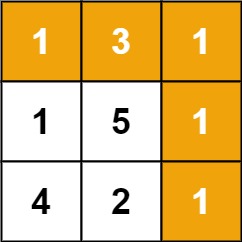

# 64. 最小路径和

## 题目

难度: 中等

给定一个包含非负整数的 *m* x *n* 网格 grid，请找出一条从左上角到右下角的路径，使得路径上的数字总和为最小。

**说明：**每次只能向下或者向右移动一步。

**示例 1：**



```
输入：grid = [[1,3,1],[1,5,1],[4,2,1]]
输出：7
解释：因为路径 1→3→1→1→1 的总和最小。

```

**示例 2：**

```
输入：grid = [[1,2,3],[4,5,6]]
输出：12

```

> 来源: 力扣（LeetCode）  
> 链接: <https://leetcode.cn/problems/minimum-path-sum/description/>  
> 著作权归领扣网络所有。商业转载请联系官方授权，非商业转载请注明出处。

## 答案

### 1. 动态规划

```c++
class Solution {
public:
    int minPathSum(vector<vector<int>>& grid) {
        // 动态规划
        int n = grid.size();
        int m = grid[0].size();

        int dp[n][m];

        // 初始化动态规划矩阵
        dp[0][0] = grid[0][0];
        for (int i = 1; i < n; i++) {
            dp[i][0] = dp[i-1][0] + grid[i][0];
        }
        for (int i = 1; i < m; i++) {
            dp[0][i] = dp[0][i-1] + grid[0][i];
        }

        for (int i = 1; i < n; i++) {
            for (int j = 1; j < m; j++) {
                dp[i][j] = grid[i][j] + std::min(dp[i-1][j], dp[i][j-1]);
            }
        }

        return dp[n-1][m-1];
    }
};
```
