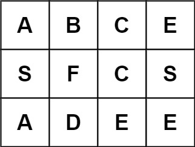

# 85. 最大矩形

## 题目

难度:

给定一个仅包含 0 和 1、大小为 rowsxcols 的二维二进制矩阵，找出只包含 1 的最大矩形，并返回其面积。

**示例 1：**



```
输入：matrix = [["1","0","1","0","0"],["1","0","1","1","1"],["1","1","1","1","1"],["1","0","0","1","0"]]
输出：6
解释：最大矩形如上图所示。

```

**示例 2：**

```
输入：matrix = []
输出：0

```

**示例 3：**

```
输入：matrix = [["0"]]
输出：0

```

**示例 4：**

```
输入：matrix = [["1"]]
输出：1

```

**示例 5：**

```
输入：matrix = [["0","0"]]
输出：0

```

> 来源: 力扣（LeetCode）  
> 链接: <https://leetcode.cn/problems/maximal-rectangle/?favorite=2cktkvj>  
> 著作权归领扣网络所有。商业转载请联系官方授权，非商业转载请注明出处。

## 答案

### 1. 暴力

```c++
class Solution {
public:
    int maximalRectangle(vector<vector<char>>& matrix) {
        int m = matrix.size();
        if (m == 0) {
            return 0;
        }
        int n = matrix[0].size();
        std::vector<std::vector<int>> left(m, std::vector<int>(n, 0));

        // 计算矩阵每个元素左边连续 1 的数量
        for (int i = 0; i < m; ++i) {
            for (int j = 0; j < n; ++j) {
                if (matrix[i][j] == '1') {
                    left[i][j] = (j == 0 ? 0 : left[i][j - 1]) + 1;
                }
            }
        }

        // 计算每个点为右下角的最大矩阵
        int ret = 0;
        for (int i = 0; i < m; ++i) {
            for (int j = 0; j < n; ++j) {
                if (matrix[i][j] == '0') {
                    continue;
                }
                int width = left[i][j];
                int area = width;
                for (int k = i - 1; k >= 0; --k) {
                    width = std::min(width, left[k][j]);
                    area = std::max(area, (i - k + 1) * width);
                }
                ret = std::max(ret, area);
            }
        }

        return ret;
    }
};
```

### 2. 单调栈

```c++
class Solution {
public:
    int maximalRectangle(vector<vector<char>>& matrix) {
        int m = matrix.size();
        if (m == 0) {
            return 0;
        }
        int n = matrix[0].size();
        std::vector<std::vector<int>> left(m, std::vector<int>(n, 0));

        for (int i = 0; i < m; ++i) {
            for (int j = 0; j < n; ++j) {
                if (matrix[i][j] == '1') {
                    left[i][j] = (j == 0 ? 0 : left[i][j - 1]) + 1;
                }
            }
        }

        int ret = 0;
        // 对于每一列，使用基于柱状图的方法
        for (int j = 0; j < n; ++j) {
            std::vector<int>up(m, 0);
            std::vector<int>down(m, 0);

            std:stack<int> stk;
            for (int i = 0; i < m; ++i) {
                while (!stk.empty() && left[stk.top()][j] >= left[i][j]) {
                    stk.pop();
                }
                up[i] = stk.empty() ? -1 : stk.top();
                stk.push(i);
            }

            stk = std::stack<int>();
            for (int i = m - 1; i >= 0; --i) {
                while (!stk.empty() && left[stk.top()][j] >= left[i][j]) {
                    stk.pop();
                }
                down[i] = stk.empty() ? m : stk.top();
                stk.push(i);
            }

            for (int i = 0; i < m; ++i) {
                int height = down[i] - up[i] - 1;
                int area = height * left[i][j];
                ret = std::max(ret, area);
            }
        }

        return ret;
    }
};
```
