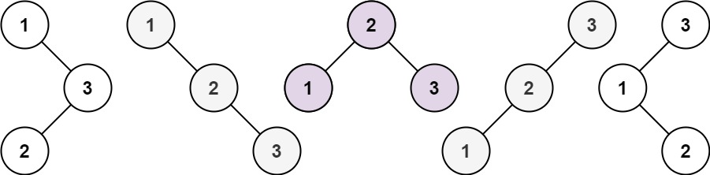
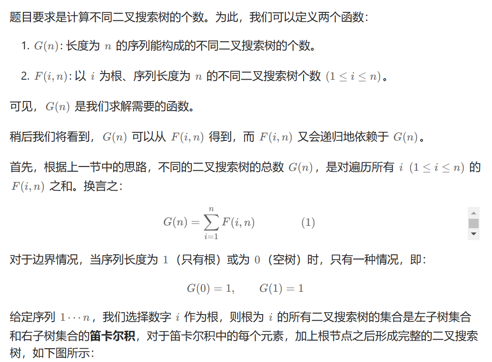
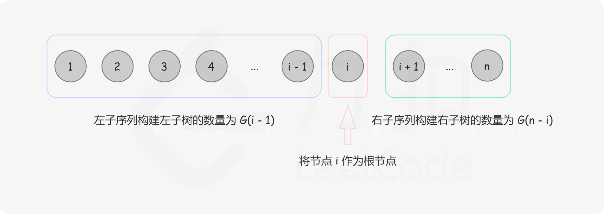
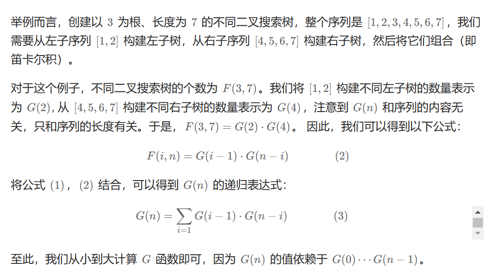

# 96. 不同的二叉搜索树

## 题目

难度:

给你一个整数 n，求恰由 n 个节点组成且节点值从 1 到 n 互不相同的 **二叉搜索树** 有多少种？返回满足题意的二叉搜索树的种数。

**示例 1：**



```
输入：n = 3
输出：5

```

**示例 2：**

```
输入：n = 1
输出：1

```

> 来源: 力扣（LeetCode）  
> 链接: <https://leetcode.cn/problems/unique-binary-search-trees/?favorite=2cktkvj>  
> 著作权归领扣网络所有。商业转载请联系官方授权，非商业转载请注明出处。

## 答案

### 1. 动态规划

给定一个有序序列 1,2,3,...,n，为了构建出一棵二叉搜索树，我们可以遍历每个数字 i，将该数字作为树根，将 1~(i-1) 序列作为左子树，将 (i+1)~n 序列作为右子树。接着我们可以按照同样的方式递归构建左子树和右子树。

在上述构建的过程中，由于根的值不同，因此我们能保证每棵二叉搜索树是唯一的。

由此可见，原问题可以分解成规模较小的两个子问题，且子问题的解可以复用。因此，我们可以想到使用动态规划来求解本题。







```c++
class Solution {
public:
    int numTrees(int n) {
        std::vector<int> G(n + 1, 0);
        G[0] = 1;
        G[1] = 1;

        for (int i = 2; i <= n; ++i) {
            for (int j = 1; j <= i; ++j) {
                G[i] += G[j - 1] * G[i - j];
            }
        }

        return G[n];
    }
};
```
