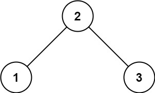
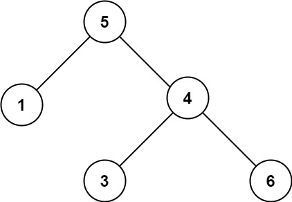

# 98. 验证二叉搜索树

## 题目

难度：中等

给你一个二叉树的根节点 root ，判断其是否是一个有效的二叉搜索树。

**有效** 二叉搜索树定义如下：

* 节点的左子树只包含 **小于** 当前节点的数。
* 节点的右子树只包含 **大于** 当前节点的数。
* 所有左子树和右子树自身必须也是二叉搜索树。

**示例 1：**



```
输入：root = [2,1,3]
输出：true

```

**示例 2：**



```
输入：root = [5,1,4,null,null,3,6]
输出：false
解释：根节点的值是 5 ，但是右子节点的值是 4 。

```

> 来源：力扣（LeetCode）  
> 链接：<https://leetcode-cn.com/problems/validate-binary-search-tree/>  
> 著作权归领扣网络所有。商业转载请联系官方授权，非商业转载请注明出处。

## 答案

> 搞一个上下限，然后递归查找下去。

```c++
/**
 * Definition for a binary tree node.
 * struct TreeNode {
 *     int val;
 *     TreeNode *left;
 *     TreeNode *right;
 *     TreeNode() : val(0), left(nullptr), right(nullptr) {}
 *     TreeNode(int x) : val(x), left(nullptr), right(nullptr) {}
 *     TreeNode(int x, TreeNode *left, TreeNode *right) : val(x), left(left), right(right) {}
 * };
 */
class Solution {
public:
    /*
     * upper_limit: 上限
     * down_limit: 下限
     * (down_limit, upper_limit)
     */
    bool isValid(TreeNode* root, long down_limit, long upper_limit) {
        if (root == nullptr) {
            return true;
        }

        if (root->val <= down_limit || root->val >= upper_limit) {
            return false;
        }

        return isValid(root->left, down_limit, root->val) && isValid(root->right, root->val, upper_limit);
    }

    bool isValidBST(TreeNode* root) {
       return isValid(root, LONG_MIN, LONG_MAX);
    }
};
```
