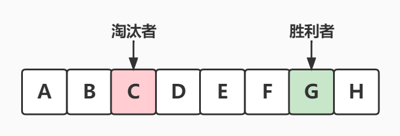

# 剑指 Offer 62. 圆圈中最后剩下的数字

## 题目

难度: 简单

0,1,···,n-1这n个数字排成一个圆圈，从数字0开始，每次从这个圆圈里删除第m个数字（删除后从下一个数字开始计数）。求出这个圆圈里剩下的最后一个数字。

例如，0、1、2、3、4这5个数字组成一个圆圈，从数字0开始每次删除第3个数字，则删除的前4个数字依次是2、0、4、1，因此最后剩下的数字是3。

**示例 1：**

```
输入: n = 5, m = 3
输出: 3

```

**示例 2：**

```
输入: n = 10, m = 17
输出: 2

```

> 来源: 力扣（LeetCode）  
> 链接: <https://leetcode.cn/problems/yuan-quan-zhong-zui-hou-sheng-xia-de-shu-zi-lcof/>  
> 著作权归领扣网络所有。商业转载请联系官方授权，非商业转载请注明出处。

## 答案

### 1. 数学 + 迭代

因为我们知道最后剩下一个人的情况时胜利者的下标是`0`，也就是我们已知胜利者最后的位置，**逆推**到最初的时候胜利者所在的位置：

1. 关注胜利者的下标位置是怎么变的
2. 每杀掉一个人，其实就是把这个数组向前移动了`m`位

==每杀掉一个人，相当于将该被杀的人放到数组末尾，并将整个数组向前移动m位：==



把`A`和`B`接到`H`后面形成一个新的队列，并且以`D`为新的队伍头：

.jpg)

可以看到`G`的位置向左移动了`m`位，也就是减少了`m`，所以**逆推**`G`的位置时就要加上`m`就是公式中的 **`(f(n - 1) + m) % n`**

==公式：==

==**`f(n, m) = (f(n−1, m) + m) % n`**==

==`f(n, m)`表示，`n`个人报数，每报到`m`时杀掉那个人，返回最终胜利者的编号==

递归方法：

```c++
class Solution {
public:
    int lastRemaining(int n, int m) {
        if (n == 1) {
            return 0;
        }

        return (lastRemaining(n - 1, m) + m) % n;
    }
};
```

迭代方法：

```c++
class Solution {
public:
    int lastRemaining(int n, int m) {
        if (n == 1) {
            return 0;
        }

        int res = 0;
        for (int i = 2; i <= n; i++) {
            res = (res + m) % i;  // 注意这里是 res = (res + m) % i 而非 res = (res + m) % n
        }

        return res;
    }
};
```
