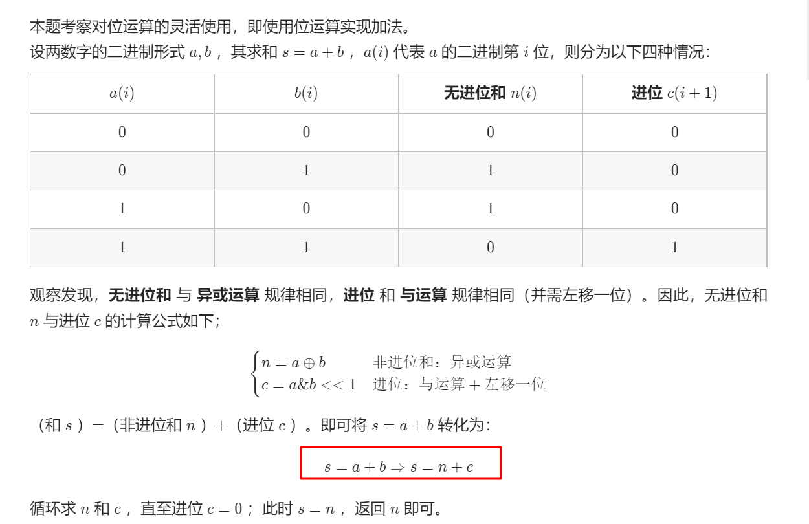

# 剑指 Offer 65. 不用加减乘除做加法

## 题目

难度: 简单

写一个函数，求两个整数之和，要求在函数体内不得使用 “+”、“-”、“*”、“/” 四则运算符号。

**示例:**

```
输入: a = 1, b = 1
输出: 2
```

> 来源: 力扣（LeetCode）  
> 链接: <https://leetcode.cn/problems/bu-yong-jia-jian-cheng-chu-zuo-jia-fa-lcof/>  
> 著作权归领扣网络所有。商业转载请联系官方授权，非商业转载请注明出处。

## 答案




## 注意事项

> Q ： 若数字 a 和 b 中有负数，则变成了减法，如何处理？
> A ： 在计算机系统中，数值一律用 补码 来表示和存储。**补码的优势： 加法、减法可以统一处理（CPU只有加法器）**。因此，以上方法 同时适用于正数和负数的加法 。

## 代码

```c++
class Solution {
public:
    int add(int a, int b) {
        // 无进位和 n, 有进位和 c
        int n = a ^ b;
        int c = unsigned(a & b) << 1;

        while (c) {
            int temp = n;
            n = n ^ c;
            c = unsigned(temp & c) << 1;
        }

        return n;
    }
};
```
