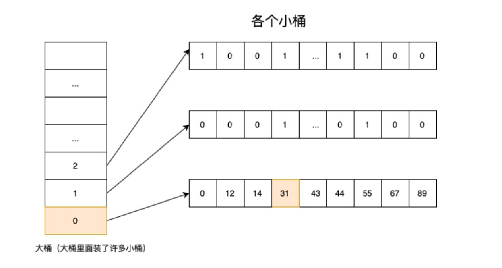
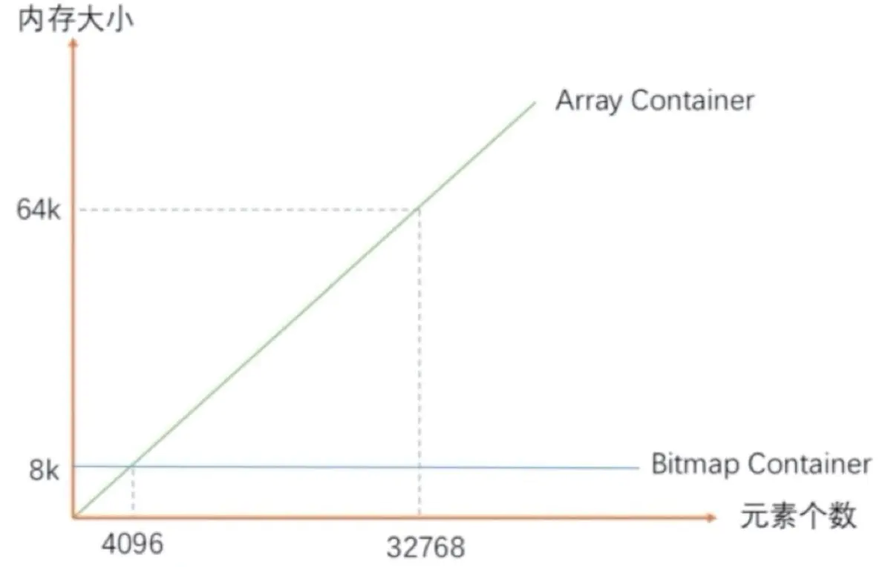

# bitmap

## 简介

bitmap 是大数据的一种常见数据结构，简单来说就是按位存储。

但是它也存在两个显著的缺点：

* 只能用于不重复数据（判断数据是否存在），而不能判断数据的重复次数
* 对于稀疏数据而言会占用大量存储

## RoaringBitmap

具体看一下第二个问题，无论业务中实际元素个数有多少，bitmap 占用的内存空间都是固定的，和元素的取值范围相关。假设我们要存储的 uint32_t 数据，那么 bitmap 就必须开辟  $2^{32} / 8 / 1024 / 1024 MB$ =  512 MB 内存。

为了解决 bitmap 中稀疏数据浪费存储空间的问题，出现了很多稀疏位图的压缩算法，RoaringBitmap 就是其中的优秀代表。

### 1. 原理

假设数据的取值范围是 uint32，即 `0 ~ 2^32 - 1`，大概是 0 到 43 亿。

RoaringBitmap 将数据的前半部分 $2^{16}$ 作为桶的编号，分为 $2^{16} = 65536$ 个桶，每个桶用 16 位表示。Bitmap 中将这些小桶称之为 Container，注意此时这些 Container 并未创建。

存储数据时按照数据的高 16 位作为 Container 编号去查找对应的 Container（找不到就创建），再将低 16 位放入到该 Container 中。因此一个 RoaringBitmap 是很多 Container 的集合。

举个例子，假设我们要存储 31，那么它高位部分就是 0，对应的桶（Container）编号为 0，将低位的 31 设置到对应的 Container 中。

> 通过这种延迟创建桶的方式可以保证在数据量较少时不会占用太多内存。

### 2. Container 类型

#### 2.1 ArrayContainer

在创建一个 Container 时如果只塞入一个元素，RoaringBitmap 默认会使用 ArrayContainer 来存储，其中每一个元素的类型为 uint16 占两个字节。

当 ArrayContainer 容量超过 4096 时会自动转为 BitmapContainer。之所以取 4096 是因为在低于它时 ArrayContainer 比较省空间，而高于它时 BitmapContainer 比较省空间。

#### 2.2 BitmapContainer

这个容器就是一开始讲的 bitmap，只不过这里位数为 $2^{16} = 65536$，占用 8kb 内存。然后用 0 和 1 表示每一位对应的整数是否存在。

#### 2.3 RunContainer

这是一种利用步长来压缩空间的方法，比如连续的整数序列 11、12、13、14、15、27、28、29 会被压缩成两个二元组 `[11, 4]` 和 `[27, 2]`。那么原先 16 个字节的数据现在只需要 8 个字节。不过这种容器一般不常用，在使用的时候需要我们自行调用相关的转换函数来判断是不是需要将 ArrayContainer 或者 BitmapContainer 转换成 RunContainer。

## 性能分析

### 1. 时间复杂度

* BitmapContainer 只涉及到位运算且可以根据下标直接寻址，因此时间复杂度为 $O (1)$
* ArrayContainer 和 RunContainer 都需要用二分法在有序数组中定位元素，时间复杂度为 $O (logN)$

### 2. 空间复杂度

* BitmapContainer 恒定占用 8KB 内存
* ArrayContainer 空间占用与基数 c 相关，为 $(2+2c) B$
* RunContainer 与它存储的连续序列数 r 相关，为 $(2+4r) B$

## Reference

[1] <https://blog.csdn.net/GGBOOMi/article/details/127576805>
