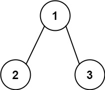

# 116. 填充每个节点的下一个右侧节点指针

## 题目

难度: 中等

给定一个 **完美二叉树**，其所有叶子节点都在同一层，每个父节点都有两个子节点。二叉树定义如下：

```
struct Node {
  int val;
  Node *left;
  Node *right;
  Node *next;
}
```

填充它的每个 next 指针，让这个指针指向其下一个右侧节点。如果找不到下一个右侧节点，则将 next 指针设置为 NULL。

初始状态下，所有 next 指针都被设置为 NULL。

**示例 1：**



```
输入：root = [1,2,3,4,5,6,7]
输出：[1,#,2,3,#,4,5,6,7,#]
解释：给定二叉树如图 A 所示，你的函数应该填充它的每个 next 指针，以指向其下一个右侧节点，如图 B 所示。序列化的输出按层序遍历排列，同一层节点由 next 指针连接，'#' 标志着每一层的结束。

```

**示例 2:**

```
输入：root = []
输出：[]

```

**进阶：**

- 你只能使用常量级额外空间。
- 使用递归解题也符合要求，本题中递归程序占用的栈空间不算做额外的空间复杂度。

> 来源: 力扣（LeetCode）  
> 链接: <https://leetcode.cn/problems/populating-next-right-pointers-in-each-node/>  
> 著作权归领扣网络所有。商业转载请联系官方授权，非商业转载请注明出处。

## 答案

==使用队列进行层次遍历。==

```c++
/*
// Definition for a Node.
class Node {
public:
    int val;
    Node* left;
    Node* right;
    Node* next;

    Node() : val(0), left(NULL), right(NULL), next(NULL) {}

    Node(int _val) : val(_val), left(NULL), right(NULL), next(NULL) {}

    Node(int _val, Node* _left, Node* _right, Node* _next)
        : val(_val), left(_left), right(_right), next(_next) {}
};
*/

class Solution {
public:
    Node* connect(Node* root) {
        // 层次遍历
        if (!root) {
            return root;
        }

        // 初始化队列, 将根节点加入到队列中
        std::queue<Node*> q;
        q.push(root);

        // 外层的 while 循环迭代的是次数
        while (!q.empty()) {
            // 记录当前队列
            int n = q.size();

            // 遍历这一层的所有结点
            for (int i = 0; i < n; i++) {
                // 取出队首元素
                Node* node = q.front();
                q.pop();

                if (i < n - 1) {
                    node->next = q.front();
                }

                if (node->left) {
                    q.push(node->left);
                }
                if (node->right) {
                    q.push(node->right);
                }
            }
        }

        return root;
    }
};
```
