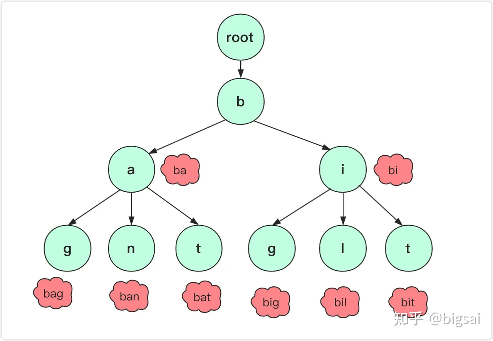

# 字典树

## 简介

字典树是用于快速存储和查找字符串集合的数据结构，它是一种空间换时间的数据结构。

> 字典树也被称为 Trie 树或者前缀树。

它的优点是利用字符串的公共前缀来减少查询时间，最大限度地减少无谓的字符串比较，查询效率比哈希树高。

## 例子

一个字典树的经典应用场景就是在搜索引擎的输入框中输入部分单测，下面会出现一些相关联的搜索内容，其中就利用了字典树的思想：


## 性质

对于字典树而言有三个重要性质：

1. **根节点不包含字符**，除了根节点每个节点都只包含一个字符。root 节点不含字符这样做的目的是为了能够包括所有字符串。
2. 从根节点到某一个节点，路过字符串起来就是该节点对应的字符串。
3. 每个节点的子节点字符不同，也就是找到对应单词、字符是唯一的。



## 设计实现字典树

对于字典树，可能不同的场景或者需求设计上有一些细致的区别，但整体来说一般的字典树有 **插入、查询（指定字符串）、查询（前缀）。**

以 Leetcode 208 为例。

我们需要实现 Trie 类：

* `Trie()` 初始化前缀树对象。
* `void insert(String word)` 向前缀树中插入字符串 `word` 。
* `boolean search(String word)` 如果字符串 `word` 在前缀树中，返回 `true`（即，在检索之前已经插入）；否则，返回 `false` 。
* `boolean startsWith(String prefix)` 如果之前已经插入的字符串 `word` 的前缀之一为 `prefix` ，返回 `true` ；否则，返回 `false` 。

对于一个字典树 Trie 类，肯定是要有一个根节点 root 的，而这个节点类型 TrieNode 也有很多设计方式，在这里我们为了简单放一个 26 个大小的 TrieNode 类型数组，分别对应 'a'-'z' 的字符，同时用一个 boolean 类型变量 is_end 表示是否为字符串末尾结束（如果为 true 说明是结尾）。

```c++
#pragma once

#include <string>
#include <vector>

/**
 * @brief 基于 26 个字母的字典树
 *
 */
class Trie {
 public:
  Trie() : childrens_(26) {
  }

 public:
  void Insert(const std::string& word) {
    Trie* node = this;
    for (const char ch : word) {
      size_t index = ch - 'a';
      if (node->childrens_[index] == nullptr) {
        node->childrens_[index] = new Trie();
      }
      node = node->childrens_[index];
    }
    node->is_end_ = true;
  }

 public:
  bool Search(const std::string& word) {
    Trie* node = this->SearchPrefix(word);
    return node != nullptr && node->is_end_;
  }

  bool StartWith(const std::string& prefix) {
    return this->SearchPrefix(prefix) != nullptr;
  }

 private:
  Trie* SearchPrefix(const std::string& prefix) {
    Trie* node = this;
    for (const char ch : prefix) {
      size_t index = ch - 'a';
      if (node->childrens_[index] == nullptr) {
        return nullptr;
      }
      node = node->childrens_[index];
    }
    return node;
  }

 private:
  std::vector<Trie*> childrens_;  // 所有子结点
  bool is_end_ = false;           // 表示该节点是否为字符串的结尾
};
```

## 原理

用数组的话如果字符比较多的话可能会消耗一些内存空间，但是这里 26 个连续字符还好的，如果向一个字典树中添加 `big`,`bit`,`bz` 那么它其实是这样的：


## 延伸思考

### 1. 字符较多时

对于上面是 26 个字符的，我们很容易用 ASCII 找到对应索引，如果字符可能性比较多，用数组可能浪费的空间比较大，那我们也可以用 HashMap 或者 List 来存储元素啊，用 List 的话就需要顺序枚举，用 **HashMap** 就可以直接查询。

### 2. 实现排序和统计

前面讲了，字典树用于大量字符的统计、排序、储存，其实排序就是和采用数组的方式可以进行排序，因为字符的 ASCII 有序，在读取时候可以按照这个规则读取，这个思想就和基数排序有点像了。

而统计的话可能会面临数量上统计，可能是出现过次数或者前缀单词数量统计，如果每次都枚举可能有点浪费时间，但你可以 TrieNode 中添加一个变量，每次插入的时候可以统计次数。如果字符串有重复那可以直接添加，如果字符串要去重那可以确定插入成功再给路径上前缀单词总数分别自增。这个的话就要具体问题具体分析了。

## Reference

[1] https://zhuanlan.zhihu.com/p/420663173