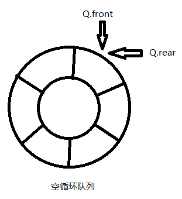
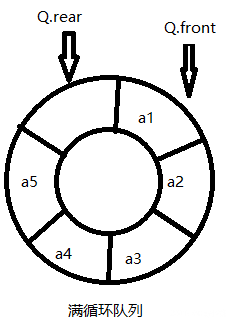

# 循环数组实现队列

## 简介

循环队列为空时 front 和 rear 相等：



循环队列为满时 rear + 1 = front：



## 实现

```c++
class Queue {
 public:
  explicit Queue(const uint32_t capacity) {
    // 留一个位置来区分满队列和空队列
    capacity_ = capacity + 1;
    data_.resize(capacity_);
  }

  ~Queue() = default;

 public:
  // 检查队列是否为空
  bool IsEmpty() {
    return front_ == rear_;
  }

  // 检查队列是否已满
  bool IsFull() {
    return (rear_ + 1) % capacity_ == front_;
  }

  bool Enqueue(const uint32_t elem) {
    if (IsFull()) {
      std::cout << "queue is full" << std::endl;
      return false;
    }

    data_[rear_] = elem;
    rear_ = (rear_ + 1) % capacity_;
    return true;
  }

  uint32_t Dequeue() {
    if (IsEmpty()) {
      std::cout << "queue is empty" << std::endl;
      return -1;
    }

    int elem = data_[front_];
    front_ = (front_ + 1) % capacity_;
    return elem;
  }

 private:
  std::vector<int32_t> data_;
  uint32_t capacity_ = 0;
  uint32_t front_ = 0;
  uint32_t rear_ = 0;
};
```
