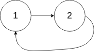

# 141. 环形链表

## 题目

难度: 简单

给你一个链表的头节点 head ，判断链表中是否有环。

如果链表中有某个节点，可以通过连续跟踪 next 指针再次到达，则链表中存在环。 为了表示给定链表中的环，评测系统内部使用整数 pos 来表示链表尾连接到链表中的位置（索引从 0 开始）。**注意：pos 不作为参数进行传递**。仅仅是为了标识链表的实际情况。

如果链表中存在环 ，则返回 true 。 否则，返回 false 。

**示例 1：**


```
输入：head = [3,2,0,-4], pos = 1
输出：true
解释：链表中有一个环，其尾部连接到第二个节点。

```

**示例 2：**



```
输入：head = [1,2], pos = 0
输出：true
解释：链表中有一个环，其尾部连接到第一个节点。

```

**示例 3：**


```
输入：head = [1], pos = -1
输出：false
解释：链表中没有环。

```

**进阶：**你能用 O(1)（即，常量）内存解决此问题吗？

> 来源: 力扣（LeetCode）  
> 链接: <https://leetcode.cn/problems/linked-list-cycle/>  
> 著作权归领扣网络所有。商业转载请联系官方授权，非商业转载请注明出处。

## 答案

### 1. hash表

```c++
/**
 * Definition for singly-linked list.
 * struct ListNode {
 *     int val;
 *     ListNode *next;
 *     ListNode(int x) : val(x), next(NULL) {}
 * };
 */
class Solution {
public:
    bool hasCycle(ListNode *head) {
        std::unordered_set<ListNode*> visited;
        while (head) {
            if (visited.count(head)) {
                return true;
            }
            visited.insert(head);
            head = head->next;
        }

        return false;
    }
};
```

### 2. 快慢指针

```c++
/**
 * Definition for singly-linked list.
 * struct ListNode {
 *     int val;
 *     ListNode *next;
 *     ListNode(int x) : val(x), next(NULL) {}
 * };
 */
class Solution {
public:
    bool hasCycle(ListNode *head) {
        auto fast = head;
        auto slow = head;

        while (fast && fast->next) {
            slow = slow->next;
            fast = fast->next->next;
            if (fast == slow) {
                return true;
            }
        }

        return false;
    }
};
```
