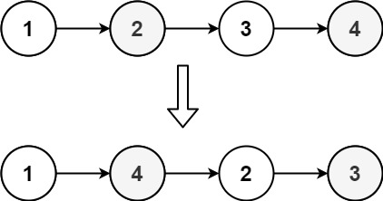
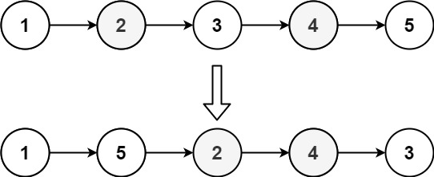

# 143. 重排链表

## 题目

难度: 中等

给定一个单链表 L 的头节点 head ，单链表 L 表示为：

```
L0 → L1 → … → Ln - 1 → Ln

```

请将其重新排列后变为：

```
L0 → Ln → L1 → Ln - 1 → L2 → Ln - 2 → …
```

不能只是单纯的改变节点内部的值，而是需要实际的进行节点交换。

**示例 1：**



```
输入：head = [1,2,3,4]
输出：[1,4,2,3]
```

**示例 2：**



```
输入：head = [1,2,3,4,5]
输出：[1,5,2,4,3]
```

> 来源: 力扣（LeetCode）  
> 链接: <https://leetcode.cn/problems/reorder-list/>  
> 著作权归领扣网络所有。商业转载请联系官方授权，非商业转载请注明出处。

## 答案

> 为了不引入额外的空间复杂度，可以将两个链表拆开后合并。

1. 找到链表中点，将链表拆成两个
2. 翻转后面的链表
3. 合并两个链表

```c++
/**
 * Definition for singly-linked list.
 * struct ListNode {
 *     int val;
 *     ListNode *next;
 *     ListNode() : val(0), next(nullptr) {}
 *     ListNode(int x) : val(x), next(nullptr) {}
 *     ListNode(int x, ListNode *next) : val(x), next(next) {}
 * };
 */
class Solution {
public:
    // 找到链表中点
    ListNode* findMiddle(ListNode* head) {
        if (!head) {
            return nullptr;
        }

        auto fast = head;
        auto slow = head;

        while (fast->next && fast->next->next) {
            slow = slow->next;
            fast = fast->next->next;
        }

        std::cout << slow->val << std::endl;
        return slow;
    }

    ListNode* reverseList(ListNode* head) {
        ListNode* prev = nullptr;
        ListNode* cur = head;

        while (cur) {
            auto next = cur->next;
            cur->next = prev;

            prev = cur;
            cur = next;
        }

        return prev;
    }

    // 合并两个链表
    ListNode* mergeList(ListNode* l1, ListNode* l2) {
        ListNode* dummy = new ListNode();
        ListNode* cur = dummy;

        while (l1 && l2) {
            cur->next = l1;
            l1 = l1->next;
            cur->next->next = l2;
            l2 = l2->next;
            cur = cur->next->next;
        }

        if (l1) {
            cur->next = l1;
        } else {
            cur->next = l2;
        }

        return dummy->next;
    }

    void reorderList(ListNode* head) {
        // 1) 找到中间结点, 将链表断开
        auto middle = findMiddle(head);
        ListNode* l1 = head;
        ListNode* l2 = middle->next;
        middle->next = nullptr;

        // 2) 翻转右半部分的链表
        l2 = reverseList(l2);

        l1 = mergeList(l1, l2);
    }
};
```
