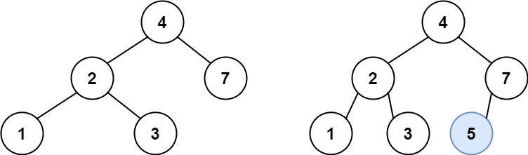

# 19. 删除链表的倒数第 N 个结点

## 题目

难度: 中等

给你一个链表，删除链表的倒数第 n 个结点，并且返回链表的头结点。

**示例 1：**



```
输入：head = [1,2,3,4,5], n = 2
输出：[1,2,3,5]

```

**示例 2：**

```
输入：head = [1], n = 1
输出：[]

```

**示例 3：**

```
输入：head = [1,2], n = 1
输出：[1]

```

**提示：**

- 链表中结点的数目为 sz
- 1 <= sz <= 30
- 0 <= Node.val <= 100
- 1 <= n <= sz

**进阶：**你能尝试使用一趟扫描实现吗？

> 来源: 力扣（LeetCode）  
> 链接: <https://leetcode.cn/problems/remove-nth-node-from-end-of-list/>  
> 著作权归领扣网络所有。商业转载请联系官方授权，非商业转载请注明出处。

## 答案

### 1. 双指针法

重点：

- 快慢指针
- 使用 dummy 结点（能用就用，别问为什么）

```c++
/**
 * Definition for singly-linked list.
 * struct ListNode {
 *     int val;
 *     ListNode *next;
 *     ListNode() : val(0), next(nullptr) {}
 *     ListNode(int x) : val(x), next(nullptr) {}
 *     ListNode(int x, ListNode *next) : val(x), next(next) {}
 * };
 */
class Solution {
public:
    ListNode* removeNthFromEnd(ListNode* head, int n) {
        ListNode* dummy = new ListNode();
        dummy->next = head;

        // 双指针, 让快指针距离慢指针 n 个结点, 当快指针为 nullptr 时, 满指针就是我们需要删除的结点
        // 由于我们需要获取删除结点的前一个结点, 因此让慢指针距离快指针 n+1 个结点
        ListNode* slow = dummy;
        ListNode* fast = dummy;

        for (int i = 0; i <= n; i++) {
            fast = fast->next;
        }

        while (fast) {
            slow = slow->next;
            fast = fast->next;
        }

        // 此时 fast == nullptr
        slow->next = slow->next->next;
        return dummy->next;
    }
};
```
