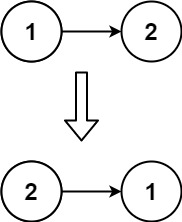

# 206. 反转链表

## 题目

**示例 1：**


```
输入：head = [1,2,3,4,5]
输出：[5,4,3,2,1]

```

**示例 2：**



```
输入：head = [1,2]
输出：[2,1]

```

**示例 3：**

```
输入：head = []
输出：[]

```

**进阶：** 链表可以选用迭代或递归方式完成反转。你能否用两种方法解决这道题？

> 来源: 力扣（LeetCode）  
> 链接: <https://leetcode.cn/problems/reverse-linked-list/?favorite=2cktkvj>  
> 著作权归领扣网络所有。商业转载请联系官方授权，非商业转载请注明出处。

## 答案

### 1. 方法一：迭代 + 双指针

![[image/image-20230210220702799.gif]]

* 定义 `pre` 和 `cur` 两个指针，分别初始化为 `nullptr` 和 `head`
* 令 `cur` 遍历每一个节点：
  * 每次令 `cur` 指向 `pre`
  * `cur` 和 `pre` 向后顺延

```c++
/**
 * Definition for singly-linked list.
 * struct ListNode {
 *     int val;
 *     ListNode *next;
 *     ListNode() : val(0), next(nullptr) {}
 *     ListNode(int x) : val(x), next(nullptr) {}
 *     ListNode(int x, ListNode *next) : val(x), next(next) {}
 * };
 */
class Solution {
public:
    ListNode* reverseList(ListNode* head) {
        // 举个例子:1->2->3->4->5->nullptr转化到5->4->3->2->1->nullptr
        // 设置两个指针 prev和cur

        ListNode *pre = nullptr;
        ListNode *cur = head;

        while (cur) {
            ListNode *nex = cur->next;
            cur->next = pre;
            // pre和cur更向前进1
            pre = cur;
            cur = nex;
        }

        return pre;
    }
};
```

### 2. 方法二：递归

递归会导致空间复杂度增大为 $O(n)$，而且比较难理解。


```c++
/**
 * Definition for singly-linked list.
 * struct ListNode {
 *     int val;
 *     ListNode *next;
 *     ListNode() : val(0), next(nullptr) {}
 *     ListNode(int x) : val(x), next(nullptr) {}
 *     ListNode(int x, ListNode *next) : val(x), next(next) {}
 * };
 */
class Solution {
public:
    ListNode* reverseList(ListNode* head) {
        // 画图比较好理解：非尾递归
        if (!head || !head->next) {
            return head;
        }

        ListNode *newHead = reverseList(head->next);
        head->next->next = head;
        head->next = nullptr;
        return newHead;
    }
};
```

### 3. 用栈

```c++
/**
 * Definition for singly-linked list.
 * struct ListNode {
 *     int val;
 *     ListNode *next;
 *     ListNode() : val(0), next(nullptr) {}
 *     ListNode(int x) : val(x), next(nullptr) {}
 *     ListNode(int x, ListNode *next) : val(x), next(next) {}
 * };
 */
class Solution {
public:
    ListNode* reverseList(ListNode* head) {
        // 使用栈: 先进后出
        std::stack<ListNode*> node_stack;
        
        ListNode* cur = head;
        while (cur) {
            node_stack.push(cur);
            cur = cur->next;
        }

        ListNode* dummy = new ListNode();
        cur = dummy;
        // 用empty方法遍历stack
        while (!node_stack.empty()) {
            auto node = node_stack.top();
            node_stack.pop();
            cur->next = node;
            cur = cur->next;  // 这一行可千万别漏, 容易写出bug
        }
        cur->next = nullptr;
        return dummy->next;
    }
};
```

## Reference

[1] <https://leetcode-cn.com/problems/reverse-linked-list/solution/fan-zhuan-lian-biao-shuang-zhi-zhen-di-gui-yao-mo-/>
