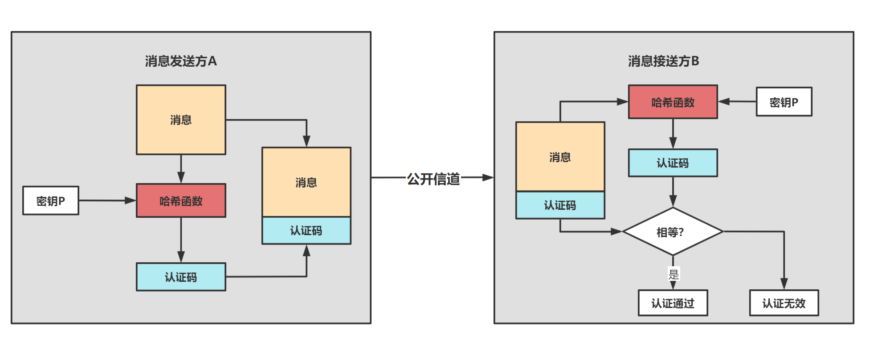

# 消息认证码

## 1. 概念

消息认证码（Message authentication code，MAC）时经过特定算法产生的一小段信息，可以用于检测某段消息的完整性（防止密文在传输过程中被篡改）以及作为身份验证（确认消息来源）。

假设消息发送方A需要将数据发送给消息接收方B，那么消息认证码的例子如下：

* A和B通过迪菲-赫尔曼密钥交换协议共同持有一个共享密钥P
* 消息发送方A使用共享密钥P对消息加密生成密文，并用密文和密钥生成消息认证码MAC（可以认为是密文和密钥组成的字符串的哈希值），然后将密文和消息认证码一起发给消息接收方B
* 消息接收方B也使用密文和密钥生成MAC，对比自己计算出的验证码和接收到的验证码是否相等

## 2. 缺陷

由于消息发送方A和消息接收方B都能生成消息认证码，因此无法解决“事后否认”的问题（数据发送方事后否认发送消息，例如消息发送方A可以否认消息是由他发送的，而是消息接收方B捏造的），这个问题可以由“数字签名”解决。

## Reference

[1] <https://www.cnblogs.com/khldragon/p/guan-yu-xiao-xi-ren-zheng-ma.html>
