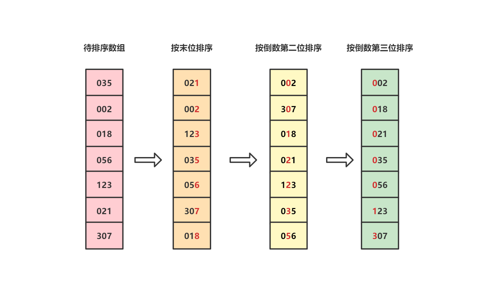

# 基数排序

## 原理

基数排序是桶排序的扩展，它将数组中所有整数视作统一长度的数字（位数较小的数字前面补零），然后从低位到高位依次排序。

举个例子，假设待排序数组是：`[35, 2, 18, 56, 123, 21, 307]`，那么基数排序的过程如下：



## 局限性

一般情况下基数排序仅适用于整数，但是对于名字、日期和特殊格式的浮点数也能适用。

## 复杂度

### 1. 时间复杂度

尽管基数排序有多种实现方式，但其本质都是按照位数进行排序然后再组合起来。

假设数组中最大值的位数为k，那么在k次排序中需要如下两步：

* 将数组元素分配到桶中：遍历数组即可，时间复杂度为$O(n)$
* 将桶中元素收集起来：遍历每个桶即可，时间复杂度为$O(n)$

因此总的时间复杂度为$O(k \times n)$，其中k是常数

### 2. 空间复杂度

该算法在按照每个位数排序时需要使用10个桶，所有桶中元素加起来数量等于数组数量n，因此空间复杂度为$O(n)$。

## 代码实现

```c++
#include <vector>
#include <algorithm>
#include <random>
#include <iostream>

std::vector<int> test_array = {1, 2, 3, 4, 5, 6, 7, 8, 9, 10, 11, 12, 13, 14, 15, 16, 17, 18, 19, 20, 21, 22, 23, 24, 25};

// 打印vector内容
void printVector(const std::string prefix, const std::vector<int> &vi) {
    std::cout << prefix;
    for (auto i : vi) {
        std::cout << " " << i;
    }
    std::cout << std::endl;
}

// 对数组按照位数排序: 例如exp = 1表示按个位排序, exp = 10表示按十位排序
void countSort(std::vector<int> &vi, int exp) {
    // 存储排序结果
    std::vector<int> temp;
    // 十个桶, 每个桶中存储位数上的值的索引, 例如bucket[0]表示exp位数为0的数字在vi中的索引
    std::vector<std::vector<int>> buckets(10);

    for (int i = 0; i < vi.size(); ++i) {
        // 计算exp位数上的值
        int bucket_index = (vi[i]/exp) % 10;
        buckets[bucket_index].push_back(i);
    }

    // 将桶中的数据迁移到临时数组
    for (int i = 0; i < buckets.size(); ++i) {
        for (int j = 0; j < buckets[i].size(); ++j) {
            int value_index = buckets[i][j];
            temp.push_back(vi[value_index]);
        }
    }

    printVector("temp: ", temp);
    // 更新数组
    vi = temp;
}


// 基数排序
void radixSort(std::vector<int> &vi) {
    if (vi.size() <= 1) { return; }

    // 获取数组最大值
    int max = vi[0];
    for (auto i : vi) {
        max = std::max(i, max);
    }

    // 依次按照个位、十位、百位...进行排序
    for (int exp = 1; max / exp > 0; exp *= 10) {
        countSort(vi, exp);
    }
}


int main() {
    // 乱排有序vector
    auto rng = std::default_random_engine {};
    std::shuffle(std::begin(test_array), std::end(test_array), rng);

    // 排序前
    printVector("before:", test_array);

    // 排序
    radixSort(test_array);

    // 排序后
    printVector("after:", test_array);

    return 0;
}
```

## Reference

[1] <https://www.runoob.com/w3cnote/radix-sort.html>
