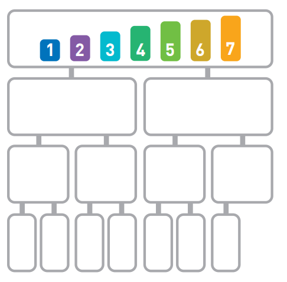

# 归并排序

## 原理

归并排序算法递归将序列划分为长度相同的两个子序列，当无法继续划分时（子序列中只有一个数据时）就开始对子序列进行有序合并，后续的问题就转化成合并两个有序序列的问题。

归并排序是使用分治法的典型应用，有两种实现方式：

* 自上而下的递归（递归都可以写成迭代）
* 自上而下的迭代


## 复杂度

### 1. 时间复杂度

假设我们初始序列如下：


归并排序的划分结果如下：



可以看到无论是哪一行都是n个数据，所以每一行的运行时间为$O(n)$，将长度为n的序列二分直到只有一个数据时可以分成$log_2n$行，因此总的时间复杂度为$O(nlog_2n)$。

### 2. 空间复杂度

归并排序非原址排序，需要的最大额外空间为n，因此空间复杂度是$O(n)$。

## 代码实现

```c++
#include <vector>
#include <algorithm>
#include <random>
#include <iostream>
#include <climits>

std::vector<int> test_array = {1, 2, 3, 4, 5, 6, 7, 8, 9, 10, 11, 12, 13, 14, 15, 16, 17, 18, 19, 20, 21, 22, 23, 24, 25};

// 打印vector内容
void printVector(const std::string prefix, const std::vector<int> &vi) {
    std::cout << prefix;
    for (auto i : vi) {
        std::cout << " " << i;
    }
    std::cout << std::endl;
}

// 合并两个有序数组
void merge(std::vector<int> &vi, int start, int mid, int end) {
    // 注意vi[start:mid] 和 vi[mid+1, end]已经是有序的了
    // 将其拷贝出来到额外的空间
    std::vector<int> leftSubArray(vi.begin() + start, vi.begin() + mid + 1);
    std::vector<int> rightSubArray(vi.begin() + mid + 1, vi.begin() + end + 1);

    // 双指针法对vi[start, end]区域进行排序
    int leftIndex = 0;
    int rightIndex = 0;

    leftSubArray.insert(leftSubArray.end(), INT_MAX);
    rightSubArray.insert(rightSubArray.end(), INT_MAX);

    for (int i = start; i <= end; ++i) {
        if (leftSubArray[leftIndex] < rightSubArray[rightIndex]) {
            vi[i] = leftSubArray[leftIndex];
            leftIndex++;
        } else {
            vi[i] = rightSubArray[rightIndex];
            rightIndex++;
        }
    }
}

// 归并排序
void mergeSort(std::vector<int> &vi, int start, int end) {
    // 仅剩下一个数据时递归结束
    if (start >= end) {
        return;
    }

    int mid = (start + end) / 2;
    mergeSort(vi, start, mid);
    mergeSort(vi, mid + 1, end);
    merge(vi, start, mid, end);
}

int main() {
    // 乱排有序vector
    auto rng = std::default_random_engine {};
    std::shuffle(std::begin(test_array), std::end(test_array), rng);

    // 排序前
    printVector("before:", test_array);

    // 排序
    mergeSort(test_array, 0, test_array.size() - 1);

    // 排序后
    printVector("after:", test_array);

    return 0;
}
```

## Reference

[1] <https://www.runoob.com/w3cnote/merge-sort.html>
