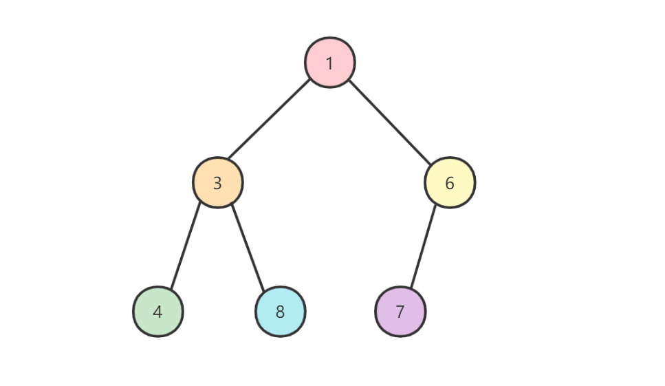
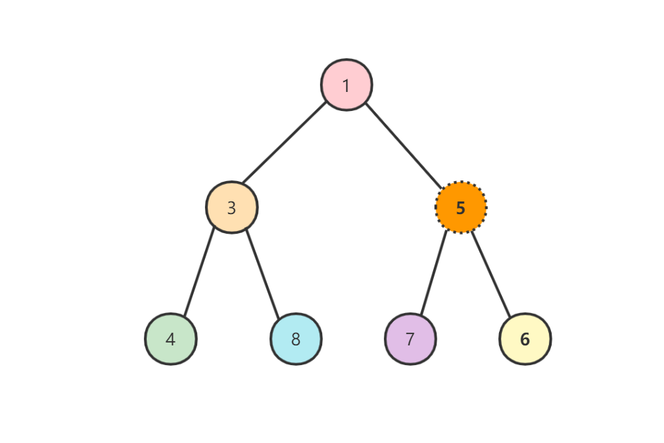
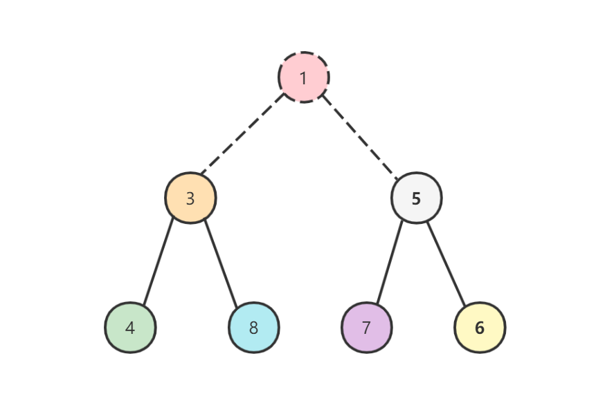
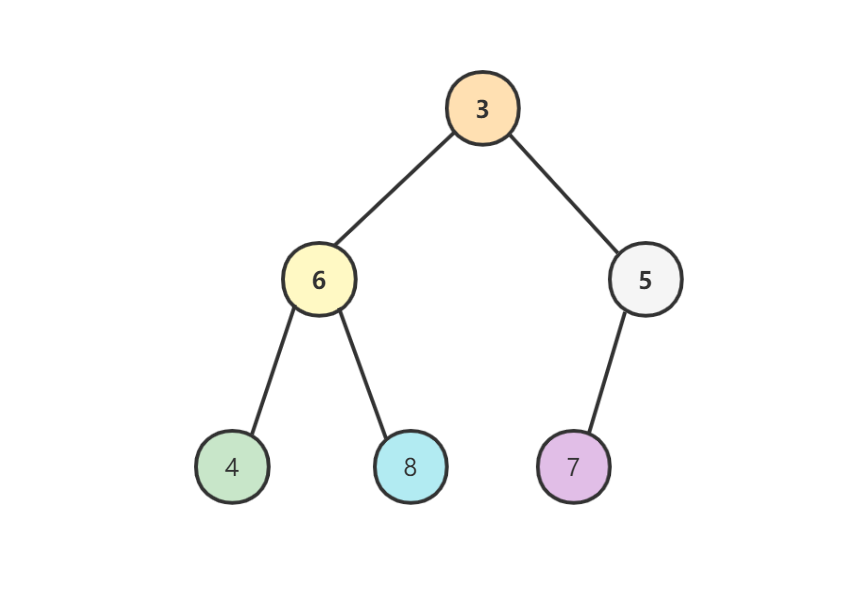
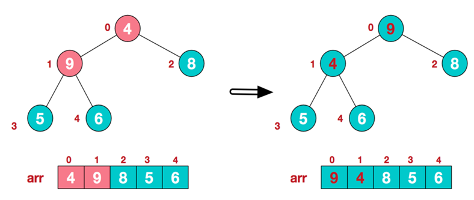

# 堆排序

## 堆

堆是一种近似完全二叉树的树形结构，被用于实现优先队列`priority queues`。顾名思义，堆满足子结点的数值总是大于（或小于）它的父结点。

堆可以分为大根堆和小根堆，大根堆父结点的值大于左右两个子结点的值，小根堆父结点的值小于左右两个子结点的值。为了方便介绍，我们这里仅讨论小根堆的情况。



### 1. 添加结点

往堆中添加结点时会添加在最下面一行靠左的位置，如果最下面一行无多余空间时则另起一行添加在这一行的最左侧，如果添加后父结点大于子结点则需要交换父子结点位置，一直重复这样的操作直到所有的子结点都大于父结点

假如我们往上面的堆中添加结点5，那么首先我们将数据加在最后一排靠左的位置：


此时5的父结点6大于它，因此需要交换父子结点位置：



此时5的父结点1小于它，因此添加元素结束。

### 2. 删除结点

往堆中取出数据时直接取出根节点，因为它就是最小的值：



然后将位于最后的数据（最后一排最右边的元素）移动到最顶端：


如果父结点的值大于子结点，那么将父结点与其左右两个子结点中较小的一个进行交换（这里交换父结点6和子结点3）：



继续交换父结点6和子结点4：


### 3. 复杂度

由于堆中顶端的数据是最小值，因此无论堆中包含多少个结点，取出最小值的时间复杂度都是$O(1)$。

取出数据后需要将最后的数据移动到最顶端，然后比较它和左右两个子结点的大小并一直向下移动，所以取出数据需要的运行时间和树高度（数据量为n时树的高度是$log_{2}n$）相关。因此取出最小值后重构堆的时间复杂度是$O(log n)$。

往堆中添加数据时需要在堆的最后添加元素，然后一边比较它和父结点的大小再一边向上移动，所以添加数据需要的时间复杂度也是$O(log n)$。

### 4. 适用范围

对于需要频繁从管理的数据中取出最小值时，可以使用堆（优先队列就是以堆实现的）。

## 原理

堆排序利用了数据结构中的堆进行排序。步骤如下：

* 将无序数组组织成一个大根堆
* 取出堆首元素（数组最大值）放在数组末尾，然后重建前面n-1个元素的大根堆
* 重复第二步，直到大根堆中所有元素都被取出

## 例子

### 1. 无序数组对应的二叉树结构

 举个例子，加入我们开始的数组为`[4,6,8,5,9]`，那么它对应的二叉树如下：


### 2. 将二叉树转化成大根堆

我们从最后一个非叶子结点6（下标为$$arr.size()/2-1 = 5/2 -1 = 1 $$）开始将完全二叉树调整成大根堆：

* 第一个非叶子结点6小于它的右子结点9，因此交换6和9


* 第二个非叶子结点4小于它的左子结点9，因此交换4和9；交换完后子堆`[4,5,6]`不符合大根堆的结构，继续交换父结点4和子结点6




至此我们将一个无序数组构造成了大根堆。

### 3. 堆排序

将数组首元素（数组最大值）和尾元素交换，此时数组末尾的元素最大。然后将前面n-1个元素的堆进行调整，使得堆顶元素为数组第二大元素，继续交换数组首元素（数组第二大值）和尾元素。如此重复，直至得到一个升序数组。

* 取出堆顶元素9放到数组末尾，将堆尾元素移到堆顶


* 重组堆，使其满足大根堆定义


* 再取出堆顶元素8，将堆尾元素5移到堆顶


* 重复取出堆顶元素，再重组堆使其符合大根堆定义，最终得到有序数组


## 复杂度

堆排序包括初始化建堆和堆排序。

### 1. 初始化建堆时间复杂度

假设数组包含N个元素，完全二叉树的高度H。前面我们提到初始化建堆时是从最后一个非叶子结点从右到左，从下到上将完全二叉树调整为大根堆的。那么每一层的节点个数和比较次数如下（注意我们是从最后一个非叶子结点开始比较的，所以最后一层比较次数为0）：


由此可知，初始化建堆时总的比较次数为：
$$
s = 1 \times (H - 1) + 2 \times (H-2) + ... + 2^{H-2} \times 1 + 2^{H-1} * 0
$$
根据等比数列求和，我们将等号左右两侧乘上2，得到：
$$
2s = 2^1 \times (H - 1) + 2^2 \times (H-2) + ... + 2^{H-1} \times 1 + 2^{H} * 0
$$
后者减去前者得到：
$$
\begin{aligned}
s &\quad = -(H-1) + 2^1 + 2^2 + ... + 2^{H-1}   \\
  &\quad = -H + 2^0 + 2^1 + 2^2 + ... + 2^{H-1} \\
  &\quad = 2^H -H -1
\end{aligned}
$$

对于完全二叉树而言结点个数N等于$2^H - 1$，因此在完全二叉树场景下H等于$log_2{N+1}$（对于一般情形而言H等于$log_{2}N + 1$向下取整），代入H后得：
$$
s = N - log_{2}(N+1)
$$
因此初始化建堆的时间复杂度近似为$O(N)$。

### 2. 堆排序时间复杂度

堆排序时我们每次将堆首和堆尾元素互换，然后重建堆。每一轮操作都意味着堆中会减少一个结点，重建时对应的时间复杂度（取决于堆的层数$log_2{N}$）也会下降。

对于N个结点的堆而言，二叉树高度H为$log_{2}N + 1$后向下取整，我们总共需要N-1次重建堆的操作。为了考虑取整带来的影响，我们倒推重建堆过程中的比较次数：

* 第N-1次重建堆时堆中仅剩下一个结点，高度为1，因此不需要额外的比较操作
* 第N-2和N-3次重建堆时，堆中包含2个结点，高度为2，因此需要1次额外的比较操作
* 第N-4~N-7次重建堆时，堆中包含4个结点，高度为3，因此需要2次额外的比较操作
* ...
* 第1次重建堆时，堆中包含N-1个结点，高度为H，因此需要H-1次额外的比较操作

由此可得，N-1次重建堆总的比较次数s满足：
$$
\begin{aligned}
s &\quad \lt 0 \times 2^0 + 1 \times 2^1 + 2 \times 2^2 +... + (H - 1) \times 2^{H-1} \\
  &\quad = (H-2) 2^H + 2\\
\end{aligned}
$$
另外s满足：
$$
\begin{aligned}
s &\quad \gt 0 \times 2^0 + 1 \times 2^1 + 2 \times 2^2 +... + (H - 2) \times 2^{H-2} \\
  &\quad = (H-3) 2^{H-1} + 2\\
\end{aligned}
$$
代入H可以得到时间复杂度为$O(Nlog_{2}N)$。

### 3. 空间复杂度

显而易见仅需要常数级别的额外空间，空间复杂度为$O(1)$。

## 代码实现

```c++
#include <vector>
#include <algorithm>
#include <random>
#include <iostream>

std::vector<int> test_array = {1, 2, 3, 4, 5, 6, 7, 8, 9, 10, 11, 12, 13, 14, 15, 16, 17, 18, 19, 20, 21, 22, 23, 24, 25};

// 打印vector内容
void printVector(const std::string prefix, const std::vector<int> &vi) {
    std::cout << prefix;
    for (auto i : vi) {
        std::cout << " " << i;
    }
    std::cout << std::endl;
}

// 递归方式调整完全二叉树的根节点, 使其符合大根堆特性
// start和end描述了堆点在数组vi中的下标
void maxHeapify(std::vector<int> &vi, int start, int end) {
    // 求出左右子结点下标
    int left = 2 * start + 1;
    int right = left + 1;

    // 求出{vi[start], vi[left], vi[right]}三者中的最大值下标
    int maxIndex = start;
    if (left <= end && vi[left] > vi[maxIndex]) {
        maxIndex = left;
    }
    if (right <= end && vi[right] > vi[maxIndex]) {
        maxIndex = right;
    }

    // 如果根结点不是最大的, 交换父子结点后则继续递归调整下一层
    if (maxIndex != start) {
        std::swap(vi[maxIndex], vi[start]);
        maxHeapify(vi, maxIndex, end);
    }
}

// 堆排序
void heapSort(std::vector<int> &vi) {
    // 初始化建堆: 从最后一个叶子结点开始, 从右到左从下到上调整二叉树成大根堆
    for (int i = vi.size() / 2 - 1; i >= 0; --i) {
        maxHeapify(vi, i, vi.size() - 1);
    }

    // 堆排序: 交换首尾元素后调整根节点使其符合大根堆特性
    for (int i = vi.size() - 1; i >= 1; --i) {
        std::swap(vi[0], vi[i]);
        maxHeapify(vi, 0, i - 1);
    }
}

int main() {
    // 乱排有序vector
    auto rng = std::default_random_engine {};
    std::shuffle(std::begin(test_array), std::end(test_array), rng);

    // 排序前
    printVector("before:", test_array);

    // 排序
    heapSort(test_array);

    // 排序后
    printVector("after:", test_array);

    return 0;
}
```

## Reference

[1] <https://www.cnblogs.com/wanglei5205/p/8733524.html>

[2] <https://www.cnblogs.com/wanglei5205/p/8733524.html>

[3] <https://www.cnblogs.com/chengxiao/p/6129630.html>
