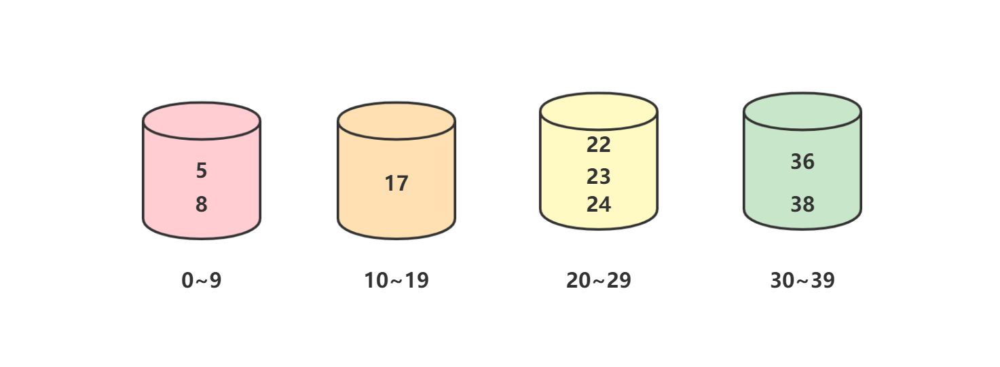

# 桶排序

## 原理

对于计数排序而言，即使待排序数组长度较短，当整数的范围跨度较大时就会使得算法时空间复杂度急剧扩张。桶排序正是计数排序的优化版本。它使用映射函数将N个数据均匀地分配到K个**有序**桶中，然后在每个桶中排完序后再组合起来。

对于待排序序列`[8, 22, 38, 5, 17, 24, 23, 36]`而言，首先将它们放置到桶中：


将每个桶中的元素排好序：



最后再按顺序将桶组合起来即可得到有序数组：`[5, 8, 17, 22, 23, 24, 36, 38]`。

## 注意事项

* 在空间充足的情况下，尽可能增大桶的数量
* 使用的映射函数可以将输入的N个数据均匀分配到K个桶中
* 桶中的排序算法会影响整体性能
* 桶与桶之间需要有大小顺序
* 输入的数据可以均匀地分配到每个桶中时性能最佳，输入的数据被分配同一个桶中时性能最差

## 复杂度

### 1. 时间复杂度

假设需要排序的数据有N个，我们将它们**均匀**分到K个桶中，如此每个桶中的数据就是M=N/K。我们在每个桶内使用其他排序算法（比如快排），那么每个桶内排序的时间复杂度就是$O(MlogM)$，总的时间复杂度为：
$$
K \times O(MlogM) = K  \times O(\frac{N}{K}log(\frac{N}{K})) = O(Nlog(\frac{N}{K}))
$$
由此可见，当桶的数量K足够大时，$log(\frac{N}{K})$就是一个较小的常数，因此时间复杂度趋近于$O(N)$。

> 总结：当桶数量K足够大且桶内的数据足够均匀的假设成立时，桶排序的时间复杂度趋近于$O(N)$。

### 2. 空间复杂度

需要创建K个桶存储总共N个数据，因此空间复杂度是$O(N)$。

## 代码实现

### 1. 无序桶 + 归并排序

> 之所以要提到这个“伪桶排序”，是因为一方面它确实用hash桶实现了排序，另一方面网上有不少桶排序的代码都是如此实现的。
>
> 优化方向：这里桶与桶之间并没有顺序关系，类似于hash到不同的桶中然后归并排序。一种做法是找到数组最大值和最小值，然后根据设定的桶数将数据丢到不同的桶中，最后按照顺序合并桶。

这种情况下我们使用链表来实现“桶排序”（每个链表表示一个桶），虽然也是将N个数据分到K个桶中进行排序，但是：

* 桶与桶之间是无序的，数据相当于被hash到不同的桶中
* 往桶中插入数据时会遍历链表找到合适的位置插入，插入完后桶内自然是有序的
* 最终合并桶时使用的是归并排序

```c++
#include <vector>
#include <algorithm>
#include <random>
#include <iostream>

std::vector<int> test_array = {1, 2, 3, 4, 5, 6, 7, 8, 9, 10, 11, 12, 13, 14, 15, 16, 17, 18, 19, 20, 21, 22, 23, 24, 25};

// 打印vector内容
void printVector(const std::string prefix, const std::vector<int> &vi) {
    std::cout << prefix;
    for (auto i : vi) {
        std::cout << " " << i;
    }
    std::cout << std::endl;
}

// 桶数量
const int BUCKET_NUM = 10;

// 链表结构体: 表示一个桶
struct ListNode {
    explicit ListNode(int i = 0) : value_(i), next_(nullptr) {}
    int value_;
    ListNode *next_;
};

// 往链表(桶)中插入结点, 插入时已经排好序了
ListNode* insert(ListNode* head, int val) {
    ListNode dummyNode;
    ListNode *newNode = new ListNode(val);
    ListNode *pre, *curr;

    dummyNode.next_ = head;
    pre = &dummyNode;
    curr = head;
    while (curr != nullptr && curr->value_ <= val) {
        pre = curr;
        curr = curr->next_;
    }

    newNode->next_ = curr;
    pre->next_ = newNode;
    return dummyNode.next_;
}

// 合并两个有序链表
ListNode* merge(ListNode *l1, ListNode *l2) {
    ListNode dummyNode;
    ListNode *dummy = &dummyNode;
    while (l1 && l2) {
        if (l1->value_ <= l2->value_) {
            dummy->next_ = l1;
            l1 = l1->next_;
        } else {
            dummy->next_ = l2;
            l2 = l2->next_;
        }
        dummy = dummy->next_;
    }

    // 要么l1为空, 要么l2为空
    if (l1) {
        dummy->next_ = l1;
    }
    if (l2) {
        dummy->next_ = l2;
    }

    return dummyNode.next_;
}

// 桶排序
void bucketSort(std::vector<int> &vi) {
    int len = vi.size();

    std::vector<ListNode*> buckets(BUCKET_NUM, reinterpret_cast<ListNode*>(0));
    for (int i = 0; i < len; ++i) {
        int index = vi[i] / BUCKET_NUM;  // 进哪个桶
        ListNode *head = buckets[index];
        buckets[index] = insert(head, vi[i]);
    }

    // 合并所有的桶
    ListNode *head = buckets[0];
    for (int i = 1; i < BUCKET_NUM; ++i) {
        head = merge(head, buckets[i]);
    }

    // 填充原始数组
    for (int i = 0; i < len; ++i) {
        vi[i] = head->value_;
        head = head->next_;
    }
}


int main() {
    // 乱排有序vector
    auto rng = std::default_random_engine {};
    std::shuffle(std::begin(test_array), std::end(test_array), rng);

    // 排序前
    printVector("before:", test_array);

    // 排序
    bucketSort(test_array);

    // 排序后
    printVector("after:", test_array);

    return 0;
}
```

### 2. 有序桶 + 快速排序

实现思路：

* 求出数组的最大值max和最小值min
* 将每个元素按照大小分到不同的桶中（桶的数量可配置）
* 桶内使用系统自带排序（快速排序）
* 按照桶的顺序输出

```c++
#include <vector>
#include <algorithm>
#include <random>
#include <iostream>

std::vector<int> test_array = {1, 2, 3, 4, 5, 6, 7, 8, 9, 10, 11, 12, 13, 14, 15, 16, 17, 18, 19, 20, 21, 22, 23, 24, 25};

// 打印vector内容
void printVector(const std::string prefix, const std::vector<int> &vi) {
    std::cout << prefix;
    for (auto i : vi) {
        std::cout << " " << i;
    }
    std::cout << std::endl;
}

// 桶数量
const int BUCKET_NUM = 10;

// 桶排序
void bucketSort(std::vector<int> &vi) {
    int len = vi.size();
    if (len <= 1) {
        return;
    }

    // 获取最大值和最小值, 构造合适的桶
    int max = vi[0];
    int min = vi[0];
    for (auto i : vi) {
        max = std::max(i, max);
        min = std::min(i, min);
    }

    // 桶数量不应该超过数组长度, 等于数组长度时变成计数排序
    int bucket_num = std::min(BUCKET_NUM, len);
    // 每个桶中应该放的数据跨度
    int num_per_bucket = std::ceil((max - min) * 1.0 / bucket_num);

    // 创建BUCKET_NUM个桶, 桶与桶之间有序
    std::vector<std::vector<int>> buckets(bucket_num);

    // 将数据放到桶中
    for (int i = 0; i < len; ++i) {
        // 计算数据该放在哪个桶中
        int bucket_index = (vi[i] - min) / num_per_bucket;
        std::cout << "value: " << vi[i] << ", bucket_index: " << bucket_index << std::endl;
        buckets[bucket_index].push_back(vi[i]);
    }

    // 对每个桶调用系统排序并且输出
    int insert_index = 0;
    for (int i = 0; i < buckets.size(); ++i) {
        auto bucket = buckets[i];
        std::sort(bucket.begin(), bucket.end());
        for (int j = 0; j < bucket.size(); ++j) {
            vi[insert_index] = bucket[j];
            insert_index++;
        }
    }
}


int main() {
    // 乱排有序vector
    auto rng = std::default_random_engine {};
    std::shuffle(std::begin(test_array), std::end(test_array), rng);

    // 排序前
    printVector("before:", test_array);

    // 排序
    bucketSort(test_array);

    // 排序后
    printVector("after:", test_array);

    return 0;
}
```

## Reference

[1] <https://www.runoob.com/w3cnote/bucket-sort.html>

[2] <https://blog.csdn.net/zihonggege/article/details/104781491/>
