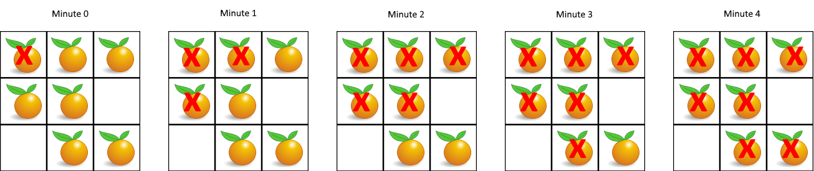

# 994. 腐烂的橘子

## 题目

难度: 中等

在给定的 m x n 网格 grid 中，每个单元格可以有以下三个值之一：

- 值 0 代表空单元格；
- 值 1 代表新鲜橘子；
- 值 2 代表腐烂的橘子。

每分钟，腐烂的橘子 **周围 4 个方向上相邻** 的新鲜橘子都会腐烂。

返回 <em>直到单元格中没有新鲜橘子为止所必须经过的最小分钟数。如果不可能，返回 -1</em> 。

**示例 1：**



```
输入：grid = [[2,1,1],[1,1,0],[0,1,1]]
输出：4

```

**示例 2：**

```
输入：grid = [[2,1,1],[0,1,1],[1,0,1]]
输出：-1
解释：左下角的橘子（第 2 行， 第 0 列）永远不会腐烂，因为腐烂只会发生在 4 个正向上。

```

**示例 3：**

```
输入：grid = [[0,2]]
输出：0
解释：因为 0 分钟时已经没有新鲜橘子了，所以答案就是 0 。

```

> 来源: 力扣（LeetCode）  
> 链接: <https://leetcode.cn/problems/rotting-oranges/>  
> 著作权归领扣网络所有。商业转载请联系官方授权，非商业转载请注明出处。

## 答案

**多源广度优先搜索（即初始的队列长度 > 1）**：

```c++
class Solution {
public:
    int orangesRotting(vector<vector<int>>& grid) {
        int m = grid.size();
        int n = grid[0].size();

        // 新鲜橘子数量
        int fresh_cnt = 0;

        std::queue<std::pair<int, int>> q;
        for (int i = 0; i < m; i++) {
            for (int j = 0; j < n; j++) {
                if (grid[i][j] == 1) {
                    fresh_cnt++;
                } else if (grid[i][j] == 2) {
                    q.push({i, j});
                }
            }
        }

        // 没有任何新鲜橘子, 直接返回
        if (fresh_cnt == 0) {
            return 0;
        }

        // 第一层腐烂的橘子不算
        int res = -1;

        // 方向数组
        std::vector<std::pair<int, int>> directions = {{-1, 0}, {0, -1}, {1, 0}, {0, 1}};

        // BFS
        while (!q.empty()) {
            res++;
            int size = q.size();
            for (int i = 0; i < size; i++) {
                auto [x, y] = q.front();
                q.pop();

                // 遍历四个方向
                for (auto& dir : directions) {
                    int new_x = x + dir.first;
                    int new_y = y + dir.second;
                    if (new_x >= 0 && new_x < m && new_y >= 0 && new_y < n) {
                        if (grid[new_x][new_y] == 1) {
                            q.push({new_x, new_y});
                            grid[new_x][new_y] = 2;
                            fresh_cnt--;
                        }
                    }
                }
            }
        }

        if (fresh_cnt > 0) {
            return -1;
        }
        return res;
    }
};
```
